## Combobox Research
<table>
  <tr>
   <td><strong>Combobox</strong>
   </td>
   <td><strong>Select</strong>
   </td>
   <td><strong>Dropdown</strong>
   </td>
   <td><strong>N/A</strong>
   </td>
  </tr>
  <tr>
   <td><a href="https://www.w3.org/WAI/ARIA/apg/patterns/combobox/">WAI-ARIA</a>
   </td>
   <td><a href="https://ant.design/components/select">Ant Design</a>
   </td>
   <td><a href="https://system.design.orange.com/0c1af118d/p/910b9b-dropdown/b/04c480">Boosted</a>
   </td>
   <td rowspan="7" >Bootstrap

<a href="https://www.carbondesignsystem.com/">Carbon Design System</a>

<a href="https://www.chromium.org/">Chromium</a> <a href="https://www.goodbarber.com/uxdesign/">GoodBarber Design System</a> 

<a href="https://public-ui.github.io/">KoliBri</a> 

<a href="https://material.io/">Material Components Web</a> 

<a href="https://primer.style/">Primer Design System</a> 
   </td>
  </tr>
  <tr>
   <td><a href="https://evergreen.segment.com/components/combobox">Evergreen</a>
   </td>
   <td><a href="https://atlassian.design/components/select/examples">Atlaskit</a>
   </td>
   <td><a href="https://semantic-ui.com/modules/dropdown.html">Semantic UI</a>
   </td>
  </tr>
  <tr>
   <td><a href="https://react.fluentui.dev/?path=/docs/components-combobox--default">UI Fabric</a>
   </td>
   <td><a href="https://mui.com/material-ui/react-select/">Material UI</a>
   </td>
   <td><a href="https://fluentsite.z22.web.core.windows.net/0.66.2/components/dropdown/definition">Stardust UI</a>
   </td>
  </tr>
  <tr>
   <td><a href="https://explore.fast.design/components/fast-combobox">FAST</a>
   </td>
   <td><a href="https://tailwind-elements.com/docs/standard/forms/select/">Tailwind Elements</a>
   </td>
   <td>
   </td>
  </tr>
  <tr>
   <td><a href="https://www.lightningdesignsystem.com/components/combobox/#Base-Combobox">Lightning Design System</a>
   </td>
   <td>
   </td>
   <td>
   </td>
  </tr>
  <tr>
   <td><a href="https://lion-web.netlify.app/components/combobox/overview/">Lion</a>
   </td>
   <td>
   </td>
   <td>
   </td>
  </tr>
  <tr>
   <td><a href="https://spectrum.adobe.com/page/combo-box/">Spectrum</a>
   </td>
   <td>
   </td>
   <td>
   </td>
  </tr>
</table>

## Features of combobox

1. Base
2. Grouped options
3. Disabled options
4. Bordered-less 
5. Autocomplete (none, list , inline, both)
6. Loading
7. Select Clearable
8. Multiple Selection 
9. Clearall
10. Custom selection render
11. Custom Tag Render
12. Dropdown indicator
13. Hide Already Selected
14. Responsive maxTagCount
15. Disabled State
16. Readonly
17. Error
18. Internationalization
19. Search with sort
20. Picker Combobox

### Base

    
&nbsp; &nbsp; &nbsp; &nbsp; &nbsp; &nbsp; 

    

    
&nbsp; &nbsp;<a class="c3"
                href="https://www.google.com/url?q=https://www.w3.org/TR/wai-aria-practices/%23intro&amp;sa=D&amp;source=editors&amp;ust=1698285950464406&amp;usg=AOvVaw3wt-5qt46M7uVOYHQhXSBg">WAI-ARIA</a>&nbsp; &nbsp; &nbsp; &nbsp; &nbsp; &nbsp; &nbsp; &nbsp; &nbsp; &nbsp; &nbsp; &nbsp; &nbsp;Ant
            Design &nbsp; &nbsp; &nbsp; &nbsp; &nbsp; &nbsp; &nbsp; &nbsp; &nbsp; &nbsp; &nbsp; &nbsp; &nbsp; &nbsp;
            &nbsp;Atlaskit &nbsp; &nbsp; &nbsp; &nbsp; 

    
&nbsp; &nbsp; &nbsp; &nbsp; &nbsp; &nbsp; &nbsp; 

    

    
&nbsp;Boosted &nbsp; &nbsp; &nbsp; &nbsp; &nbsp; &nbsp; &nbsp; &nbsp; &nbsp;
            &nbsp; &nbsp; &nbsp; &nbsp; &nbsp; &nbsp; &nbsp; &nbsp; &nbsp; &nbsp; &nbsp; &nbsp; &nbsp; &nbsp;
            Evergreen

    
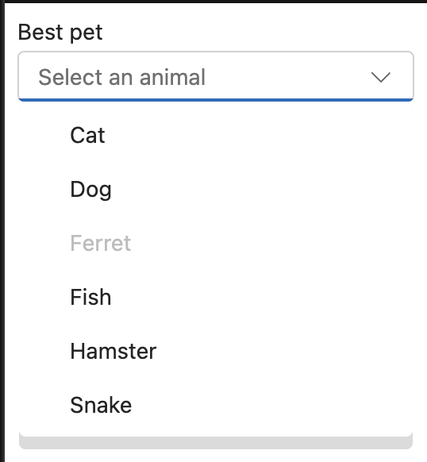&nbsp; &nbsp; 

    
<a class="c3"
                href="https://www.google.com/url?q=https://developer.microsoft.com/en-us/fabric&amp;sa=D&amp;source=editors&amp;ust=1698285950465416&amp;usg=AOvVaw2r400p8x1HWWDtfxrsfSrB">UI
                Fabric</a>&nbsp; &nbsp; &nbsp; &nbsp; &nbsp; &nbsp; &nbsp; &nbsp; &nbsp; &nbsp; &nbsp;
            &nbsp; &nbsp; &nbsp; &nbsp; &nbsp; &nbsp; &nbsp; &nbsp; &nbsp; &nbsp; &nbsp; &nbsp; &nbsp; &nbsp;
        &nbsp; &nbsp; &nbsp; &nbsp;FAST

    
&nbsp;&nbsp;&nbsp;&nbsp;&nbsp;&nbsp;&nbsp;&nbsp;&nbsp;&nbsp;&nbsp;&nbsp;&nbsp;&nbsp;&nbsp;&nbsp;
    

    
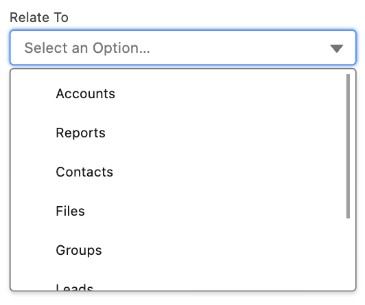&nbsp; &nbsp; &nbsp;

    
LDS
            &nbsp;&nbsp;&nbsp;&nbsp;&nbsp;&nbsp;&nbsp;&nbsp;&nbsp;&nbsp;&nbsp;&nbsp;&nbsp;&nbsp;&nbsp;&nbsp;&nbsp;&nbsp;&nbsp;&nbsp;&nbsp;&nbsp;&nbsp;&nbsp;&nbsp;
            &nbsp; &nbsp; &nbsp; &nbsp;
            &nbsp;&nbsp;&nbsp;&nbsp;&nbsp;&nbsp;&nbsp;&nbsp;&nbsp;&nbsp;&nbsp;&nbsp;&nbsp;&nbsp;&nbsp;&nbsp;&nbsp;
            &nbsp; &nbsp; LION

    

    

    
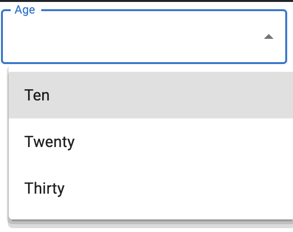&nbsp; &nbsp; &nbsp; 

    

    
Material
            UI&nbsp;&nbsp;&nbsp;&nbsp;&nbsp;&nbsp;&nbsp;&nbsp;&nbsp;&nbsp;&nbsp;&nbsp;&nbsp;&nbsp;&nbsp;&nbsp;&nbsp;&nbsp;&nbsp;&nbsp;&nbsp;&nbsp;&nbsp;&nbsp;&nbsp;&nbsp;&nbsp;&nbsp;&nbsp;&nbsp;&nbsp;&nbsp;&nbsp;&nbsp;&nbsp;&nbsp;&nbsp;&nbsp;&nbsp;&nbsp;&nbsp;&nbsp;&nbsp;&nbsp;&nbsp;&nbsp;&nbsp;&nbsp;Semantic
            UI

    

    

    

    

    

    
Spectrum

    

    

    &nbsp; &nbsp; &nbsp; &nbsp; &nbsp; &nbsp;&nbsp; &nbsp; &nbsp; &nbsp; &nbsp; &nbsp; &nbsp;&nbsp; &nbsp; &nbsp; &nbsp; &nbsp; &nbsp;&nbsp; &nbsp; &nbsp;

    
&nbsp;&nbsp;&nbsp;&nbsp;&nbsp;&nbsp;&nbsp;&nbsp;Immediate popover
            launch# &nbsp; &nbsp; &nbsp; &nbsp; &nbsp; &nbsp; &nbsp; &nbsp; Delayed popover launch#

    

    
StartDust&nbsp;&nbsp;&nbsp;&nbsp;&nbsp;&nbsp;&nbsp;&nbsp;&nbsp;&nbsp;&nbsp;&nbsp;&nbsp;&nbsp;&nbsp;&nbsp;&nbsp;&nbsp;&nbsp;&nbsp;&nbsp;&nbsp;&nbsp;&nbsp;&nbsp;&nbsp;&nbsp;&nbsp;&nbsp;&nbsp;&nbsp;&nbsp;&nbsp;&nbsp;&nbsp;&nbsp;&nbsp;&nbsp;&nbsp;&nbsp;&nbsp;&nbsp;&nbsp;&nbsp;&nbsp;&nbsp;&nbsp;&nbsp;Tailwind
    

    

    

### Grouped options

&nbsp; &nbsp; &nbsp; &nbsp; 

    
Ant Design &nbsp; &nbsp; &nbsp; &nbsp; &nbsp; &nbsp; &nbsp; &nbsp; &nbsp; &nbsp;
            &nbsp; &nbsp; &nbsp; &nbsp; &nbsp; &nbsp; &nbsp; &nbsp;Atlaskit &nbsp; &nbsp; &nbsp; &nbsp; &nbsp; &nbsp;
            &nbsp; &nbsp; &nbsp; &nbsp; &nbsp; &nbsp; &nbsp; &nbsp; &nbsp; &nbsp;UI Fabric

    
&nbsp; &nbsp; &nbsp; 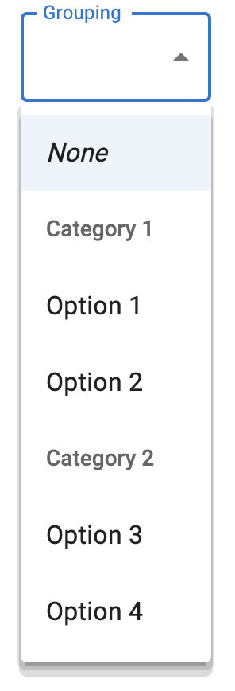

    
LDS&nbsp;&nbsp;&nbsp;&nbsp;&nbsp;&nbsp;&nbsp;&nbsp;&nbsp;&nbsp;&nbsp;&nbsp;&nbsp;&nbsp;&nbsp;&nbsp;&nbsp;&nbsp;&nbsp;&nbsp;&nbsp;&nbsp;&nbsp;&nbsp;
            &nbsp; &nbsp; &nbsp; &nbsp;Material UI( ListSubheader/native &lt;optgroup&gt;)

    

    
Tailwind Elements

    <h3 class="c30" id="h.ujvw0qd1qaw4">No images (TBD)</h3>
    <ol class="c18 lst-kix_rtf2wnkr5att-0 start" start="1">
        <li class="c6 c14 li-bullet-0">&nbsp;<a class="c3"
                    href="https://www.google.com/url?q=https://www.w3.org/TR/wai-aria-practices/%23intro&amp;sa=D&amp;source=editors&amp;ust=1698285950469334&amp;usg=AOvVaw1KqHn-EaWk4XGlXRpB5ZNV">WAI-ARIA</a>&nbsp;</li>
    </ol>
    

### Disabled Options

&nbsp; &nbsp; &nbsp; &nbsp;

    
&nbsp;Boosted &nbsp; &nbsp; &nbsp; &nbsp; &nbsp; &nbsp; &nbsp; &nbsp; &nbsp;
            &nbsp; &nbsp; &nbsp; &nbsp;UI Fabric
            &nbsp;&nbsp;&nbsp;&nbsp;&nbsp;&nbsp;&nbsp;&nbsp;&nbsp;&nbsp;&nbsp;&nbsp;&nbsp;&nbsp;&nbsp;&nbsp;&nbsp;&nbsp;&nbsp;&nbsp;&nbsp;&nbsp;&nbsp;&nbsp;Semantic
            UI

    

    
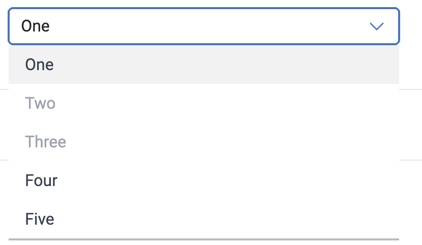

    
Tailwind Elements

### Bordered-less **(subtle)**

    
&nbsp; 

    
Ant Design &nbsp; &nbsp; &nbsp; &nbsp; &nbsp; &nbsp; &nbsp; &nbsp; &nbsp; &nbsp;
            &nbsp; &nbsp; &nbsp; &nbsp; &nbsp; &nbsp; &nbsp; &nbsp; &nbsp; &nbsp; &nbsp; &nbsp; &nbsp; &nbsp; &nbsp;
            &nbsp; &nbsp; &nbsp; &nbsp;Atlaskit

    

    
&nbsp;&nbsp;&nbsp;&nbsp;&nbsp;&nbsp;&nbsp;&nbsp;&nbsp;&nbsp;&nbsp;&nbsp;&nbsp;&nbsp;&nbsp;&nbsp;&nbsp;&nbsp;&nbsp;&nbsp;&nbsp;&nbsp;&nbsp;&nbsp;
    

    

    
&nbsp; &nbsp;&nbsp;&nbsp;&nbsp;&nbsp;&nbsp;&nbsp;&nbsp;&nbsp; &nbsp;
            &nbsp; &nbsp; &nbsp;&nbsp; &nbsp; &nbsp; &nbsp; 

    
UI
            Fabric&nbsp;&nbsp;&nbsp;&nbsp;&nbsp;&nbsp;&nbsp;&nbsp;&nbsp;&nbsp;&nbsp;&nbsp;&nbsp;&nbsp;&nbsp;&nbsp;&nbsp;&nbsp;&nbsp;&nbsp;&nbsp;&nbsp;&nbsp;&nbsp;&nbsp;&nbsp;&nbsp;&nbsp;&nbsp;&nbsp;&nbsp;&nbsp;&nbsp;&nbsp;&nbsp;&nbsp;&nbsp;&nbsp;&nbsp;&nbsp;Semantic
            UI 

    

    

    
Spectrum&nbsp;&nbsp;&nbsp;&nbsp;&nbsp;&nbsp;&nbsp;&nbsp;&nbsp;&nbsp;&nbsp;&nbsp;&nbsp;&nbsp;&nbsp;&nbsp;&nbsp;&nbsp;&nbsp;&nbsp;&nbsp;&nbsp;&nbsp;&nbsp;&nbsp;&nbsp;&nbsp;&nbsp;&nbsp;&nbsp;&nbsp;&nbsp;&nbsp;&nbsp;&nbsp;&nbsp;&nbsp;&nbsp;&nbsp;&nbsp;&nbsp;&nbsp;&nbsp;&nbsp;&nbsp;&nbsp;&nbsp;&nbsp;
    

    

    <h3 class="c30" id="h.a83o186ta7x0">No images(TBD)</h3>
    <ol class="c18 lst-kix_eezqa8imrs8w-0 start" start="1">
        <li class="c6 c14 li-bullet-0">&nbsp;<a class="c3"
                    href="https://www.google.com/url?q=https://www.w3.org/TR/wai-aria-practices/%23intro&amp;sa=D&amp;source=editors&amp;ust=1698285950472949&amp;usg=AOvVaw026Z4c_OSYgzU4GnUzww7A">WAI-ARIA</a>
        </li>
    </ol>

### Autocomplete (none, list , inline, both)
<h3 class="c30" id="h.fih7pfns3ph">None</h3>
    
&nbsp; &nbsp; &nbsp; &nbsp; &nbsp; &nbsp; &nbsp; &nbsp;

    
&nbsp;<a class="c3"
                href="https://www.google.com/url?q=https://www.w3.org/TR/wai-aria-practices/%23intro&amp;sa=D&amp;source=editors&amp;ust=1698285950473974&amp;usg=AOvVaw07J7YNv20Mq8ixKA7Dm65K">WAI-ARIA</a>&nbsp;&nbsp;&nbsp;&nbsp;&nbsp;&nbsp;&nbsp;&nbsp;&nbsp;&nbsp;&nbsp;&nbsp;&nbsp;&nbsp;&nbsp;&nbsp;&nbsp;&nbsp;&nbsp;&nbsp;&nbsp;&nbsp;&nbsp;&nbsp;&nbsp;&nbsp;&nbsp;&nbsp;&nbsp;&nbsp;&nbsp;&nbsp;&nbsp;&nbsp;&nbsp;&nbsp;&nbsp;&nbsp;&nbsp;&nbsp;&nbsp;&nbsp;&nbsp;&nbsp;&nbsp;&nbsp;&nbsp;&nbsp;&nbsp;LION
    

    

    <h3 class="c30" id="h.khzriav83bqt">List</h3>
    

    
&nbsp; 

    
&nbsp;<a class="c3"
                href="https://www.google.com/url?q=https://www.w3.org/TR/wai-aria-practices/%23intro&amp;sa=D&amp;source=editors&amp;ust=1698285950474949&amp;usg=AOvVaw3dVF74h0Nyh6l-K-vNSz68">WAI-ARIA</a>&nbsp;
            &nbsp; &nbsp; &nbsp; &nbsp; &nbsp; &nbsp; &nbsp; &nbsp; &nbsp; &nbsp; &nbsp; &nbsp; &nbsp; &nbsp; &nbsp;
            &nbsp; &nbsp; &nbsp; &nbsp; &nbsp; &nbsp; &nbsp; &nbsp; &nbsp; &nbsp;Ant Design
            &nbsp; &nbsp; 

    
&nbsp; &nbsp; &nbsp; &nbsp; &nbsp;

    
&nbsp;Atlaskit &nbsp; &nbsp; &nbsp; &nbsp; &nbsp; &nbsp; &nbsp; &nbsp; &nbsp;
            &nbsp; &nbsp; &nbsp; &nbsp; &nbsp; &nbsp; &nbsp; &nbsp; &nbsp; &nbsp; &nbsp; &nbsp; &nbsp; &nbsp; &nbsp;
            &nbsp; &nbsp; &nbsp; &nbsp; &nbsp; &nbsp; Evergreen

    

    

    

    

    

    

    

    
UI Fabric

    

    

    
Boosted

    

    
&nbsp; &nbsp; 

    
FAST &nbsp; &nbsp; &nbsp; &nbsp; &nbsp; &nbsp; &nbsp; &nbsp; &nbsp; &nbsp; &nbsp;
            &nbsp; &nbsp; &nbsp; &nbsp; &nbsp; &nbsp; &nbsp; &nbsp; &nbsp; &nbsp; &nbsp; Semantic UI

    

    

    
Spectrum
            &nbsp;&nbsp;&nbsp;&nbsp;&nbsp;&nbsp;&nbsp;&nbsp;&nbsp;&nbsp;&nbsp;&nbsp;&nbsp;&nbsp;&nbsp;&nbsp;&nbsp;&nbsp;&nbsp;&nbsp;&nbsp;&nbsp;&nbsp;&nbsp;&nbsp;&nbsp;&nbsp;&nbsp;&nbsp;&nbsp;&nbsp;&nbsp;&nbsp;&nbsp;&nbsp;&nbsp;&nbsp;&nbsp;&nbsp;&nbsp;Tailwind
            Elements

    

    

        &nbsp;&nbsp;&nbsp;&nbsp;&nbsp;&nbsp;&nbsp;&nbsp;&nbsp;&nbsp;&nbsp;&nbsp;&nbsp;&nbsp;&nbsp;&nbsp;&nbsp;&nbsp;&nbsp;&nbsp;&nbsp;&nbsp;&nbsp;&nbsp;LDS

    <h3 class="c30 c17 c35" id="h.l26vxw8bmolb"></h3>
    
&nbsp; 

    <h3 class="c30 c17" id="h.tgape46r1do6">LION&nbsp;&nbsp;&nbsp;&nbsp;&nbsp;&nbsp;&nbsp;&nbsp;&nbsp;&nbsp;&nbsp;&nbsp;&nbsp;&nbsp;&nbsp;&nbsp;&nbsp;&nbsp;&nbsp;&nbsp;&nbsp;&nbsp;&nbsp;&nbsp;&nbsp;&nbsp;&nbsp;&nbsp;&nbsp;&nbsp;&nbsp;&nbsp;&nbsp;&nbsp;&nbsp;&nbsp;&nbsp;&nbsp;&nbsp;&nbsp;Stardust UI</h3>
    <h3 class="c30" id="h.i6enzv2ze9an">Inline</h3>
    

    
&nbsp; 

    
&nbsp;
            Fast&nbsp;&nbsp;&nbsp;&nbsp;&nbsp;&nbsp;&nbsp;&nbsp;&nbsp;&nbsp;&nbsp;&nbsp;&nbsp;&nbsp;&nbsp;&nbsp;&nbsp;&nbsp;&nbsp;&nbsp;&nbsp;&nbsp;&nbsp;&nbsp;&nbsp;&nbsp;&nbsp;&nbsp;&nbsp;&nbsp;&nbsp;&nbsp;&nbsp;&nbsp;&nbsp;&nbsp;&nbsp;&nbsp;&nbsp;&nbsp;LION
    

    

    
&nbsp; &nbsp;&nbsp;&nbsp;&nbsp;&nbsp;&nbsp;&nbsp;&nbsp;

    

    
Spectrum&nbsp;&nbsp;&nbsp;&nbsp;&nbsp;&nbsp;&nbsp;&nbsp;&nbsp;&nbsp;&nbsp;&nbsp;&nbsp;&nbsp;&nbsp;&nbsp;&nbsp;&nbsp;&nbsp;&nbsp;&nbsp;&nbsp;&nbsp;&nbsp;&nbsp;&nbsp;&nbsp;&nbsp;&nbsp;&nbsp;&nbsp;&nbsp;&nbsp;&nbsp;&nbsp;&nbsp;&nbsp;&nbsp;&nbsp;&nbsp;
            &nbsp; &nbsp;Stardust UI

    

    <h4 class="c63" id="h.tkj0s27ni0oo">No screenshots(TBD)</h4>
    <ol class="c18 lst-kix_h116iuth2w89-0 start" start="1">
        <li class="c6 c14 li-bullet-0">&nbsp;<a class="c3"
                    href="https://www.google.com/url?q=https://www.w3.org/TR/wai-aria-practices/%23intro&amp;sa=D&amp;source=editors&amp;ust=1698285950478899&amp;usg=AOvVaw3PW0MoDcmRvYEZRFIjF_5W">WAI-ARIA</a>&nbsp;</li>
    </ol>
    

    <h3 class="c30" id="h.da9n7yq1gklx">Both</h3>
    
&nbsp;

    
&nbsp;<a class="c3"
                href="https://www.google.com/url?q=https://www.w3.org/TR/wai-aria-practices/%23intro&amp;sa=D&amp;source=editors&amp;ust=1698285950479843&amp;usg=AOvVaw3m7rIF6N1lz2SUExzy5AEF">WAI-ARIA</a>&nbsp;
            &nbsp; &nbsp; &nbsp; &nbsp; &nbsp; &nbsp; &nbsp; &nbsp; &nbsp; &nbsp; &nbsp; &nbsp; &nbsp; &nbsp; &nbsp;
            &nbsp; &nbsp; &nbsp; &nbsp; &nbsp; &nbsp; &nbsp;Fabric &nbsp; &nbsp; &nbsp;
    

    

    

    
LION

    <h1 class="c28" id="h.majuqypwiy0d"></h1>
    

### Loading

&nbsp; &nbsp; 

    
&nbsp; &nbsp; 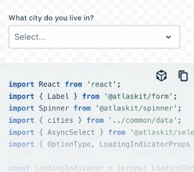&nbsp; &nbsp;

    
&nbsp;Ant Design &nbsp; &nbsp; &nbsp; &nbsp; &nbsp; &nbsp; &nbsp; &nbsp;
            &nbsp; &nbsp; &nbsp; &nbsp; &nbsp; &nbsp; &nbsp;Atlaskit &nbsp; &nbsp; &nbsp; &nbsp; &nbsp; &nbsp; &nbsp;
            &nbsp; &nbsp; &nbsp; &nbsp; &nbsp; &nbsp; &nbsp; &nbsp; &nbsp; &nbsp; &nbsp; &nbsp; &nbsp; &nbsp; &nbsp;
            &nbsp; &nbsp; &nbsp; LDS

    

    

    
Lion&nbsp;&nbsp;&nbsp;&nbsp;&nbsp;&nbsp;&nbsp;&nbsp;&nbsp;&nbsp;&nbsp;&nbsp;&nbsp;&nbsp;&nbsp;&nbsp;
    

    

    

    
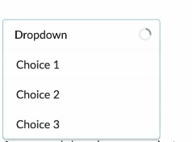

    
Semantic UI 

    

    

    
StartDust UI

    <h3 class="c30" id="h.h0v0jw7z47m3">No images (TBD)</h3>
    <ol class="c18 lst-kix_rky23vl0zrp-0 start" start="1">
        <li class="c30 c14 li-bullet-0">
            <h3 id="h.5a0rjsr0s4t6" style="display:inline"><a class="c3"
                        href="https://www.google.com/url?q=https://www.w3.org/TR/wai-aria-practices/%23intro&amp;sa=D&amp;source=editors&amp;ust=1698285950481922&amp;usg=AOvVaw3_yx5gowmdKiDTu8w-eEJA">WAI-ARIA</a>
            </h3>
        </li>
    </ol>
    

### Clearable

 
&nbsp;

    
&nbsp; &nbsp; &nbsp; &nbsp; &nbsp; &nbsp; &nbsp; &nbsp; &nbsp; &nbsp; &nbsp; &nbsp; &nbsp;
            &nbsp; &nbsp; &nbsp; &nbsp; &nbsp; &nbsp; &nbsp; 

    
&nbsp;Ant Design &nbsp; &nbsp; &nbsp; &nbsp; &nbsp; &nbsp; &nbsp; &nbsp;
            &nbsp; &nbsp; &nbsp; &nbsp; &nbsp; &nbsp; &nbsp; &nbsp; &nbsp; &nbsp; &nbsp; &nbsp; &nbsp; Atlaskit
    

    
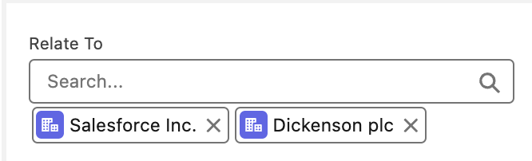

    
LDS

    

    
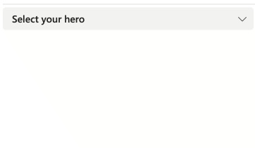&nbsp; &nbsp; &nbsp; 

    
Stardust
            UI&nbsp;&nbsp;&nbsp;&nbsp;&nbsp;&nbsp;&nbsp;&nbsp;&nbsp;&nbsp;&nbsp;&nbsp;&nbsp;&nbsp;&nbsp;&nbsp;&nbsp;&nbsp;&nbsp;&nbsp;&nbsp;&nbsp;&nbsp;&nbsp;&nbsp;&nbsp;&nbsp;&nbsp;&nbsp;&nbsp;&nbsp;&nbsp;&nbsp;&nbsp;&nbsp;&nbsp;&nbsp;&nbsp;&nbsp;&nbsp;&nbsp;&nbsp;&nbsp;&nbsp;&nbsp;&nbsp;&nbsp;&nbsp;&nbsp;&nbsp;&nbsp;&nbsp;&nbsp;&nbsp;&nbsp;&nbsp;Tailwind
            Elements

    

    

    <h3 class="c30" id="h.2duvk4aemg7q">No images (TBD)</h3>
    <ol class="c18 lst-kix_rky23vl0zrp-0" start="2">
        <li class="c30 c14 li-bullet-0">
            <h3 id="h.gs6xq7ig9yav" style="display:inline"><a class="c3"
                        href="https://www.google.com/url?q=https://www.w3.org/TR/wai-aria-practices/%23intro&amp;sa=D&amp;source=editors&amp;ust=1698285950483810&amp;usg=AOvVaw0kSnGg8QAqiXn2nSDs2fQZ">WAI-ARIA</a>
            </h3>
        </li>
    </ol>
    

### Multiple Selection

    
&nbsp; &nbsp; &nbsp; &nbsp; &nbsp; &nbsp;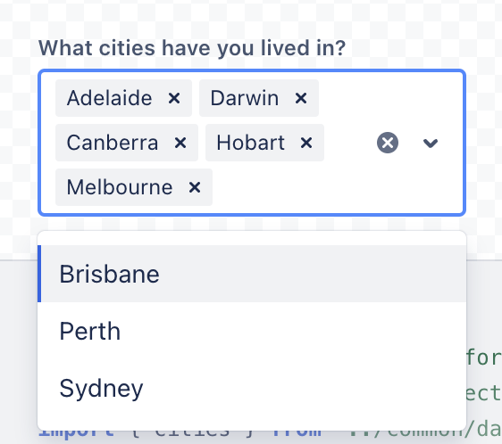&nbsp; &nbsp; &nbsp; &nbsp; &nbsp;

    
&nbsp; &nbsp; &nbsp; Ant Design &nbsp; &nbsp; &nbsp; &nbsp; &nbsp; &nbsp; &nbsp;
            &nbsp; &nbsp; &nbsp; &nbsp; &nbsp; &nbsp; &nbsp; &nbsp; &nbsp; &nbsp; Atlaskit &nbsp; &nbsp; &nbsp; &nbsp;
            &nbsp; &nbsp; &nbsp;
            &nbsp;&nbsp;&nbsp;&nbsp;&nbsp;&nbsp;&nbsp;&nbsp;&nbsp;&nbsp;&nbsp;&nbsp;&nbsp;&nbsp;&nbsp;&nbsp;&nbsp;
            &nbsp;Boosted

    

    

    
&nbsp; 

    
Boosted

    

    
&nbsp;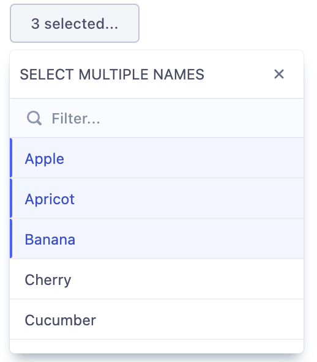&nbsp; &nbsp; &nbsp; &nbsp; 

    
Evergreen &nbsp; &nbsp; &nbsp; &nbsp; &nbsp; &nbsp; &nbsp; &nbsp; &nbsp;
            &nbsp; &nbsp; &nbsp; &nbsp; &nbsp; &nbsp; &nbsp; &nbsp; &nbsp; &nbsp; &nbsp; &nbsp; &nbsp; &nbsp;UI
            Fabric

    

    

    

    

    
&nbsp;

    
UI Fabric 

    

    
&nbsp;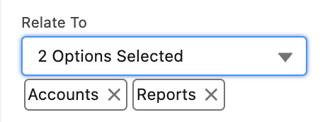

    

    

    
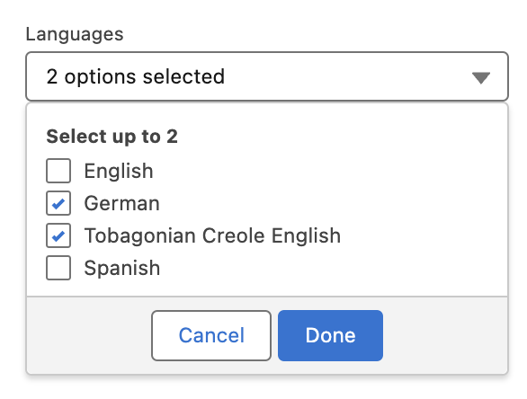

    
LDS

    

    
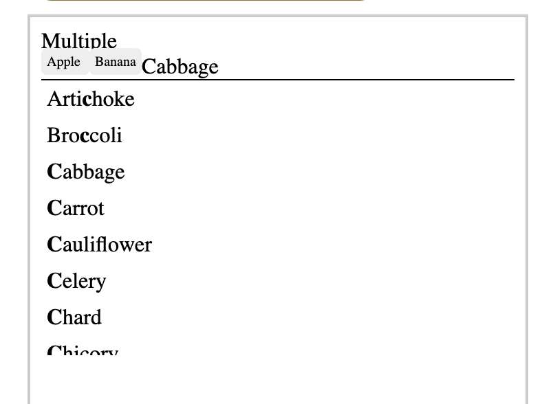

    
LION

    

    

    

    

    
Material UI

    

    
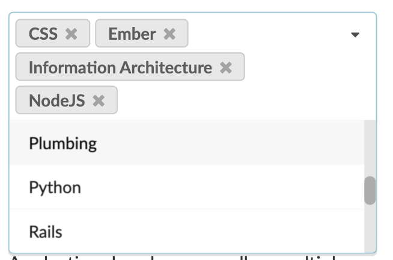

    
Semantic UI

    

    

    
Stardust
            UI&nbsp;&nbsp;&nbsp;&nbsp;&nbsp;&nbsp;&nbsp;&nbsp;&nbsp;&nbsp;&nbsp;&nbsp;&nbsp;&nbsp;&nbsp;&nbsp;&nbsp;&nbsp;&nbsp;&nbsp;&nbsp;&nbsp;&nbsp;&nbsp;&nbsp;&nbsp;&nbsp;&nbsp;&nbsp;&nbsp;&nbsp;&nbsp;Tailwind
            Elements

    <h3 class="c30" id="h.7kdht0avgoci">No images (TBD)</h3>
    <ol class="c18 lst-kix_rky23vl0zrp-0" start="3">
        <li class="c30 c14 li-bullet-0">
            <h3 id="h.83s7iamc4fww" style="display:inline"><a class="c3"
                        href="https://www.google.com/url?q=https://www.w3.org/TR/wai-aria-practices/%23intro&amp;sa=D&amp;source=editors&amp;ust=1698285950488983&amp;usg=AOvVaw0YYYQM0TArmTBI5-6yC_kq">WAI-ARIA</a>
            </h3>
        </li>
    </ol>
    

### Custom Title

    

    
Evergreen

    

### Custom Selection Render

    
&nbsp; &nbsp; &nbsp; &nbsp;

    
&nbsp; &nbsp;Ant Design &nbsp; &nbsp; &nbsp; &nbsp; &nbsp; &nbsp; &nbsp; &nbsp;
            &nbsp; &nbsp; &nbsp; &nbsp; &nbsp; &nbsp; &nbsp; &nbsp; &nbsp; &nbsp; &nbsp; &nbsp; &nbsp;Evergreen &nbsp;
            &nbsp; &nbsp; &nbsp; &nbsp; &nbsp; &nbsp; &nbsp; &nbsp; &nbsp; &nbsp; &nbsp; &nbsp; &nbsp; &nbsp; &nbsp;UI
            Fabric

    

    

    

    
LDS
            &nbsp;&nbsp;&nbsp;&nbsp;&nbsp;&nbsp;&nbsp;&nbsp;&nbsp;&nbsp;&nbsp;&nbsp;&nbsp;&nbsp;&nbsp;&nbsp;&nbsp;&nbsp;&nbsp;&nbsp;&nbsp;&nbsp;&nbsp;&nbsp;&nbsp;&nbsp;&nbsp;&nbsp;&nbsp;&nbsp;&nbsp;&nbsp;&nbsp;&nbsp;&nbsp;&nbsp;&nbsp;&nbsp;&nbsp;&nbsp;&nbsp;&nbsp;&nbsp;&nbsp;&nbsp;&nbsp;&nbsp;&nbsp;&nbsp;&nbsp;&nbsp;&nbsp;&nbsp;&nbsp;&nbsp;&nbsp;&nbsp;&nbsp;&nbsp;&nbsp;&nbsp;&nbsp;&nbsp;&nbsp;LION
    

    

    
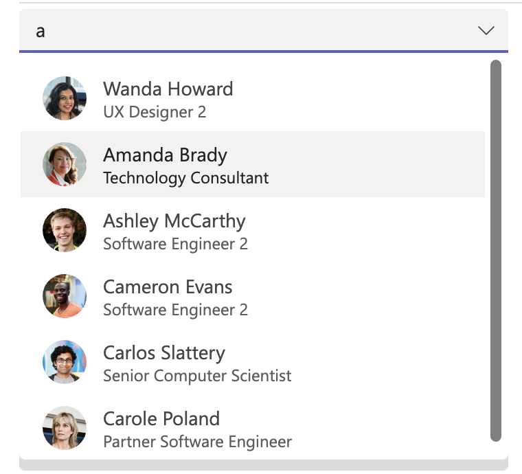

    
Semantic
            UI&nbsp;&nbsp;&nbsp;&nbsp;&nbsp;&nbsp;&nbsp;&nbsp;&nbsp;&nbsp;&nbsp;&nbsp;&nbsp;&nbsp;&nbsp;&nbsp;&nbsp;&nbsp;&nbsp;&nbsp;&nbsp;&nbsp;&nbsp;&nbsp;&nbsp;&nbsp;&nbsp;&nbsp;&nbsp;&nbsp;&nbsp;&nbsp;&nbsp;&nbsp;&nbsp;&nbsp;&nbsp;&nbsp;&nbsp;&nbsp;&nbsp;&nbsp;&nbsp;&nbsp;&nbsp;&nbsp;&nbsp;&nbsp;&nbsp;&nbsp;&nbsp;&nbsp;&nbsp;&nbsp;&nbsp;&nbsp;Stardust
            UI

    

    
&nbsp;

    
Tailwind Elements

    <h3 class="c30 c35" id="h.jilgggyvghwi"></h3>
    <h3 class="c30" id="h.9pjzhra497bg">No images (TBD)</h3>
    <ol class="c18 lst-kix_okb4bkct2qa-0 start" start="1">
        <li class="c6 c14 li-bullet-0">&nbsp;<a class="c3"
                    href="https://www.google.com/url?q=https://www.w3.org/TR/wai-aria-practices/%23intro&amp;sa=D&amp;source=editors&amp;ust=1698285950491931&amp;usg=AOvVaw1QY5zetry2cOf86XZSuEZr">WAI-ARIA</a>
        </li>
    </ol>
    

### Custom Tag Render

    

    
&nbsp; &nbsp; &nbsp; &nbsp; &nbsp; &nbsp; Ant Design

    <h3 class="c30" id="h.scy16i83xxft">No images (TBD)</h3>
    <ol class="c18 lst-kix_o5v0zloe0ek3-0 start" start="1">
        <li class="c6 c14 li-bullet-0">&nbsp;<a class="c3"
                    href="https://www.google.com/url?q=https://www.w3.org/TR/wai-aria-practices/%23intro&amp;sa=D&amp;source=editors&amp;ust=1698285950493156&amp;usg=AOvVaw0Gp4Orl7UrcaI78e6058cM">WAI-ARIA</a>
        </li>
    </ol>
    

    

### Custom Filter PlaceHolder and Icon

    
&nbsp; &nbsp; &nbsp; &nbsp; 

    
Evergreen
            &nbsp;&nbsp;&nbsp;&nbsp;&nbsp;&nbsp;&nbsp;&nbsp;&nbsp;&nbsp;&nbsp;&nbsp;&nbsp;&nbsp;&nbsp;&nbsp;&nbsp;&nbsp;&nbsp;&nbsp;&nbsp;&nbsp;&nbsp;&nbsp;Semantic
            UI

### Drop Down Indicator

&nbsp; &nbsp; &nbsp; &nbsp; &nbsp; &nbsp; &nbsp; &nbsp;

    
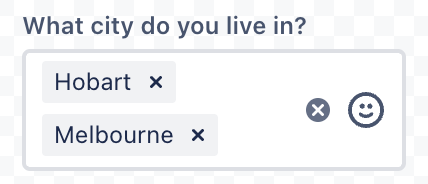 &nbsp;&nbsp;&nbsp;&nbsp;&nbsp;&nbsp;&nbsp;&nbsp;&nbsp;Atlaskit

    <h3 class="c30" id="h.kg3hsk49p42v">No images (TBD)</h3>
    <ol class="c18 lst-kix_uvo1i2pi2ue-0 start" start="1">
        <li class="c6 c14 li-bullet-0">&nbsp;<a class="c3"
                    href="https://www.google.com/url?q=https://www.w3.org/TR/wai-aria-practices/%23intro&amp;sa=D&amp;source=editors&amp;ust=1698285950494479&amp;usg=AOvVaw0tSpqAbF9QVtxXOEerfE_M">WAI-ARIA</a>
        </li>
        <li class="c6 c14 li-bullet-0">Ant Design</li>
        <li class="c6 c14 c7 li-bullet-0"></li>
    </ol>

### Hide Already Selected

    
&nbsp; &nbsp; &nbsp; &nbsp; &nbsp; &nbsp; &nbsp;Ant Design

    <h3 class="c30" id="h.4868w74u4buu">No images (TBD)</h3>
    <ol class="c18 lst-kix_vwfiln2fd3bf-0 start" start="1">
        <li class="c6 c14 li-bullet-0">&nbsp;<a class="c3"
                    href="https://www.google.com/url?q=https://www.w3.org/TR/wai-aria-practices/%23intro&amp;sa=D&amp;source=editors&amp;ust=1698285950495396&amp;usg=AOvVaw37eCVBPcBRrImAfDL1Gqf2">WAI-ARIA</a>
        </li>
    </ol>

### Max Count

    

    
Ant
            Design&nbsp;&nbsp;&nbsp;&nbsp;&nbsp;&nbsp;&nbsp;&nbsp;&nbsp;&nbsp;&nbsp;&nbsp;&nbsp;&nbsp;&nbsp;&nbsp;&nbsp;&nbsp;&nbsp;&nbsp;&nbsp;&nbsp;&nbsp;&nbsp;&nbsp;&nbsp;&nbsp;&nbsp;&nbsp;&nbsp;&nbsp;&nbsp;&nbsp;&nbsp;&nbsp;&nbsp;&nbsp;&nbsp;&nbsp;&nbsp;&nbsp;&nbsp;&nbsp;&nbsp;&nbsp;&nbsp;&nbsp;&nbsp;Semantic
            UI

    <h3 class="c30" id="h.6mw3pyw6u660">No images (TBD)</h3>
    <ol class="c18 lst-kix_wzfphyjr7zcr-0 start" start="1">
        <li class="c6 c14 li-bullet-0"><a class="c3"
                    href="https://www.google.com/url?q=https://www.w3.org/TR/wai-aria-practices/%23intro&amp;sa=D&amp;source=editors&amp;ust=1698285950496131&amp;usg=AOvVaw2Bbov_K2VDhPXTOEdYOiw3">WAI-ARIA</a>
        </li>
        <li class="c6 c14 c7 li-bullet-0"></li>
    </ol>
    

### Label Position

    
&nbsp; 

    
Boosted&nbsp;&nbsp;&nbsp;&nbsp;&nbsp;&nbsp;&nbsp;&nbsp;&nbsp;&nbsp;&nbsp;&nbsp;&nbsp;&nbsp;&nbsp;&nbsp;&nbsp;&nbsp;&nbsp;&nbsp;&nbsp;&nbsp;&nbsp;&nbsp;&nbsp;&nbsp;&nbsp;&nbsp;&nbsp;&nbsp;&nbsp;&nbsp;Spectrum
    

    

    <h3 class="c30" id="h.j59kwbbfa9t9">No images (TBD)</h3>
    <ol class="c18 lst-kix_z765k3nkgsk8-0 start" start="1">
        <li class="c6 c14 li-bullet-0">&nbsp;<a class="c3"
                    href="https://www.google.com/url?q=https://www.w3.org/TR/wai-aria-practices/%23intro&amp;sa=D&amp;source=editors&amp;ust=1698285950497287&amp;usg=AOvVaw1DQdW9YSGCsD7fJt7Qc1Fn">WAI-ARIA</a>&nbsp;
        </li>
    </ol>

### Required

    

    
Boosted&nbsp;&nbsp;&nbsp;&nbsp;&nbsp;&nbsp;&nbsp;&nbsp;&nbsp;&nbsp;&nbsp;&nbsp;&nbsp;&nbsp;&nbsp;&nbsp;&nbsp;&nbsp;&nbsp;&nbsp;&nbsp;&nbsp;&nbsp;&nbsp;&nbsp;&nbsp;&nbsp;&nbsp;&nbsp;&nbsp;&nbsp;&nbsp;&nbsp;&nbsp;&nbsp;&nbsp;&nbsp;&nbsp;&nbsp;&nbsp;&nbsp;&nbsp;&nbsp;&nbsp;&nbsp;&nbsp;&nbsp;&nbsp;Material
            UI

    

    
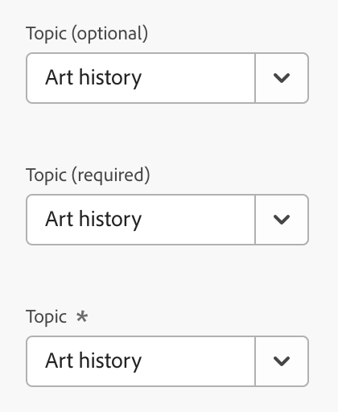

    
Spectrum

    <h3 class="c30" id="h.446er5j12587">No images (TBD)</h3>
    <ol class="c18 lst-kix_w2xmhupbtmsk-0 start" start="1">
        <li class="c6 c14 li-bullet-0">&nbsp;<a class="c3"
                    href="https://www.google.com/url?q=https://www.w3.org/TR/wai-aria-practices/%23intro&amp;sa=D&amp;source=editors&amp;ust=1698285950498209&amp;usg=AOvVaw1WTxd5q0Qz_weR9YbkHAyP">WAI-ARIA</a>&nbsp;
        </li>
    </ol>

### Disabled State

    
&nbsp; &nbsp;

    

    
&nbsp; &nbsp; &nbsp;&nbsp; &nbsp; &nbsp;

    
Ant Design &nbsp; &nbsp; &nbsp; &nbsp; &nbsp; &nbsp; &nbsp; &nbsp; &nbsp;
            &nbsp; &nbsp; &nbsp; &nbsp; &nbsp; &nbsp; Boosted &nbsp; &nbsp; &nbsp; &nbsp; &nbsp; &nbsp; &nbsp; &nbsp;
            &nbsp; &nbsp; UI Fabric

    

    
&nbsp; &nbsp; &nbsp; &nbsp; &nbsp; &nbsp; 

    
Fast&nbsp;&nbsp;&nbsp;&nbsp;&nbsp;&nbsp;&nbsp;&nbsp;&nbsp;&nbsp;&nbsp;&nbsp;&nbsp;&nbsp;&nbsp;&nbsp;&nbsp;&nbsp;&nbsp;&nbsp;&nbsp;&nbsp;&nbsp;&nbsp;&nbsp;&nbsp;&nbsp;&nbsp;&nbsp;&nbsp;&nbsp;&nbsp;&nbsp;&nbsp;&nbsp;&nbsp;&nbsp;&nbsp;&nbsp;&nbsp;Semantic
            UI

    

    
&nbsp; &nbsp; &nbsp;&nbsp; &nbsp; &nbsp; &nbsp; &nbsp; &nbsp; &nbsp; &nbsp; &nbsp; &nbsp;
            &nbsp;

    
Material
            UI&nbsp;&nbsp;&nbsp;&nbsp;&nbsp;&nbsp;&nbsp;&nbsp;&nbsp;&nbsp;&nbsp;&nbsp;&nbsp;&nbsp;&nbsp;&nbsp;&nbsp;&nbsp;&nbsp;&nbsp;&nbsp;&nbsp;&nbsp;&nbsp;Spectrum&nbsp;&nbsp;&nbsp;&nbsp;&nbsp;&nbsp;&nbsp;&nbsp;&nbsp;&nbsp;&nbsp;&nbsp;&nbsp;&nbsp;&nbsp;&nbsp;&nbsp;&nbsp;&nbsp;&nbsp;&nbsp;&nbsp;&nbsp;&nbsp;
    

    

    

    
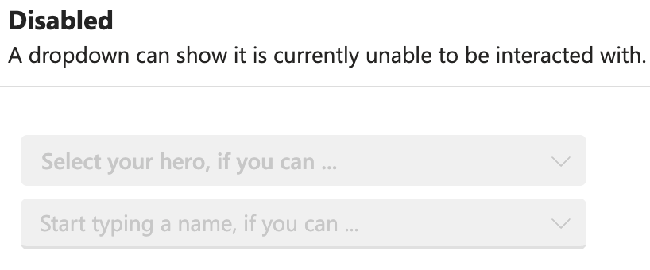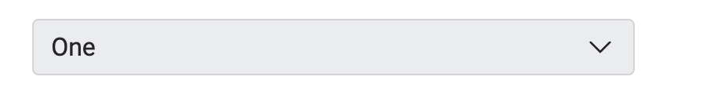

    
Stardust
            UI&nbsp;&nbsp;&nbsp;&nbsp;&nbsp;&nbsp;&nbsp;&nbsp;&nbsp;&nbsp;&nbsp;&nbsp;&nbsp;&nbsp;&nbsp;&nbsp;&nbsp;&nbsp;&nbsp;&nbsp;&nbsp;&nbsp;&nbsp;&nbsp;&nbsp;&nbsp;&nbsp;&nbsp;&nbsp;&nbsp;&nbsp;&nbsp;&nbsp;&nbsp;&nbsp;&nbsp;&nbsp;&nbsp;&nbsp;&nbsp;
            &nbsp;Tailwind Elements

    <h3 class="c30" id="h.jjj800xmh0p7">No images (TBD)</h3>
    <ol class="c18 lst-kix_z765k3nkgsk8-0" start="2">
        <li class="c6 c14 li-bullet-0">&nbsp;<a class="c3"
                    href="https://www.google.com/url?q=https://www.w3.org/TR/wai-aria-practices/%23intro&amp;sa=D&amp;source=editors&amp;ust=1698285950500213&amp;usg=AOvVaw39NaZVdbHAYXYKfPxhPJuK">WAI-ARIA</a>&nbsp;</li>
    </ol>
    

### Hover

### Error

  
&nbsp; 

    
&nbsp; &nbsp; &nbsp; &nbsp; &nbsp; &nbsp;&nbsp;&nbsp;&nbsp;&nbsp;&nbsp;&nbsp;&nbsp;&nbsp;

    

    
Ant Design &nbsp; &nbsp; &nbsp; &nbsp; &nbsp; &nbsp; Material
            UI&nbsp;&nbsp;&nbsp;&nbsp;&nbsp;&nbsp;&nbsp;&nbsp;&nbsp;&nbsp;&nbsp;&nbsp;&nbsp;&nbsp;&nbsp;&nbsp;&nbsp;&nbsp;&nbsp;&nbsp;&nbsp;&nbsp;&nbsp;&nbsp;Semantic
            UI

    

    

    

    
Spectrum

    <h3 class="c30" id="h.oq9uhsfe6rtk">No images (TBD)</h3>
    <ol class="c18 lst-kix_z765k3nkgsk8-0" start="3">
        <li class="c6 c14 li-bullet-0">&nbsp;<a class="c3"
                    href="https://www.google.com/url?q=https://www.w3.org/TR/wai-aria-practices/%23intro&amp;sa=D&amp;source=editors&amp;ust=1698285950502058&amp;usg=AOvVaw39ezXmZNkrSKVVJypP_zWc">WAI-ARIA</a>&nbsp;
        </li>
    </ol>
    

### Warning

&nbsp; 

    

    
Ant Design

    <h3 class="c30" id="h.mq528ccmhi7q">No images (TBD)</h3>
    <ol class="c18 lst-kix_xui7j32zqr0w-0 start" start="1">
        <li class="c6 c14 li-bullet-0">&nbsp;<a class="c3"
                    href="https://www.google.com/url?q=https://www.w3.org/TR/wai-aria-practices/%23intro&amp;sa=D&amp;source=editors&amp;ust=1698285950503336&amp;usg=AOvVaw0TrPvZK3ZpJV8f8alUpBzn">WAI-ARIA</a>&nbsp;
        </li>
    </ol>
    

  

### Internationalisation

    <h1 class="c57" id="h.1kpl7scyw2lm">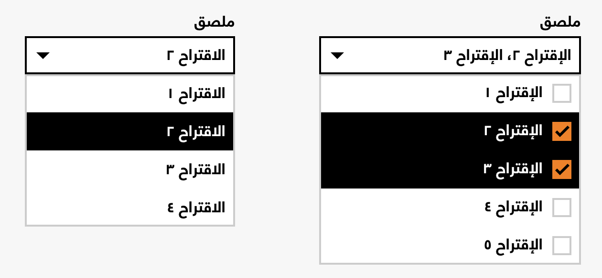</h1>
    
Boosted

    

    

    

    
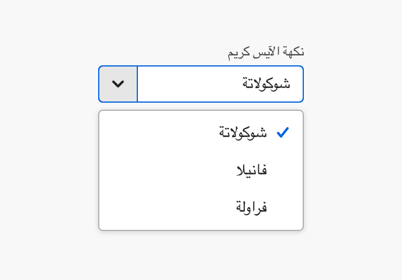

    
Spectrum

    <h3 class="c30" id="h.ml3uru4oqma9">No images (TBD)</h3>
    <ol class="c18 lst-kix_s032igudeh9z-0 start" start="1">
        <li class="c6 c14 li-bullet-0">&nbsp;WAI-ARIA&nbsp;</li>
        <li class="c6 c14 li-bullet-0">Ant Design</li>
        <li class="c6 c14 li-bullet-0">Atlaskit</li>
    </ol>

### Truncation

    
&nbsp;&nbsp;&nbsp;&nbsp;&nbsp;&nbsp;

    
Spectrum

    <h3 class="c30" id="h.3u23s6u641ii">No images (TBD)</h3>
    <ol class="c18 lst-kix_10ehaz5xohg6-0 start" start="1">
        <li class="c6 c14 li-bullet-0">&nbsp;WAI-ARIA </li>
        <li class="c6 c14 li-bullet-0">&nbsp;Ant Design</li>
        <li class="c6 c14 li-bullet-0">&nbsp;Atlaskit</li>
    </ol>

### [Search with sort](https://ant.design/components/select#select-demo-search-sort)

    

    

    
Ant Design

    

    

    <h3 class="c30" id="h.2w5kbcbljmo8">No images (TBD)<a href="#cmnt4"
                id="cmnt_ref4">[d]</a><a href="#cmnt5" id="cmnt_ref5">[e]</a></h3>
    <ol class="c18 lst-kix_cctmboerhyjk-0 start" start="1">
        <li class="c6 c14 li-bullet-0">&nbsp;<a class="c3"
                    href="https://www.google.com/url?q=https://www.w3.org/TR/wai-aria-practices/%23intro&amp;sa=D&amp;source=editors&amp;ust=1698285950506670&amp;usg=AOvVaw2UC4VQB14SoI7kAWwRehXJ">WAI-ARIA</a>&nbsp;</li>
    </ol>
    

### Picker Combobox

    
&nbsp;WARIA

    

