## Combobox Research
<table>
  <tr>
   <td><strong>Combobox</strong>
   </td>
   <td><strong>Select</strong>
   </td>
   <td><strong>Dropdown</strong>
   </td>
   <td><strong>N/A</strong>
   </td>
  </tr>
  <tr>
   <td><a href="https://www.w3.org/WAI/ARIA/apg/patterns/combobox/">WAI-ARIA</a>
   </td>
   <td><a href="https://ant.design/components/select">Ant Design</a>
   </td>
   <td><a href="https://system.design.orange.com/0c1af118d/p/910b9b-dropdown/b/04c480">Boosted</a>
   </td>
   <td rowspan="7" >Bootstrap

<a href="https://www.carbondesignsystem.com/">Carbon Design System</a>

<a href="https://www.chromium.org/">Chromium</a> <a href="https://www.goodbarber.com/uxdesign/">GoodBarber Design System</a> 

<a href="https://public-ui.github.io/">KoliBri</a> 

<a href="https://material.io/">Material Components Web</a> 

<a href="https://primer.style/">Primer Design System</a> 
   </td>
  </tr>
  <tr>
   <td><a href="https://evergreen.segment.com/components/combobox">Evergreen</a>
   </td>
   <td><a href="https://atlassian.design/components/select/examples">Atlaskit</a>
   </td>
   <td><a href="https://semantic-ui.com/modules/dropdown.html">Semantic UI</a>
   </td>
  </tr>
  <tr>
   <td><a href="https://react.fluentui.dev/?path=/docs/components-combobox--default">UI Fabric</a>
   </td>
   <td><a href="https://mui.com/material-ui/react-select/">Material UI</a>
   </td>
   <td><a href="https://fluentsite.z22.web.core.windows.net/0.66.2/components/dropdown/definition">Stardust UI</a>
   </td>
  </tr>
  <tr>
   <td><a href="https://explore.fast.design/components/fast-combobox">FAST</a>
   </td>
   <td><a href="https://tailwind-elements.com/docs/standard/forms/select/">Tailwind Elements</a>
   </td>
   <td>
   </td>
  </tr>
  <tr>
   <td><a href="https://www.lightningdesignsystem.com/components/combobox/#Base-Combobox">Lightning Design System</a>
   </td>
   <td>
   </td>
   <td>
   </td>
  </tr>
  <tr>
   <td><a href="https://lion-web.netlify.app/components/combobox/overview/">Lion</a>
   </td>
   <td>
   </td>
   <td>
   </td>
  </tr>
  <tr>
   <td><a href="https://spectrum.adobe.com/page/combo-box/">Spectrum</a>
   </td>
   <td>
   </td>
   <td>
   </td>
  </tr>
</table>

## Features of combobox

1. Base
2. Grouped options
3. Disabled options
4. Bordered-less 
5. Autocomplete (none, list , inline, both)
6. Loading
7. Select Clearable
8. Multiple Selection 
9. Clearall
10. Custom selection render
11. Custom Tag Render
12. Dropdown indicator
13. Hide Already Selected
14. Responsive maxTagCount
15. Disabled State
16. Readonly
17. Error
18. Internationalization
19. Search with sort
20. Picker Combobox

### Base

  
  &nbsp;&nbsp;&nbsp;&nbsp;&nbsp;
  
  &nbsp;&nbsp;&nbsp;&nbsp;&nbsp;
  

  &nbsp; &nbsp;&nbsp; &nbsp;&nbsp; &nbsp;&nbsp; &nbsp;
  WAI-ARIA
  &nbsp; &nbsp;&nbsp; &nbsp;&nbsp; &nbsp;&nbsp; &nbsp;
  &nbsp; &nbsp;&nbsp; &nbsp;&nbsp; &nbsp;&nbsp; &nbsp;
  Ant Design
  &nbsp; &nbsp;&nbsp; &nbsp;&nbsp; &nbsp;&nbsp; &nbsp;
  &nbsp; &nbsp;&nbsp; &nbsp;&nbsp; &nbsp;&nbsp; &nbsp;
  Atlaskit

  
  
  

<!-- Corresponding captions -->

  Boosted
  Evergreen
  UI Fabric

  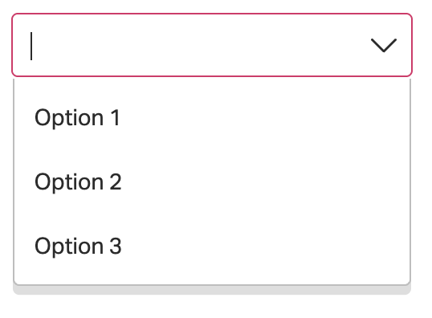
  
  

<!-- Corresponding captions -->

  FAST
  LDS
  LION

<!-- Extra blank line to signal transition to Markdown -->
&nbsp;

### Grouped options

<!-- Images and their captions -->

  
  
  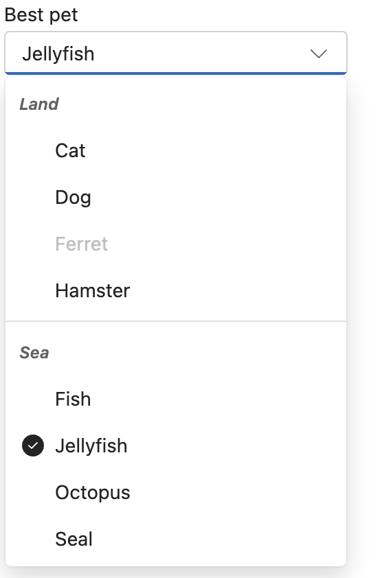

  Ant Design
  Atlaskit
  UI Fabric

<!-- Clear the float -->

<!-- More images and their captions -->

  
  
  

  LDS
  Material UI
  (ListSubheader/native &lt;optgroup&gt;)

<!-- Clear the float -->

<!-- Final image and caption -->

  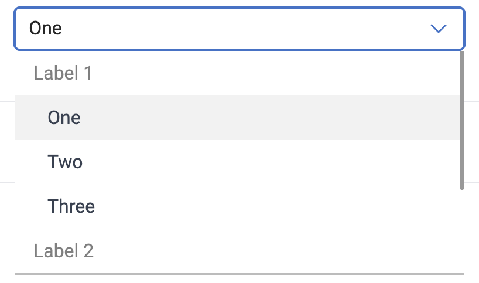

  Tailwind Elements

<!-- Clear the float -->

 **No images (TBD)**
 * WAI-ARIA

### Disabled Options
<!-- Images -->

  
  
  

<!-- Corresponding captions -->

  Boosted
  UI Fabric
  Semantic UI

<!-- Clear the float -->

<!-- Second image -->

  

<!-- Corresponding caption -->

  Tailwind Elements

<!-- Clear the float -->

### Bordered-less **(subtle)**

<!-- Images -->

  
  

<!-- Corresponding captions -->

  Ant Design
  Atlaskit

<!-- Clear the float -->

<!-- Images -->

  
  

<!-- Corresponding captions -->

  UI Fabric
  Semantic UI

<!-- Clear the float -->

<!-- Images -->

  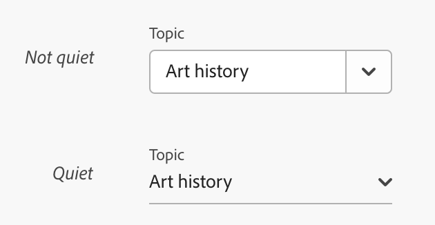

   

<!-- Corresponding caption -->

  Spectrum

<!-- Clear the float -->

<!-- No images section -->
**No images (TBD)**
 * WAI-ARIA

### Autocomplete (none, list , inline, both)

 **None**
    <!-- Images -->

  
  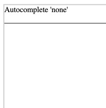

<!-- Corresponding captions -->

  <a href="https://www.google.com/url?q=https://www.w3.org/TR/wai-aria-practices/%23intro&amp;sa=D&amp;source=editors&amp;ust=1698285950473974&amp;usg=AOvVaw07J7YNv20Mq8ixKA7Dm65K">WAI-ARIA</a>
  LION

<!-- Clear the float -->

**List**
    <!-- First set of images -->

  
  

<!-- Corresponding caption -->

  WAI-ARIA
  Ant Design

<!-- Second set of images -->

  
  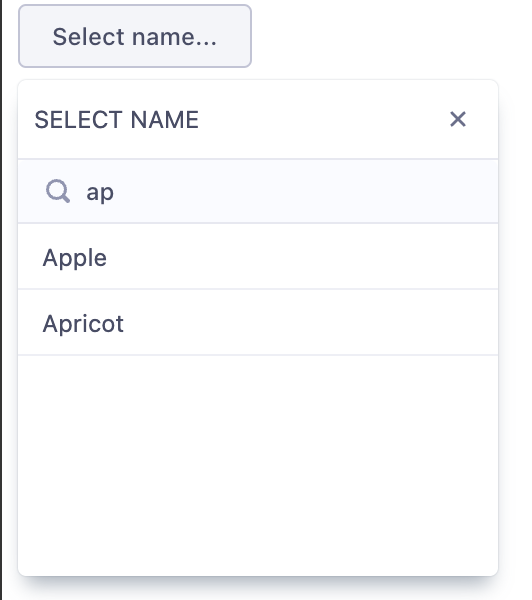

<!-- Corresponding caption -->

  Atlaskit
  Evergreen

<!-- Third set of images -->

  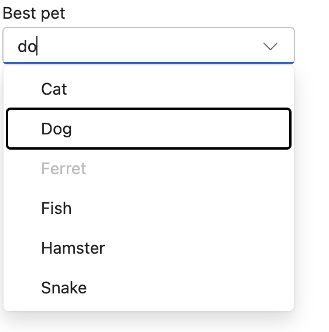
  
  

<!-- No corresponding captions provided for the third set -->

<!-- Fourth set of images -->

  

<!-- Corresponding caption -->

  UI Fabric

<!-- Fifth set of images -->

  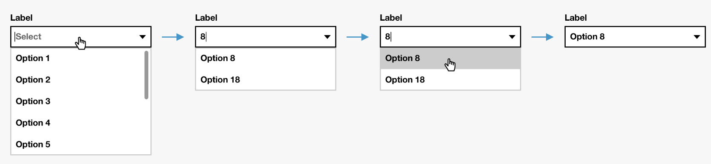

<!-- No corresponding captions provided for the fifth set -->

<!-- Sixth set of images -->

  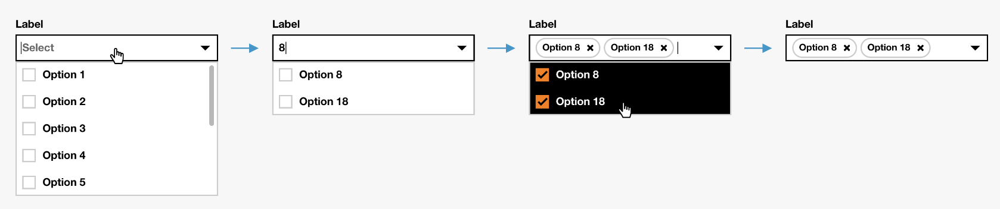

<!-- Corresponding caption -->

  Boosted

<!-- Seventh set of images -->

  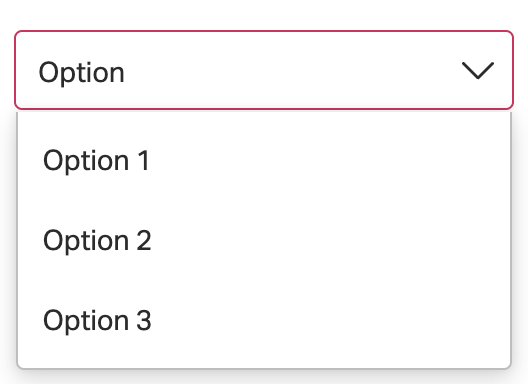
  

<!-- Corresponding caption -->

  FAST
  Semantic UI

<!-- Eighth set of images -->

  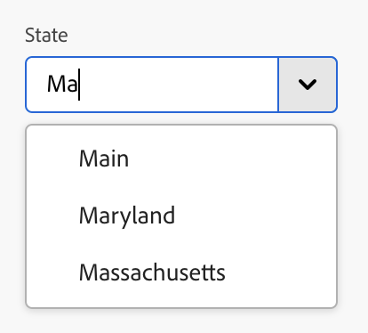
  

<!-- Corresponding caption -->

  Spectrum
  Tailwind Elements

<!-- Ninth set of images -->

  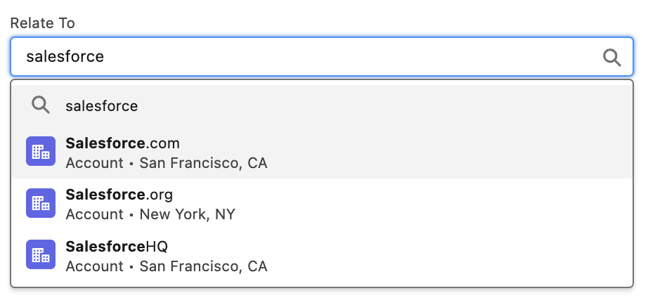
  

<!-- Corresponding caption -->

  LDS

<!-- Tenth set of images -->

  
  

  LION
   Stardust UI

<!-- No corresponding captions provided for the tenth set -->

  
  

**Inline**

  

  

<!-- Corresponding caption -->

  Fast

  LION

<!-- Second set of images -->

  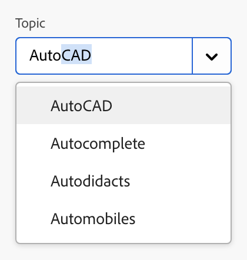

  

<!-- Corresponding caption -->

  Spectrum

  Stardust UI

**No images (TBD)**
 * WAI-ARIA

**Both**

  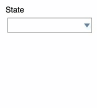

  

<!-- Corresponding caption -->

  WAI-ARIA

  Fabric

<!-- Second image -->

  

<!-- Corresponding caption for the second image -->

  LION

<!-- Placeholder for H1, no content available -->
<h1 id="h.majuqypwiy0d"></h1>

    

### Loading

<!-- First group of images -->

  
  
  

<!-- Corresponding captions -->

  Ant Design
  Atlaskit
  LDS

<!-- Second image -->

  

<!-- Corresponding caption -->

  Lion

<!-- Third group of images -->

  
  

<!-- Corresponding captions -->

  Semantic UI
   <!-- Placeholder for missing caption -->

<!-- Fourth image -->

  

<!-- Corresponding caption -->

  StartDust UI

**No images (TBD)**
 * WAI-ARIA

### Clearable

 <!-- First group of images -->

  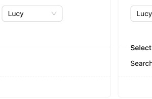
  

<!-- Second image -->

  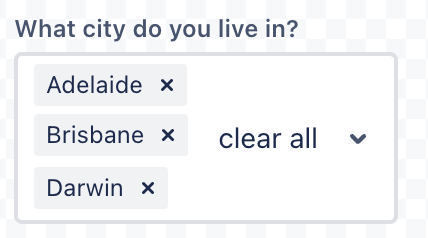

<!-- Corresponding captions -->

  Ant Design &nbsp; &nbsp; &nbsp; &nbsp; &nbsp; &nbsp; &nbsp; &nbsp; &nbsp; &nbsp; &nbsp; &nbsp; &nbsp; &nbsp; &nbsp; &nbsp; &nbsp; &nbsp; &nbsp; &nbsp; Atlaskit

<!-- Third group of images -->

  
  
  
  

<!-- Corresponding caption -->

  LDS

<!-- Fourth group of images -->

  
  

<!-- Corresponding captions -->

  Stardust UI&nbsp;&nbsp;&nbsp;&nbsp;&nbsp;&nbsp;&nbsp;&nbsp;&nbsp;&nbsp;&nbsp;&nbsp;&nbsp;&nbsp;&nbsp;&nbsp;&nbsp;&nbsp;&nbsp;&nbsp;&nbsp;&nbsp;&nbsp;&nbsp;&nbsp;&nbsp;&nbsp;&nbsp;&nbsp;&nbsp;&nbsp;&nbsp;&nbsp;&nbsp;&nbsp;&nbsp;&nbsp;&nbsp;&nbsp;&nbsp;&nbsp;&nbsp;&nbsp;&nbsp;&nbsp;&nbsp;&nbsp;&nbsp;&nbsp;&nbsp;&nbsp;&nbsp;&nbsp;&nbsp;&nbsp;&nbsp;Tailwind Elements

**No images (TBD)**
 * WAI-ARIA

### Multiple Selection

<!-- First set of images -->

    
    &nbsp; &nbsp; &nbsp; &nbsp; &nbsp; &nbsp;
    
    &nbsp; &nbsp; &nbsp; &nbsp; &nbsp;
    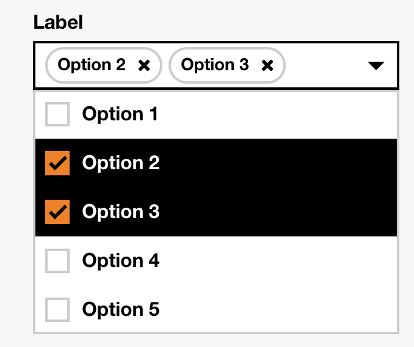

<!-- Corresponding caption -->

    Ant Design &nbsp; &nbsp; &nbsp; &nbsp; &nbsp; &nbsp; &nbsp;
        &nbsp; &nbsp; &nbsp; &nbsp; &nbsp; &nbsp; &nbsp; &nbsp; &nbsp; &nbsp; Atlaskit &nbsp; &nbsp; &nbsp; &nbsp;
        &nbsp; &nbsp; &nbsp;
        &nbsp;&nbsp;&nbsp;&nbsp;&nbsp;&nbsp;&nbsp;&nbsp;&nbsp;&nbsp;&nbsp;&nbsp;&nbsp;&nbsp;&nbsp;&nbsp;&nbsp;
        &nbsp;Boosted

<!-- Second set of images -->

    
    &nbsp; 

<!-- Corresponding caption -->

    Boosted

<!-- Third set of images -->

    
    &nbsp; &nbsp; &nbsp; &nbsp; 
    

<!-- Corresponding caption -->

    Evergreen &nbsp; &nbsp; &nbsp; &nbsp; &nbsp; &nbsp; &nbsp; &nbsp; &nbsp;
        &nbsp; &nbsp; &nbsp; &nbsp; &nbsp; &nbsp; &nbsp; &nbsp; &nbsp; &nbsp; &nbsp; &nbsp; &nbsp; &nbsp;UI
        Fabric

<!-- Fourth set of images -->

    
    &nbsp;
    
    

<!-- Corresponding caption -->

    UI Fabric 

<!-- Further sets of images and their captions follow the same structure. -->

<!-- ... -->

<!-- Final set of images -->

    
    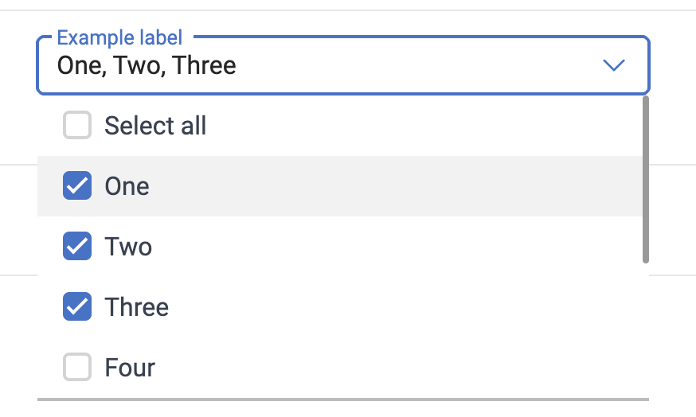

<!-- Corresponding caption -->

    Stardust UI&nbsp;&nbsp;&nbsp;&nbsp;&nbsp;&nbsp;&nbsp;&nbsp;&nbsp;&nbsp;&nbsp;&nbsp;&nbsp;&nbsp;&nbsp;&nbsp;&nbsp;&nbsp;&nbsp;&nbsp;&nbsp;&nbsp;&nbsp;&nbsp;&nbsp;&nbsp;&nbsp;&nbsp;&nbsp;&nbsp;&nbsp;&nbsp;Tailwind Elements

**No images (TBD)**
 * WAI-ARIA

### Custom Title

<!-- Single image with specified style -->

    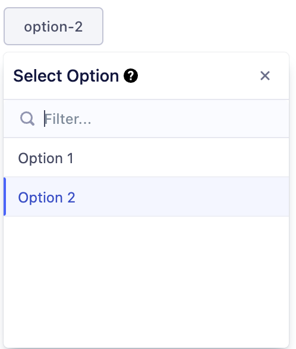

<!-- Corresponding caption -->

    Evergreen

### Custom Selection Render

<!-- First set of images -->

    
    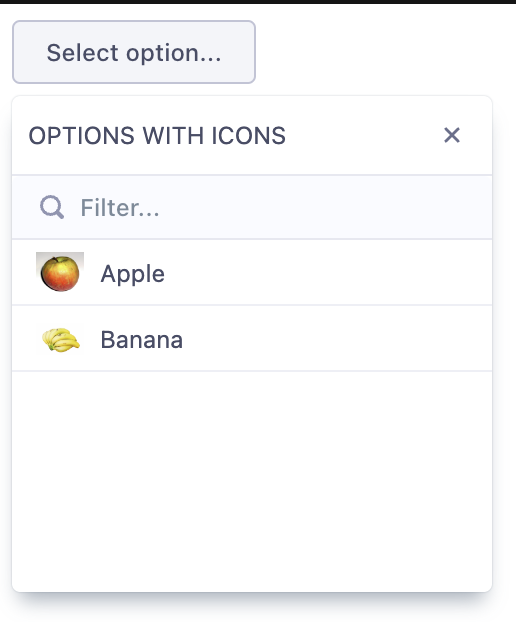
    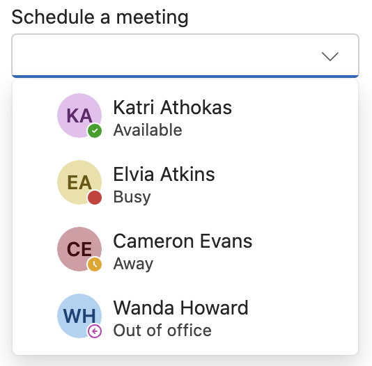

<!-- Corresponding captions -->

    Ant Design
    Evergreen
    UI Fabric

<!-- Second set of images -->

    
    

<!-- Corresponding captions -->

    LDS
    LION

<!-- Third set of images -->

    
    

<!-- Corresponding captions -->

    Semantic UI
    Stardust UI

<!-- Fourth set of images -->

    
    

<!-- Corresponding caption -->

    Tailwind Elements

**No images (TBD)**
 * WAI-ARIA

### Custom Tag Render

<!-- Single image -->

    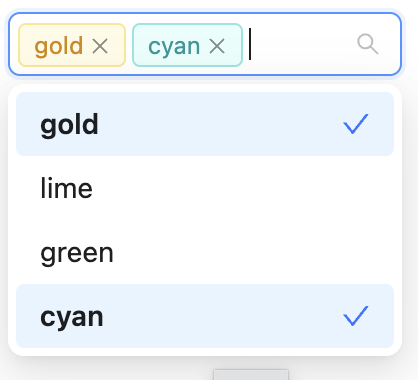

<!-- Corresponding caption -->

    Ant Design

**No images (TBD)**
 * WAI-ARIA

### Custom Filter PlaceHolder and Icon

<!-- Images -->

    
    

<!-- Corresponding captions -->

    Evergreen
    Semantic UI

### Drop Down Indicator

<!-- Images -->

    

<!-- Corresponding captions -->

    Atlaskit

**No images (TBD)**
 * WAI-ARIA
 * Ant Design
 * 

### Hide Already Selected

<!-- Images -->

    

<!-- Corresponding caption -->

    Ant Design

**No images (TBD)**
 * WAI-ARIA

### Max Count

<!-- Images -->

    
    

<!-- Corresponding captions -->

    Ant Design
    Semantic UI

**No images (TBD)**
 * WAI-ARIA

### Label Position

<!-- Images -->

    
    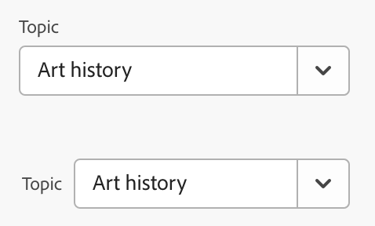

<!-- Corresponding captions -->

    Boosted
    Spectrum

**No images (TBD)**
 * WAI-ARIA

### Required

<!-- Images -->

    
    

<!-- Corresponding captions -->

    Boosted
    Material UI

<!-- More images -->

    

<!-- Corresponding caption -->

    Spectrum

**No images (TBD)**
 * WAI-ARIA

### Disabled State

<!-- First set of images -->

    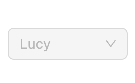
    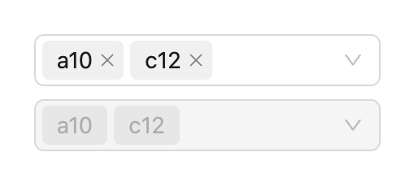
    
    

<!-- Captions for the first set of images -->

    Ant Design
    Boosted
    UI Fabric <!-- Adjusted for the scaled-down image -->
    Caption 4 <!-- Replace with actual caption -->

<!-- Second set of images -->

    
    

<!-- Captions for the second set of images -->

    Fast
    Semantic UI

<!-- Third set of images -->

    
    

<!-- Captions for the third set of images -->

    Material UI
    Spectrum

<!-- Fourth set of images -->

    
    

<!-- Captions for the fourth set of images -->

    Stardust UI
    Tailwind Elements

**No images (TBD)**
 * WAI-ARIA

    

### Hover

<!-- Single image -->

    

<!-- Corresponding caption -->

    Caption Here <!-- Replace with the actual caption -->

### Error

  <!-- Images -->

    
    
    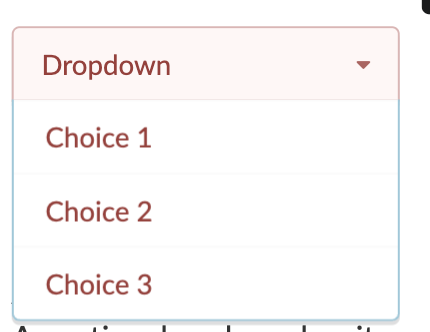

<!-- Corresponding captions -->

    Ant Design
    Material UI
    Semantic UI

<!-- Additional Image -->

    

<!-- Corresponding caption -->

    Spectrum

**No images (TBD)**
 * WAI-ARIA

### Warning

    
<!-- Image -->

    

<!-- Corresponding caption -->

    Ant Design

**No images (TBD)**
 * WAI-ARIA

  

### Internationalisation

<!-- First Image -->

    

<!-- Corresponding caption for the first image -->

    Boosted

<!-- Space between sets of image and caption -->

    &nbsp;

<!-- Second Image -->

    

<!-- Corresponding caption for the second image -->

    Spectrum

**No images (TBD)**
 * WAI-ARIA
 * Ant Design
 * Atlaskit

### Truncation

<!-- Image Section -->

    

<!-- Caption Section -->

    Spectrum

**No images (TBD)**
 * WAI-ARIA
 * Ant Design
 * Atlaskit

### [Search with sort](https://ant.design/components/select#select-demo-search-sort)

<!-- Image Section -->

    
    

<!-- Caption Section -->

    Ant Design

**No images (TBD)**
 * WAI-ARIA

### Picker Combobox

<!-- Image Section -->

    

<!-- Caption Section -->

    WARIA

