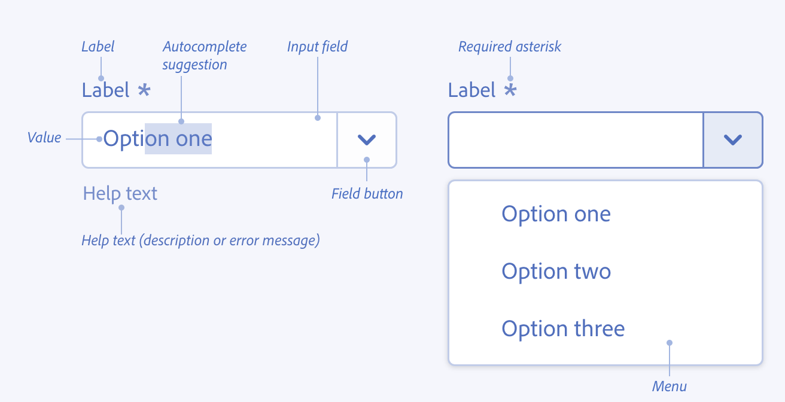
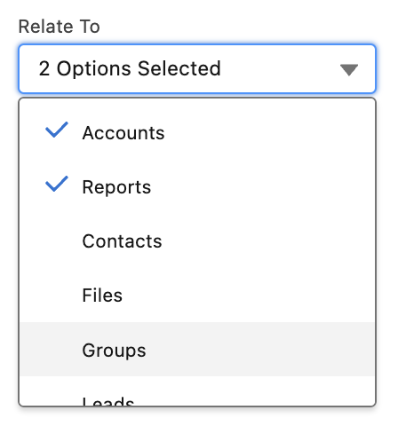

## NOTE: THIS DOCUMENT IS IN EARLY DRAFT AND UNDER HEAVY REVISION


## Combobox Explainer

Last Updated:


1. Background and scope of this document
2. Overview of Combo-box
3. Recommended anatomy for version 1
4. Introduction of the filter attribute
5. Introduction of the search attribute
6. Introduction of multiple attribute
7. Keyboard behavior
8. Other approaches considered
9. Open Questions
10. Research


### Background and scope of this document


#### Background

From the early days of the web, form controls have been pivotal in creating interactive and dynamic user experiences. Elements like `<input>`, `<button>`, and `<select>` were foundational, offering basic interactivity. As the web matured, so did the demands of web designers and developers. They sought more versatile and customizable controls to cater to a myriad of designs and functionalities.

The `<select>` element, for instance, while functional, lacks flexibility. It offers limited customization, which often leads developers to craft their own solutions. These custom implementations, while visually appealing, often come at the cost of performance, reliability, and most importantly, accessibility.

Recognizing these limitations, the [`<selectlist>`](https://open-ui.org/components/selectlist/) was introduced. This element builds on the foundation of the `<select>` but provides greater flexibility. The `<selectlist>` lets developers create a button-triggered dropdown with customizable appearance and behavior. Paired with `<listbox>`, and inclusive of `<option>` and `<optgroup>`, it offers a modern, adaptable, yet accessible web control.

Right now, many websites have their own type of **'combobox'**, but they're all a bit different. We often see a mix of `<input>` fields and `<datalist>` elements trying to do the job, but it's not quite perfect. By creating a standard **`<combobox>`**, we're aiming to simplify things. 

This proposal for `<combobox>` builds upon the strengths of `<selectlist>` and `<listbox>`. It aims to offer a control that is versatile for developers, intuitive for users, and, above all, accessible to all.

By standardizing such elements, we hope to bridge the gap between design demands and the need for performant, reliable, and accessible web controls. 


#### Scope of this document

This document aims to provide a complete view of combo-box utilisation across the web to inform a potential proposal within Open UI. The goal of this document is to propose a very basic anatomy to simplify the initial shipment of `<combobox>` (or some other name) in the web platform. It will heavily build upon `selectlist` but provide a better accessible and extensible solution than that of an `input` bound with `datalist`.


#### Out of scope of this document

This document will not be attempting some of the complex scenarios found across the web that leverage various ways in which to represent multi-selected options. Additionally, it does not intend to cover the addition of options that are not available in a `<listbox>`. It will not cover multi-select but will leverage the resolutions defined by `selectlist`.

A good analogy for what this document will result in looking like is the [Tabs research document.](https://open-ui.org/components/tabs.research.parts/)


### Recommended anatomy for version 1


#### Approach 1


```
<input type="text" list="browsers"  />
<datalist id="browsers">
	<option>firefox</option>
	<option>Chrome</option>
</datalist>
```


**Pros:**


* Native elements

**Cons:**


* You can't achieve multi-select with `<datalist>`:
* grouping options or adding icons next to options, the `<datalist>` approach falls short.
* Inconsistent Browser Support: While most modern browsers support `<datalist>`, the appearance and behavior can be inconsistent across different browsers.


#### Approach 2


```
<selectlist combobox>
  <input type=selectlist>
  <listbox>
	<option>One</option>
	<option>Two</option>
  </listbox>
</selectlist>
```


**Pros:**


* Leveraging the existing `<selectlist>`

**Cons:**


* Need to rely on an opt-in attribute(`combobox`) to modify the behavior of `<selectlist>`.


#### Approach 3 (Recommended)


```
<combobox>
   <input type=selectlist>
   <listbox>
	<option>One</option>
	<option>Two</option>
   </listbox>
</combobox>
```


**Pros:**


* Clear Semantics: The `<combobox>` element explicitly conveys its purpose.

**Cons:**


* Introducing new element, `<combobox>`


### Anatomy of `<combobox>`:


1. `<combobox>`: The root container that encapsulates the entire `combobox` structure. It provides context for the interaction between the `input` and the `listbox`.
   1. Slots:
      1. input
      2. listbox

   2. Attributes:
      1. **multiple**: Allows multiple options to be selected.
      2. **search**: Indicates the combobox will actively fetch results based on user input.
      3. **filter**: Indicates the combobox will narrow down visible options based on user input.
2. `<input type=selectlist>`: This is where the user can type input or view the selected option. It acts as the trigger to display the listbox.
   1. Slots:
      1. **placeholder** (optional): To display hint text when the input is empty.
      2. **selectedoption** (optional): To display the currently selected option from the `listbox`. ???
3. `<listbox>`: This container holds the selectable options. It's hidden by default and is displayed when the `<input type=selectlist>` is activated.
   1. Slots:
      1. option
      2. optgroup (optional)
4. `<option>`: Represents an individual selectable item within the `listbox`.
5. `<optgroup>` (Optional): A container to group related options together.
   1. Slots:
      1. **legend**: To label the group.
      2. **option**: The options within this group.
6. `<legend>` (Optional, within `<optgroup>`): Provides a label or title for a group of options within the `listbox`.


##### Default Behavior

Just like a regular dropdown, the <combobox> doesn't need much to get started. Here's how you can set it up with the basics:


```
<combobox>
  <option>Option 1</option>
  <option>Option 2</option>
  <option>Option 3</option>
</combobox>
```


When you use it like this, the combobox creates the parts you need: an input to drop down the list, a place showing your selected option, and the `listbox` itself.


##### Combobox with selectedoption/optgroup


```
<combobox>
    <input type="selectlist" placeholder="Select or type an item...">
    <selectedoption></selectedoption>
    <listbox>
        <option>Apple</option>
        <option>Banana</option>
        <!-- Group of options with a legend -->
        <optgroup>
            <legend>Citrus Fruits</legend>
            <option>Orange</option>
            <option>Lemon</option>
        </optgroup>
        <!-- Another group of options with a legend -->
        <optgroup>
            <legend>Berries</legend>
            <option>Strawberry</option>
            <option>Blueberry</option>
        </optgroup>
    </listbox>
</combobox>
```


### Introduction of the `filter` attribute

The introduction of the `filter` _bool_ attribute revolutionizes the way users interact with combobox elements. By narrowing down visible options based on real-time input.


```
<combobox filter>
    <input type="selectlist" placeholder="Type to filter...">
    <listbox>
        <option>Apple</option>
        <option>Apricot</option>
        <option>Banana</option>
        <!-- ... -->
    </listbox>
</combobox>
```


<center>

E.g: Type 'A' to quickly filter to 'Apple' and 'Apricot'.
</center>


### Introduction of the `search` attribute

The introduction of the `search` attribute support search with


* pattern
* startswith 
* Contains
* ..

The current behavior of `<selectlist>` is the _startswith_ value


```
<combobox search>
    <input type="selectlist" placeholder="Type to search...">
    <listbox>
       <option>Apple</option>
        <option>Apricot</option>
        <option>Banana</option>
        <!-- ... -->
    </listbox>
</combobox>
```


### Introduction of `multiple` attribute

TBD


### Keyboard Behavior

TBD : [https://www.w3.org/WAI/ARIA/apg/patterns/combobox/](https://www.w3.org/WAI/ARIA/apg/patterns/combobox/) 


### <span style="text-decoration:underline;">Combobox Research</span>


<table>
  <tr>
   <td><strong>Combobox</strong>
   </td>
   <td><strong>Select</strong>
   </td>
   <td><strong>Dropdown</strong>
   </td>
   <td><strong>N/A</strong>
   </td>
  </tr>
  <tr>
   <td><a href="https://www.w3.org/WAI/ARIA/apg/patterns/combobox/">WAI-ARIA</a>
   </td>
   <td><a href="https://ant.design/components/select">Ant Design</a>
   </td>
   <td><a href="https://system.design.orange.com/0c1af118d/p/910b9b-dropdown/b/04c480">Boosted</a>
   </td>
   <td rowspan="7" >Bootstrap
<p>
<a href="https://www.carbondesignsystem.com/">Carbon Design System</a>
<p>
<a href="https://www.chromium.org/">Chromium</a> <a href="https://www.goodbarber.com/uxdesign/">GoodBarber Design System</a> 
<p>
<a href="https://public-ui.github.io/">KoliBri</a> 
<p>
<a href="https://material.io/">Material Components Web</a> 
<p>
<a href="https://primer.style/">Primer Design System</a> 
   </td>
  </tr>
  <tr>
   <td><a href="https://evergreen.segment.com/components/combobox">Evergreen</a>
   </td>
   <td><a href="https://atlassian.design/components/select/examples">Atlaskit</a>
   </td>
   <td><a href="https://semantic-ui.com/modules/dropdown.html">Semantic UI</a>
   </td>
  </tr>
  <tr>
   <td><a href="https://react.fluentui.dev/?path=/docs/components-combobox--default">UI Fabric</a>
   </td>
   <td><a href="https://mui.com/material-ui/react-select/">Material UI</a>
   </td>
   <td><a href="https://fluentsite.z22.web.core.windows.net/0.66.2/components/dropdown/definition">Stardust UI</a>
   </td>
  </tr>
  <tr>
   <td><a href="https://explore.fast.design/components/fast-combobox">FAST</a>
   </td>
   <td><a href="https://tailwind-elements.com/docs/standard/forms/select/">Tailwind Elements</a>
   </td>
   <td>
   </td>
  </tr>
  <tr>
   <td><a href="https://www.lightningdesignsystem.com/components/combobox/#Base-Combobox">Lightning Design System</a>
   </td>
   <td>
   </td>
   <td>
   </td>
  </tr>
  <tr>
   <td><a href="https://lion-web.netlify.app/components/combobox/overview/">Lion</a>
   </td>
   <td>
   </td>
   <td>
   </td>
  </tr>
  <tr>
   <td><a href="https://spectrum.adobe.com/page/combo-box/">Spectrum</a>
   </td>
   <td>
   </td>
   <td>
   </td>
  </tr>
</table>


## Features of combobox


1. Base
2. Grouped options
3. Disabled options
4. Bordered-less 
5. Autocomplete (none, list , inline, both)
6. Loading
7. Select Clearable
8. Multiple Selection 
9. Clearall
10. Custom selection render
11. Custom Tag Render
12. Dropdown indicator
13. Hide Already Selected
14. Responsive maxTagCount
15. Disabled State
16. Readonly
17. Error
18. Internationalization
19. Search with sort
20. Picker Combobox


### Base
<p class="c6 c7"><span class="c9 c44 c55"></span></p>
    <p class="c6"><span
            style="overflow: hidden; display: inline-block; margin: 0.00px 0.00px; border: 0.00px solid #000000; transform: rotate(0.00rad) translateZ(0px); -webkit-transform: rotate(0.00rad) translateZ(0px); width: 141.50px; height: 302.71px;"></span><span>&nbsp; </span><span
            style="overflow: hidden; display: inline-block; margin: 0.00px 0.00px; border: 0.00px solid #000000; transform: rotate(0.00rad) translateZ(0px); -webkit-transform: rotate(0.00rad) translateZ(0px); width: 149.00px; height: 211.00px;"></span><span>&nbsp; &nbsp; &nbsp; </span><span
            style="overflow: hidden; display: inline-block; margin: 0.00px 0.00px; border: 0.00px solid #000000; transform: rotate(0.00rad) translateZ(0px); -webkit-transform: rotate(0.00rad) translateZ(0px); width: 197.49px; height: 212.89px;"></span><span class="c0">&nbsp; &nbsp; </span></p>
    <p class="c6 c7"><span class="c8"></span></p>
    <p class="c6"><span class="c9">&nbsp; &nbsp;</span><span class="c26 c9"><a class="c3"
                href="https://www.google.com/url?q=https://www.w3.org/TR/wai-aria-practices/%23intro&amp;sa=D&amp;source=editors&amp;ust=1698285950464406&amp;usg=AOvVaw3wt-5qt46M7uVOYHQhXSBg">WAI-ARIA</a></span><span
            class="c8">&nbsp; &nbsp; &nbsp; &nbsp; &nbsp; &nbsp; &nbsp; &nbsp; &nbsp; &nbsp; &nbsp; &nbsp; &nbsp;Ant
            Design &nbsp; &nbsp; &nbsp; &nbsp; &nbsp; &nbsp; &nbsp; &nbsp; &nbsp; &nbsp; &nbsp; &nbsp; &nbsp; &nbsp;
            &nbsp;Atlaskit &nbsp; &nbsp; &nbsp; &nbsp; </span></p>
    <p class="c6"><span class="c8">&nbsp; &nbsp; &nbsp; &nbsp; &nbsp; &nbsp; &nbsp; </span></p>
    <p class="c6"><span
            style="overflow: hidden; display: inline-block; margin: 0.00px 0.00px; border: 0.00px solid #000000; transform: rotate(0.00rad) translateZ(0px); -webkit-transform: rotate(0.00rad) translateZ(0px); width: 256.90px; height: 254.84px;"></span><span
            style="overflow: hidden; display: inline-block; margin: 0.00px 0.00px; border: 0.00px solid #000000; transform: rotate(0.00rad) translateZ(0px); -webkit-transform: rotate(0.00rad) translateZ(0px); width: 228.46px; height: 261.81px;"></span></p>
    <p class="c6 c17"><span class="c8">&nbsp;Boosted &nbsp; &nbsp; &nbsp; &nbsp; &nbsp; &nbsp; &nbsp; &nbsp; &nbsp;
            &nbsp; &nbsp; &nbsp; &nbsp; &nbsp; &nbsp; &nbsp; &nbsp; &nbsp; &nbsp; &nbsp; &nbsp; &nbsp; &nbsp;
            Evergreen</span></p>
    <p class="c6"><span
            style="overflow: hidden; display: inline-block; margin: 0.00px 0.00px; border: 0.00px solid #000000; transform: rotate(0.00rad) translateZ(0px); -webkit-transform: rotate(0.00rad) translateZ(0px); width: 214.50px; height: 231.40px;"></span><span>&nbsp; &nbsp; </span><span
            style="overflow: hidden; display: inline-block; margin: 0.00px 0.00px; border: 0.00px solid #000000; transform: rotate(0.00rad) translateZ(0px); -webkit-transform: rotate(0.00rad) translateZ(0px); width: 313.69px; height: 230.47px;"></span></p>
    <p class="c6 c17"><span class="c26"><a class="c3"
                href="https://www.google.com/url?q=https://developer.microsoft.com/en-us/fabric&amp;sa=D&amp;source=editors&amp;ust=1698285950465416&amp;usg=AOvVaw2r400p8x1HWWDtfxrsfSrB">UI
                Fabric</a></span><span>&nbsp; &nbsp; &nbsp; &nbsp; &nbsp; &nbsp; &nbsp; &nbsp; &nbsp; &nbsp; &nbsp;
            &nbsp; &nbsp; &nbsp; &nbsp; &nbsp; &nbsp; &nbsp; &nbsp; &nbsp; &nbsp; &nbsp; &nbsp; &nbsp; &nbsp;
        </span><span class="c9">&nbsp; &nbsp; &nbsp; &nbsp;FAST</span></p>
    <p class="c6"><span
            class="c8">&nbsp;&nbsp;&nbsp;&nbsp;&nbsp;&nbsp;&nbsp;&nbsp;&nbsp;&nbsp;&nbsp;&nbsp;&nbsp;&nbsp;&nbsp;&nbsp;</span>
    </p>
    <p class="c6"><span
            style="overflow: hidden; display: inline-block; margin: 0.00px 0.00px; border: 0.00px solid #000000; transform: rotate(0.00rad) translateZ(0px); -webkit-transform: rotate(0.00rad) translateZ(0px); width: 254.55px; height: 212.45px;"></span><span>&nbsp; &nbsp; &nbsp;</span><span
            style="overflow: hidden; display: inline-block; margin: 0.00px 0.00px; border: 0.00px solid #000000; transform: rotate(0.00rad) translateZ(0px); -webkit-transform: rotate(0.00rad) translateZ(0px); width: 182.00px; height: 203.00px;"></span></p>
    <p class="c6 c17 c42"><span class="c9">LDS
            &nbsp;&nbsp;&nbsp;&nbsp;&nbsp;&nbsp;&nbsp;&nbsp;&nbsp;&nbsp;&nbsp;&nbsp;&nbsp;&nbsp;&nbsp;&nbsp;&nbsp;&nbsp;&nbsp;&nbsp;&nbsp;&nbsp;&nbsp;&nbsp;&nbsp;
            &nbsp; &nbsp; &nbsp; &nbsp;
            &nbsp;&nbsp;&nbsp;&nbsp;&nbsp;&nbsp;&nbsp;&nbsp;&nbsp;&nbsp;&nbsp;&nbsp;&nbsp;&nbsp;&nbsp;&nbsp;&nbsp;
            &nbsp; &nbsp; LION</span></p>
    <p class="c6 c7"><span class="c8"></span></p>
    <p class="c6 c7"><span class="c8"></span></p>
    <p class="c6"><span
            style="overflow: hidden; display: inline-block; margin: 0.00px 0.00px; border: 0.00px solid #000000; transform: rotate(0.00rad) translateZ(0px); -webkit-transform: rotate(0.00rad) translateZ(0px); width: 273.70px; height: 216.25px;"></span><span>&nbsp; &nbsp; &nbsp; </span><span
            style="overflow: hidden; display: inline-block; margin: 0.00px 0.00px; border: 0.00px solid #000000; transform: rotate(0.00rad) translateZ(0px); -webkit-transform: rotate(0.00rad) translateZ(0px); width: 257.50px; height: 154.73px;"></span></p>
    <p class="c6 c7"><span class="c8"></span></p>
    <p class="c6 c17"><span class="c8">Material
            UI&nbsp;&nbsp;&nbsp;&nbsp;&nbsp;&nbsp;&nbsp;&nbsp;&nbsp;&nbsp;&nbsp;&nbsp;&nbsp;&nbsp;&nbsp;&nbsp;&nbsp;&nbsp;&nbsp;&nbsp;&nbsp;&nbsp;&nbsp;&nbsp;&nbsp;&nbsp;&nbsp;&nbsp;&nbsp;&nbsp;&nbsp;&nbsp;&nbsp;&nbsp;&nbsp;&nbsp;&nbsp;&nbsp;&nbsp;&nbsp;&nbsp;&nbsp;&nbsp;&nbsp;&nbsp;&nbsp;&nbsp;&nbsp;Semantic
            UI</span></p>
    <p class="c6 c7"><span class="c8"></span></p>
    <p class="c6 c7"><span class="c8"></span></p>
    <p class="c6 c7"><span class="c8"></span></p>
    <p class="c6 c7"><span class="c8"></span></p>
    <p class="c6 c7"><span class="c8"></span></p>
    <p class="c6"><span class="c8">Spectrum</span></p>
    <p class="c6"><span
            style="overflow: hidden; display: inline-block; margin: 0.00px 0.00px; border: 0.00px solid #000000; transform: rotate(0.00rad) translateZ(0px); -webkit-transform: rotate(0.00rad) translateZ(0px); width: 601.70px; height: 308.00px;"></span></p>
    <p class="c6">
    <span
            style="overflow: hidden; display: inline-block; margin: 0.00px 0.00px; border: 0.00px solid #000000; translateZ(0px); width: 250.00px; height: 289.16px;">&nbsp; &nbsp; &nbsp; &nbsp; &nbsp; &nbsp;</span><span>&nbsp; &nbsp; &nbsp; &nbsp; &nbsp; &nbsp; &nbsp;</span><span
            style="overflow: hidden; display: inline-block; margin: 0.00px 0.00px; border: 0.00px solid #000000; transform: rotate(0.00rad) translateZ(0px); -webkit-transform: rotate(0.00rad) translateZ(0px); width: 228.50px; height: 270.63px;">&nbsp; &nbsp; &nbsp; &nbsp; &nbsp; &nbsp;&nbsp; &nbsp; &nbsp;</span></p>
    <p class="c6"><span>&nbsp;&nbsp;&nbsp;&nbsp;&nbsp;&nbsp;&nbsp;&nbsp;</span><span class="c8">Immediate popover
            launch# &nbsp; &nbsp; &nbsp; &nbsp; &nbsp; &nbsp; &nbsp; &nbsp; Delayed popover launch#</span></p>
    <p class="c6"><span
            style="overflow: hidden; display: inline-block; margin: 0.00px 0.00px; border: 0.00px solid #000000; transform: rotate(0.00rad) translateZ(0px); -webkit-transform: rotate(0.00rad) translateZ(0px); width: 267.37px; height: 240.24px;"></span><span
            style="overflow: hidden; display: inline-block; margin: 0.00px 0.00px; border: 0.00px solid #000000; transform: rotate(0.00rad) translateZ(0px); -webkit-transform: rotate(0.00rad) translateZ(0px); width: 303.33px; height: 175.86px;"></span></p>
    <p class="c6 c17"><span
            class="c9">StartDust&nbsp;&nbsp;&nbsp;&nbsp;&nbsp;&nbsp;&nbsp;&nbsp;&nbsp;&nbsp;&nbsp;&nbsp;&nbsp;&nbsp;&nbsp;&nbsp;&nbsp;&nbsp;&nbsp;&nbsp;&nbsp;&nbsp;&nbsp;&nbsp;&nbsp;&nbsp;&nbsp;&nbsp;&nbsp;&nbsp;&nbsp;&nbsp;&nbsp;&nbsp;&nbsp;&nbsp;&nbsp;&nbsp;&nbsp;&nbsp;&nbsp;&nbsp;&nbsp;&nbsp;&nbsp;&nbsp;&nbsp;&nbsp;Tailwind</span>
    </p>
    <p class="c6 c7"><span class="c0"></span></p>
    

### Grouped options

<p class="c6"><span
            style="overflow: hidden; display: inline-block; margin: 0.00px 0.00px; border: 0.00px solid #000000; transform: rotate(0.00rad) translateZ(0px); -webkit-transform: rotate(0.00rad) translateZ(0px); width: 229.93px; height: 243.50px;"></span><span>&nbsp; </span><span
            style="overflow: hidden; display: inline-block; margin: 0.00px 0.00px; border: 0.00px solid #000000; transform: rotate(0.00rad) translateZ(0px); -webkit-transform: rotate(0.00rad) translateZ(0px); width: 162.57px; height: 249.50px;"></span><span>&nbsp; &nbsp; &nbsp; </span><span
            style="overflow: hidden; display: inline-block; margin: 0.00px 0.00px; border: 0.00px solid #000000; transform: rotate(0.00rad) translateZ(0px); -webkit-transform: rotate(0.00rad) translateZ(0px); width: 161.05px; height: 244.50px;"></span></p>
    <p class="c6 c17"><span class="c8">Ant Design &nbsp; &nbsp; &nbsp; &nbsp; &nbsp; &nbsp; &nbsp; &nbsp; &nbsp; &nbsp;
            &nbsp; &nbsp; &nbsp; &nbsp; &nbsp; &nbsp; &nbsp; &nbsp;Atlaskit &nbsp; &nbsp; &nbsp; &nbsp; &nbsp; &nbsp;
            &nbsp; &nbsp; &nbsp; &nbsp; &nbsp; &nbsp; &nbsp; &nbsp; &nbsp; &nbsp;UI Fabric</span></p>
    <p class="c6"><span
            style="overflow: hidden; display: inline-block; margin: 0.00px 0.00px; border: 0.00px solid #000000; transform: rotate(0.00rad) translateZ(0px); -webkit-transform: rotate(0.00rad) translateZ(0px); width: 193.59px; height: 223.64px;"></span><span>&nbsp; &nbsp; &nbsp; </span><span
            style="overflow: hidden; display: inline-block; margin: 0.00px 0.00px; border: 0.00px solid #000000; transform: rotate(0.00rad) translateZ(0px); -webkit-transform: rotate(0.00rad) translateZ(0px); width: 132.84px; height: 312.25px;"></span><span
            style="overflow: hidden; display: inline-block; margin: 0.00px 0.00px; border: 0.00px solid #000000; transform: rotate(0.00rad) translateZ(0px); -webkit-transform: rotate(0.00rad) translateZ(0px); width: 153.59px; height: 236.61px;"></span></p>
    <p class="c6 c42"><span
            class="c9">LDS&nbsp;&nbsp;&nbsp;&nbsp;&nbsp;&nbsp;&nbsp;&nbsp;&nbsp;&nbsp;&nbsp;&nbsp;&nbsp;&nbsp;&nbsp;&nbsp;&nbsp;&nbsp;&nbsp;&nbsp;&nbsp;&nbsp;&nbsp;&nbsp;
            &nbsp; &nbsp; &nbsp; &nbsp;Material UI</span><span class="c53 c62">( </span><span
            class="c44 c53">ListSubheader/native &lt;optgroup&gt;</span><span class="c53 c62">)</span></p>
    <p class="c6"><span
            style="overflow: hidden; display: inline-block; margin: 0.00px 0.00px; border: 0.00px solid #000000; transform: rotate(0.00rad) translateZ(0px); -webkit-transform: rotate(0.00rad) translateZ(0px); width: 265.21px; height: 156.36px;"></span></p>
    <p class="c6 c17"><span class="c8">Tailwind Elements</span></p>
    <h3 class="c30" id="h.ujvw0qd1qaw4"><span class="c1">No images (TBD)</span></h3>
    <ol class="c18 lst-kix_rtf2wnkr5att-0 start" start="1">
        <li class="c6 c14 li-bullet-0"><span>&nbsp;</span><span class="c26"><a class="c3"
                    href="https://www.google.com/url?q=https://www.w3.org/TR/wai-aria-practices/%23intro&amp;sa=D&amp;source=editors&amp;ust=1698285950469334&amp;usg=AOvVaw1KqHn-EaWk4XGlXRpB5ZNV">WAI-ARIA</a></span><span
                class="c0">&nbsp;</span></li>
    </ol>
    <p class="c6 c7"><span class="c0"></span></p>

### Disabled Options
<p class="c6"><span
            style="overflow: hidden; display: inline-block; margin: 0.00px 0.00px; border: 0.00px solid #000000; transform: rotate(0.00rad) translateZ(0px); -webkit-transform: rotate(0.00rad) translateZ(0px); width: 140.00px; height: 323.00px;"></span><span>&nbsp; &nbsp; &nbsp; &nbsp;</span><span
            style="overflow: hidden; display: inline-block; margin: 0.00px 0.00px; border: 0.00px solid #000000; transform: rotate(0.00rad) translateZ(0px); -webkit-transform: rotate(0.00rad) translateZ(0px); width: 149.33px; height: 150.03px;"></span><span
            style="overflow: hidden; display: inline-block; margin: 0.00px 0.00px; border: 0.00px solid #000000; transform: rotate(0.00rad) translateZ(0px); -webkit-transform: rotate(0.00rad) translateZ(0px); width: 254.00px; height: 288.00px;"></span></p>
    <p class="c6 c17"><span class="c8">&nbsp;Boosted &nbsp; &nbsp; &nbsp; &nbsp; &nbsp; &nbsp; &nbsp; &nbsp; &nbsp;
            &nbsp; &nbsp; &nbsp; &nbsp;UI Fabric
            &nbsp;&nbsp;&nbsp;&nbsp;&nbsp;&nbsp;&nbsp;&nbsp;&nbsp;&nbsp;&nbsp;&nbsp;&nbsp;&nbsp;&nbsp;&nbsp;&nbsp;&nbsp;&nbsp;&nbsp;&nbsp;&nbsp;&nbsp;&nbsp;Semantic
            UI</span></p>
    <p class="c6 c17 c7"><span class="c8"></span></p>
    <p class="c6"><span
            style="overflow: hidden; display: inline-block; margin: 0.00px 0.00px; border: 0.00px solid #000000; transform: rotate(0.00rad) translateZ(0px); -webkit-transform: rotate(0.00rad) translateZ(0px); width: 274.69px; height: 159.72px;"></span></p>
    <p class="c6 c17"><span class="c8">Tailwind Elements</span></p>


### Bordered-less **(subtle)**

<p class="c6 c7"><span class="c8"></span></p>
    <p class="c6"><span
            style="overflow: hidden; display: inline-block; margin: 0.00px 0.00px; border: 0.00px solid #000000; transform: rotate(0.00rad) translateZ(0px); -webkit-transform: rotate(0.00rad) translateZ(0px); width: 288.50px; height: 186.10px;"></span><span>&nbsp; </span><span
            style="overflow: hidden; display: inline-block; margin: 0.00px 0.00px; border: 0.00px solid #000000; transform: rotate(0.00rad) translateZ(0px); -webkit-transform: rotate(0.00rad) translateZ(0px); width: 222.04px; height: 170.40px;"></span></p>
    <p class="c6 c17"><span class="c9">Ant Design &nbsp; &nbsp; &nbsp; &nbsp; &nbsp; &nbsp; &nbsp; &nbsp; &nbsp; &nbsp;
            &nbsp; &nbsp; &nbsp; &nbsp; &nbsp; &nbsp; &nbsp; &nbsp; &nbsp; &nbsp; &nbsp; &nbsp; &nbsp; &nbsp; &nbsp;
            &nbsp; &nbsp; &nbsp; &nbsp;Atlaskit</span></p>
    <p class="c6 c7"><span class="c0"></span></p>
    <p class="c6"><span
            class="c8">&nbsp;&nbsp;&nbsp;&nbsp;&nbsp;&nbsp;&nbsp;&nbsp;&nbsp;&nbsp;&nbsp;&nbsp;&nbsp;&nbsp;&nbsp;&nbsp;&nbsp;&nbsp;&nbsp;&nbsp;&nbsp;&nbsp;&nbsp;&nbsp;</span>
    </p>
    <p class="c6 c7"><span class="c8"></span></p>
    <p class="c6"><span
            style="overflow: hidden; display: inline-block; margin: 0.00px 0.00px; border: 0.00px solid #000000; transform: rotate(0.00rad) translateZ(0px); -webkit-transform: rotate(0.00rad) translateZ(0px); width: 257.00px; height: 147.00px;"></span><span class="c9">&nbsp; &nbsp;&nbsp;&nbsp;&nbsp;&nbsp;&nbsp;&nbsp;&nbsp;&nbsp; &nbsp;
            &nbsp; &nbsp; &nbsp;</span><span
            style="overflow: hidden; display: inline-block; margin: 0.00px 0.00px; border: 0.00px solid #000000; transform: rotate(0.00rad) translateZ(0px); -webkit-transform: rotate(0.00rad) translateZ(0px); width: 129.75px; height: 187.50px;"></span><span class="c8">&nbsp; &nbsp; &nbsp; &nbsp; </span></p>
    <p class="c6 c17"><span class="c8">UI
            Fabric&nbsp;&nbsp;&nbsp;&nbsp;&nbsp;&nbsp;&nbsp;&nbsp;&nbsp;&nbsp;&nbsp;&nbsp;&nbsp;&nbsp;&nbsp;&nbsp;&nbsp;&nbsp;&nbsp;&nbsp;&nbsp;&nbsp;&nbsp;&nbsp;&nbsp;&nbsp;&nbsp;&nbsp;&nbsp;&nbsp;&nbsp;&nbsp;&nbsp;&nbsp;&nbsp;&nbsp;&nbsp;&nbsp;&nbsp;&nbsp;Semantic
            UI </span></p>
    <p class="c6 c7"><span class="c8"></span></p>
    <p class="c6"><span
            style="overflow: hidden; display: inline-block; margin: 0.00px 0.00px; border: 0.00px solid #000000; transform: rotate(0.00rad) translateZ(0px); -webkit-transform: rotate(0.00rad) translateZ(0px); width: 275.50px; height: 143.30px;"></span></p>
    <p class="c6 c17"><span
            class="c8">Spectrum&nbsp;&nbsp;&nbsp;&nbsp;&nbsp;&nbsp;&nbsp;&nbsp;&nbsp;&nbsp;&nbsp;&nbsp;&nbsp;&nbsp;&nbsp;&nbsp;&nbsp;&nbsp;&nbsp;&nbsp;&nbsp;&nbsp;&nbsp;&nbsp;&nbsp;&nbsp;&nbsp;&nbsp;&nbsp;&nbsp;&nbsp;&nbsp;&nbsp;&nbsp;&nbsp;&nbsp;&nbsp;&nbsp;&nbsp;&nbsp;&nbsp;&nbsp;&nbsp;&nbsp;&nbsp;&nbsp;&nbsp;&nbsp;</span>
    </p>
    <p class="c6 c17 c7"><span class="c8"></span></p>
    <h3 class="c30" id="h.a83o186ta7x0"><span class="c1">No images(TBD)</span></h3>
    <ol class="c18 lst-kix_eezqa8imrs8w-0 start" start="1">
        <li class="c6 c14 li-bullet-0"><span>&nbsp;</span><span class="c22 c9"><a class="c3"
                    href="https://www.google.com/url?q=https://www.w3.org/TR/wai-aria-practices/%23intro&amp;sa=D&amp;source=editors&amp;ust=1698285950472949&amp;usg=AOvVaw026Z4c_OSYgzU4GnUzww7A">WAI-ARIA</a></span>
        </li>
    </ol>

### Autocomplete (none, list , inline, both)
<h3 class="c30" id="h.fih7pfns3ph"><span>None</span></h3>
    <p class="c6"><span
            style="overflow: hidden; display: inline-block; margin: 0.00px 0.00px; border: 0.00px solid #000000; transform: rotate(0.00rad) translateZ(0px); -webkit-transform: rotate(0.00rad) translateZ(0px); width: 206.00px; height: 343.00px;"></span><span>&nbsp; &nbsp; &nbsp; &nbsp; &nbsp; &nbsp; &nbsp; &nbsp;</span><span
            style="overflow: hidden; display: inline-block; margin: 0.00px 0.00px; border: 0.00px solid #000000; transform: rotate(0.00rad) translateZ(0px); -webkit-transform: rotate(0.00rad) translateZ(0px); width: 219.00px; height: 223.00px;"></span></p>
    <p class="c6"><span class="c9">&nbsp;</span><span class="c26 c9"><a class="c3"
                href="https://www.google.com/url?q=https://www.w3.org/TR/wai-aria-practices/%23intro&amp;sa=D&amp;source=editors&amp;ust=1698285950473974&amp;usg=AOvVaw07J7YNv20Mq8ixKA7Dm65K">WAI-ARIA</a></span><span
            class="c8">&nbsp;&nbsp;&nbsp;&nbsp;&nbsp;&nbsp;&nbsp;&nbsp;&nbsp;&nbsp;&nbsp;&nbsp;&nbsp;&nbsp;&nbsp;&nbsp;&nbsp;&nbsp;&nbsp;&nbsp;&nbsp;&nbsp;&nbsp;&nbsp;&nbsp;&nbsp;&nbsp;&nbsp;&nbsp;&nbsp;&nbsp;&nbsp;&nbsp;&nbsp;&nbsp;&nbsp;&nbsp;&nbsp;&nbsp;&nbsp;&nbsp;&nbsp;&nbsp;&nbsp;&nbsp;&nbsp;&nbsp;&nbsp;&nbsp;LION</span>
    </p>
    <p class="c6 c7"><span class="c0"></span></p>
    <h3 class="c30" id="h.khzriav83bqt"><span class="c1">List</span></h3>
    <p class="c6 c7"><span class="c0"></span></p>
    <p class="c6"><span
            style="overflow: hidden; display: inline-block; margin: 0.00px 0.00px; border: 0.00px solid #000000; transform: rotate(0.00rad) translateZ(0px); -webkit-transform: rotate(0.00rad) translateZ(0px); width: 210.00px; height: 342.62px;"></span><span>&nbsp; </span><span
            style="overflow: hidden; display: inline-block; margin: 0.00px 0.00px; border: 0.00px solid #000000; transform: rotate(0.00rad) translateZ(0px); -webkit-transform: rotate(0.00rad) translateZ(0px); width: 175.00px; height: 194.00px;"></span></p>
    <p class="c6"><span>&nbsp;</span><span class="c22 c9"><a class="c3"
                href="https://www.google.com/url?q=https://www.w3.org/TR/wai-aria-practices/%23intro&amp;sa=D&amp;source=editors&amp;ust=1698285950474949&amp;usg=AOvVaw3dVF74h0Nyh6l-K-vNSz68">WAI-ARIA</a></span><span>&nbsp;
            &nbsp; &nbsp; &nbsp; &nbsp; &nbsp; &nbsp; &nbsp; &nbsp; &nbsp; &nbsp; &nbsp; &nbsp; &nbsp; &nbsp; &nbsp;
            &nbsp; &nbsp; &nbsp; &nbsp; &nbsp; &nbsp; &nbsp; &nbsp; &nbsp; &nbsp;</span><span class="c8">Ant Design
            &nbsp; &nbsp; </span></p>
    <p class="c6"><span
            style="overflow: hidden; display: inline-block; margin: 0.00px 0.00px; border: 0.00px solid #000000; transform: rotate(0.00rad) translateZ(0px); -webkit-transform: rotate(0.00rad) translateZ(0px); width: 249.16px; height: 252.86px;"></span><span>&nbsp; &nbsp; &nbsp; &nbsp; &nbsp;</span><span
            style="overflow: hidden; display: inline-block; margin: 0.00px 0.00px; border: 0.00px solid #000000; transform: rotate(0.00rad) translateZ(0px); -webkit-transform: rotate(0.00rad) translateZ(0px); width: 249.31px; height: 281.17px;"></span></p>
    <p class="c6 c17"><span class="c9">&nbsp;Atlaskit &nbsp; &nbsp; &nbsp; &nbsp; &nbsp; &nbsp; &nbsp; &nbsp; &nbsp;
            &nbsp; &nbsp; &nbsp; &nbsp; &nbsp; &nbsp; &nbsp; &nbsp; &nbsp; &nbsp; &nbsp; &nbsp; &nbsp; &nbsp; &nbsp;
            &nbsp; &nbsp; &nbsp; &nbsp; &nbsp; &nbsp; Evergreen</span></p>
    <p class="c6 c7"><span class="c8"></span></p>
    <p class="c6 c7"><span class="c8"></span></p>
    <p class="c6 c7"><span class="c8"></span></p>
    <p class="c6 c7"><span class="c8"></span></p>
    <p class="c6"><span
            style="overflow: hidden; display: inline-block; margin: 0.00px 0.00px; border: 0.00px solid #000000; transform: rotate(0.00rad) translateZ(0px); -webkit-transform: rotate(0.00rad) translateZ(0px); width: 184.00px; height: 205.00px;"></span><span
            style="overflow: hidden; display: inline-block; margin: 0.00px 0.00px; border: 0.00px solid #000000; transform: rotate(0.00rad) translateZ(0px); -webkit-transform: rotate(0.00rad) translateZ(0px); width: 212.23px; height: 209.50px;"></span><span
            style="overflow: hidden; display: inline-block; margin: 0.00px 0.00px; border: 0.00px solid #000000; transform: rotate(0.00rad) translateZ(0px); -webkit-transform: rotate(0.00rad) translateZ(0px); width: 185.91px; height: 190.50px;"></span></p>
    <p class="c6 c7"><span class="c8"></span></p>
    <p class="c6"><span
            style="overflow: hidden; display: inline-block; margin: 0.00px 0.00px; border: 0.00px solid #000000; transform: rotate(0.00rad) translateZ(0px); -webkit-transform: rotate(0.00rad) translateZ(0px); width: 269.00px; height: 217.00px;"></span></p>
    <p class="c6 c17"><span class="c9">UI Fabric</span></p>
    <p class="c6"><span
            style="overflow: hidden; display: inline-block; margin: 0.00px 0.00px; border: 0.00px solid #000000; transform: rotate(0.00rad) translateZ(0px); -webkit-transform: rotate(0.00rad) translateZ(0px); width: 490.50px; height: 114.00px;"></span></p>
    <p class="c38"><span
            style="overflow: hidden; display: inline-block; margin: 0.00px 0.00px; border: 0.00px solid #000000; transform: rotate(0.00rad) translateZ(0px); -webkit-transform: rotate(0.00rad) translateZ(0px); width: 601.70px; height: 126.67px;"></span></p>
    <p class="c6 c17 c54"><span class="c9">Boosted</span></p>
    <p class="c6 c17 c7 c54"><span class="c0"></span></p>
    <p class="c6"><span
            style="overflow: hidden; display: inline-block; margin: 0.00px 0.00px; border: 0.00px solid #000000; transform: rotate(0.00rad) translateZ(0px); -webkit-transform: rotate(0.00rad) translateZ(0px); width: 174.50px; height: 126.91px;"></span><span>&nbsp; &nbsp; </span><span
            style="overflow: hidden; display: inline-block; margin: 0.00px 0.00px; border: 0.00px solid #000000; transform: rotate(0.00rad) translateZ(0px); -webkit-transform: rotate(0.00rad) translateZ(0px); width: 283.50px; height: 147.66px;"></span></p>
    <p class="c6 c17"><span class="c9">FAST &nbsp; &nbsp; &nbsp; &nbsp; &nbsp; &nbsp; &nbsp; &nbsp; &nbsp; &nbsp; &nbsp;
            &nbsp; &nbsp; &nbsp; &nbsp; &nbsp; &nbsp; &nbsp; &nbsp; &nbsp; &nbsp; &nbsp; Semantic UI</span></p>
    <p class="c6 c7"><span class="c8"></span></p>
    <p class="c6"><span
            style="overflow: hidden; display: inline-block; margin: 0.00px 0.00px; border: 0.00px solid #000000; transform: rotate(0.00rad) translateZ(0px); -webkit-transform: rotate(0.00rad) translateZ(0px); width: 246.50px; height: 223.31px;"></span><span
            style="overflow: hidden; display: inline-block; margin: 0.00px 0.00px; border: 0.00px solid #000000; transform: rotate(0.00rad) translateZ(0px); -webkit-transform: rotate(0.00rad) translateZ(0px); width: 308.86px; height: 172.86px;"></span></p>
    <p class="c6 c17"><span class="c8">Spectrum
            &nbsp;&nbsp;&nbsp;&nbsp;&nbsp;&nbsp;&nbsp;&nbsp;&nbsp;&nbsp;&nbsp;&nbsp;&nbsp;&nbsp;&nbsp;&nbsp;&nbsp;&nbsp;&nbsp;&nbsp;&nbsp;&nbsp;&nbsp;&nbsp;&nbsp;&nbsp;&nbsp;&nbsp;&nbsp;&nbsp;&nbsp;&nbsp;&nbsp;&nbsp;&nbsp;&nbsp;&nbsp;&nbsp;&nbsp;&nbsp;Tailwind
            Elements</span></p>
    <p class="c6"><span
            style="overflow: hidden; display: inline-block; margin: 0.00px 0.00px; border: 0.00px solid #000000; transform: rotate(0.00rad) translateZ(0px); -webkit-transform: rotate(0.00rad) translateZ(0px); width: 267.14px; height: 125.32px;"></span><span
            style="overflow: hidden; display: inline-block; margin: 0.00px 0.00px; border: 0.00px solid #000000; transform: rotate(0.00rad) translateZ(0px); -webkit-transform: rotate(0.00rad) translateZ(0px); width: 239.72px; height: 178.50px;"></span></p>
    <p class="c6 c17">
        <span>&nbsp;&nbsp;&nbsp;&nbsp;&nbsp;&nbsp;&nbsp;&nbsp;&nbsp;&nbsp;&nbsp;&nbsp;&nbsp;&nbsp;&nbsp;&nbsp;&nbsp;&nbsp;&nbsp;&nbsp;&nbsp;&nbsp;&nbsp;&nbsp;</span><span
            class="c9">LDS</span></p>
    <h3 class="c30 c17 c35" id="h.l26vxw8bmolb"><span class="c9 c20"></span></h3>
    <p class="c6"><span
            style="overflow: hidden; display: inline-block; margin: 0.00px 0.00px; border: 0.00px solid #000000; transform: rotate(0.00rad) translateZ(0px); -webkit-transform: rotate(0.00rad) translateZ(0px); width: 212.00px; height: 228.00px;"></span><span>&nbsp; </span><span
            style="overflow: hidden; display: inline-block; margin: 0.00px 0.00px; border: 0.00px solid #000000; transform: rotate(0.00rad) translateZ(0px); -webkit-transform: rotate(0.00rad) translateZ(0px); width: 289.29px; height: 172.36px;"></span></p>
    <h3 class="c30 c17" id="h.tgape46r1do6"><span
            class="c9">LION&nbsp;&nbsp;&nbsp;&nbsp;&nbsp;&nbsp;&nbsp;&nbsp;&nbsp;&nbsp;&nbsp;&nbsp;&nbsp;&nbsp;&nbsp;&nbsp;&nbsp;&nbsp;&nbsp;&nbsp;&nbsp;&nbsp;&nbsp;&nbsp;&nbsp;&nbsp;&nbsp;&nbsp;&nbsp;&nbsp;&nbsp;&nbsp;&nbsp;&nbsp;&nbsp;&nbsp;&nbsp;&nbsp;&nbsp;&nbsp;</span><span
            class="c9 c47 c61">Stardust UI</span></h3>
    <h3 class="c30" id="h.i6enzv2ze9an"><span class="c1">Inline</span></h3>
    <p class="c6 c7"><span class="c8"></span></p>
    <p class="c6"><span
            style="overflow: hidden; display: inline-block; margin: 0.00px 0.00px; border: 0.00px solid #000000; transform: rotate(0.00rad) translateZ(0px); -webkit-transform: rotate(0.00rad) translateZ(0px); width: 175.87px; height: 121.38px;"></span><span>&nbsp; </span><span
            style="overflow: hidden; display: inline-block; margin: 0.00px 0.00px; border: 0.00px solid #000000; transform: rotate(0.00rad) translateZ(0px); -webkit-transform: rotate(0.00rad) translateZ(0px); width: 257.73px; height: 201.50px;"></span></p>
    <p class="c6 c17"><span class="c8">&nbsp;
            Fast&nbsp;&nbsp;&nbsp;&nbsp;&nbsp;&nbsp;&nbsp;&nbsp;&nbsp;&nbsp;&nbsp;&nbsp;&nbsp;&nbsp;&nbsp;&nbsp;&nbsp;&nbsp;&nbsp;&nbsp;&nbsp;&nbsp;&nbsp;&nbsp;&nbsp;&nbsp;&nbsp;&nbsp;&nbsp;&nbsp;&nbsp;&nbsp;&nbsp;&nbsp;&nbsp;&nbsp;&nbsp;&nbsp;&nbsp;&nbsp;LION</span>
    </p>
    <p class="c6 c7"><span class="c8"></span></p>
    <p class="c6"><span
            style="overflow: hidden; display: inline-block; margin: 0.00px 0.00px; border: 0.00px solid #000000; transform: rotate(0.00rad) translateZ(0px); -webkit-transform: rotate(0.00rad) translateZ(0px); width: 281.50px; height: 296.25px;"></span><span>&nbsp; &nbsp;&nbsp;&nbsp;&nbsp;&nbsp;&nbsp;&nbsp;&nbsp;</span><span
            style="overflow: hidden; display: inline-block; margin: 0.00px 0.00px; border: 0.00px solid #000000; transform: rotate(0.00rad) translateZ(0px); -webkit-transform: rotate(0.00rad) translateZ(0px); width: 178.84px; height: 230.50px;"></span></p>
    <p class="c6 c7"><span class="c0"></span></p>
    <p class="c6 c17"><span
            class="c9">Spectrum&nbsp;&nbsp;&nbsp;&nbsp;&nbsp;&nbsp;&nbsp;&nbsp;&nbsp;&nbsp;&nbsp;&nbsp;&nbsp;&nbsp;&nbsp;&nbsp;&nbsp;&nbsp;&nbsp;&nbsp;&nbsp;&nbsp;&nbsp;&nbsp;&nbsp;&nbsp;&nbsp;&nbsp;&nbsp;&nbsp;&nbsp;&nbsp;&nbsp;&nbsp;&nbsp;&nbsp;&nbsp;&nbsp;&nbsp;&nbsp;
            &nbsp; &nbsp;Stardust UI</span></p>
    <p class="c6 c7"><span class="c0"></span></p>
    <h4 class="c63" id="h.tkj0s27ni0oo"><span class="c44 c45">No screenshots(TBD)</span></h4>
    <ol class="c18 lst-kix_h116iuth2w89-0 start" start="1">
        <li class="c6 c14 li-bullet-0"><span>&nbsp;</span><span class="c26"><a class="c3"
                    href="https://www.google.com/url?q=https://www.w3.org/TR/wai-aria-practices/%23intro&amp;sa=D&amp;source=editors&amp;ust=1698285950478899&amp;usg=AOvVaw3PW0MoDcmRvYEZRFIjF_5W">WAI-ARIA</a></span><span
                class="c0">&nbsp;</span></li>
    </ol>
    <p class="c6 c7"><span class="c0"></span></p>
    <h3 class="c30" id="h.da9n7yq1gklx"><span class="c1">Both</span></h3>
    <p class="c6"><span class="c9">&nbsp;</span><span
            style="overflow: hidden; display: inline-block; margin: 0.00px 0.00px; border: 0.00px solid #000000; transform: rotate(0.00rad) translateZ(0px); -webkit-transform: rotate(0.00rad) translateZ(0px); width: 194.00px; height: 216.00px;"></span><span
            style="overflow: hidden; display: inline-block; margin: 0.00px 0.00px; border: 0.00px solid #000000; transform: rotate(0.00rad) translateZ(0px); -webkit-transform: rotate(0.00rad) translateZ(0px); width: 216.97px; height: 148.45px;"></span></p>
    <p class="c6"><span>&nbsp;</span><span class="c22 c9"><a class="c3"
                href="https://www.google.com/url?q=https://www.w3.org/TR/wai-aria-practices/%23intro&amp;sa=D&amp;source=editors&amp;ust=1698285950479843&amp;usg=AOvVaw3m7rIF6N1lz2SUExzy5AEF">WAI-ARIA</a></span><span>&nbsp;
            &nbsp; &nbsp; &nbsp; &nbsp; &nbsp; &nbsp; &nbsp; &nbsp; &nbsp; &nbsp; &nbsp; &nbsp; &nbsp; &nbsp; &nbsp;
            &nbsp; &nbsp; &nbsp; &nbsp; &nbsp; &nbsp; &nbsp;</span><span class="c9">Fabric &nbsp; &nbsp; &nbsp;</span>
    </p>
    <p class="c6 c7"><span class="c0"></span></p>
    <p class="c6"><span
            style="overflow: hidden; display: inline-block; margin: 0.00px 0.00px; border: 0.00px solid #000000; transform: rotate(0.00rad) translateZ(0px); -webkit-transform: rotate(0.00rad) translateZ(0px); width: 271.96px; height: 206.86px;"></span></p>
    <p class="c6 c17"><span class="c9">LION</span></p>
    <h1 class="c28" id="h.majuqypwiy0d"><span class="c12"></span></h1>
    <p class="c6 c7"><span class="c0"></span></p>


### Loading
<p class="c6"><span>&nbsp; &nbsp; </span></p>
    <p class="c6"><span
            style="overflow: hidden; display: inline-block; margin: 0.00px 0.00px; border: 0.00px solid #000000; transform: rotate(0.00rad) translateZ(0px); -webkit-transform: rotate(0.00rad) translateZ(0px); width: 133.00px; height: 118.00px;"></span><span>&nbsp; &nbsp; </span><span
            style="overflow: hidden; display: inline-block; margin: 0.00px 0.00px; border: 0.00px solid #000000; transform: rotate(0.00rad) translateZ(0px); -webkit-transform: rotate(0.00rad) translateZ(0px); width: 202.39px; height: 180.84px;"></span><span>&nbsp; &nbsp;</span><span
            style="overflow: hidden; display: inline-block; margin: 0.00px 0.00px; border: 0.00px solid #000000; transform: rotate(0.00rad) translateZ(0px); -webkit-transform: rotate(0.00rad) translateZ(0px); width: 214.00px; height: 194.00px;"></span></p>
    <p class="c6"><span>&nbsp;</span><span class="c9">Ant Design &nbsp; &nbsp; &nbsp; &nbsp; &nbsp; &nbsp; &nbsp; &nbsp;
            &nbsp; &nbsp; &nbsp; &nbsp; &nbsp; &nbsp; &nbsp;Atlaskit &nbsp; &nbsp; &nbsp; &nbsp; &nbsp; &nbsp; &nbsp;
            &nbsp; &nbsp; &nbsp; &nbsp; &nbsp; &nbsp; &nbsp; &nbsp; &nbsp; &nbsp; &nbsp; &nbsp; &nbsp; &nbsp; &nbsp;
            &nbsp; &nbsp; &nbsp; LDS</span></p>
    <p class="c6 c17 c7"><span class="c8"></span></p>
    <p class="c6"><span
            style="overflow: hidden; display: inline-block; margin: 0.00px 0.00px; border: 0.00px solid #000000; transform: rotate(0.00rad) translateZ(0px); -webkit-transform: rotate(0.00rad) translateZ(0px); width: 264.22px; height: 180.07px;"></span></p>
    <p class="c6 c17"><span
            class="c9">Lion&nbsp;&nbsp;&nbsp;&nbsp;&nbsp;&nbsp;&nbsp;&nbsp;&nbsp;&nbsp;&nbsp;&nbsp;&nbsp;&nbsp;&nbsp;&nbsp;</span>
    </p>
    <p class="c6 c7"><span class="c0"></span></p>
    <p class="c6 c17 c7"><span class="c0"></span></p>
    <p class="c6"><span
            style="overflow: hidden; display: inline-block; margin: 0.00px 0.00px; border: 0.00px solid #000000; transform: rotate(0.00rad) translateZ(0px); -webkit-transform: rotate(0.00rad) translateZ(0px); width: 313.66px; height: 178.68px;"></span><span
            style="overflow: hidden; display: inline-block; margin: 0.00px 0.00px; border: 0.00px solid #000000; transform: rotate(0.00rad) translateZ(0px); -webkit-transform: rotate(0.00rad) translateZ(0px); width: 238.00px; height: 176.00px;"></span></p>
    <p class="c6 c17 c50"><span class="c9">Semantic UI</span><span class="c0"><br></span></p>
    <p class="c6 c7"><span class="c8"></span></p>
    <p class="c6"><span
            style="overflow: hidden; display: inline-block; margin: 0.00px 0.00px; border: 0.00px solid #000000; transform: rotate(0.00rad) translateZ(0px); -webkit-transform: rotate(0.00rad) translateZ(0px); width: 309.50px; height: 213.21px;"></span></p>
    <p class="c6 c17 c42"><span class="c9">StartDust UI</span></p>
    <h3 class="c30" id="h.h0v0jw7z47m3"><span class="c1">No images (TBD)</span></h3>
    <ol class="c18 lst-kix_rky23vl0zrp-0 start" start="1">
        <li class="c30 c14 li-bullet-0">
            <h3 id="h.5a0rjsr0s4t6" style="display:inline"><span class="c22 c9"><a class="c3"
                        href="https://www.google.com/url?q=https://www.w3.org/TR/wai-aria-practices/%23intro&amp;sa=D&amp;source=editors&amp;ust=1698285950481922&amp;usg=AOvVaw3_yx5gowmdKiDTu8w-eEJA">WAI-ARIA</a></span>
            </h3>
        </li>
    </ol>
    <p class="c6 c7"><span class="c0"></span></p>

### Clearable

 <p class="c6"><span>&nbsp;</span><span
            style="overflow: hidden; display: inline-block; margin: 0.00px 0.00px; border: 0.00px solid #000000; transform: rotate(0.00rad) translateZ(0px); -webkit-transform: rotate(0.00rad) translateZ(0px); width: 155.00px; height: 51.28px;"></span><span
            style="overflow: hidden; display: inline-block; margin: 0.00px 0.00px; border: 0.00px solid #000000; transform: rotate(0.00rad) translateZ(0px); -webkit-transform: rotate(0.00rad) translateZ(0px); width: 298.30px; height: 61.44px;"></span></p>
    <p class="c6"><span>&nbsp; &nbsp; &nbsp; &nbsp; &nbsp; &nbsp; &nbsp; &nbsp; &nbsp; &nbsp; &nbsp; &nbsp; &nbsp;
            &nbsp; &nbsp; &nbsp; &nbsp; &nbsp; &nbsp; &nbsp; </span><span
            style="overflow: hidden; display: inline-block; margin: 0.00px 0.00px; border: 0.00px solid #000000; transform: rotate(0.00rad) translateZ(0px); -webkit-transform: rotate(0.00rad) translateZ(0px); width: 241.17px; height: 134.50px;"></span></p>
    <p class="c6"><span>&nbsp;</span><span class="c8">Ant Design &nbsp; &nbsp; &nbsp; &nbsp; &nbsp; &nbsp; &nbsp; &nbsp;
            &nbsp; &nbsp; &nbsp; &nbsp; &nbsp; &nbsp; &nbsp; &nbsp; &nbsp; &nbsp; &nbsp; &nbsp; &nbsp; Atlaskit</span>
    </p>
    <p class="c6"><span
            style="overflow: hidden; display: inline-block; margin: 0.00px 0.00px; border: 0.00px solid #000000; transform: rotate(0.00rad) translateZ(0px); -webkit-transform: rotate(0.00rad) translateZ(0px); width: 274.90px; height: 38.08px;"></span><span
            style="overflow: hidden; display: inline-block; margin: 0.00px 0.00px; border: 0.00px solid #000000; transform: rotate(0.00rad) translateZ(0px); -webkit-transform: rotate(0.00rad) translateZ(0px); width: 258.50px; height: 63.61px;"></span><span
            style="overflow: hidden; display: inline-block; margin: 0.00px 0.00px; border: 0.00px solid #000000; transform: rotate(0.00rad) translateZ(0px); -webkit-transform: rotate(0.00rad) translateZ(0px); width: 323.31px; height: 98.28px;"></span><span
            style="overflow: hidden; display: inline-block; margin: 0.00px 0.00px; border: 0.00px solid #000000; transform: rotate(0.00rad) translateZ(0px); -webkit-transform: rotate(0.00rad) translateZ(0px); width: 302.38px; height: 56.92px;"></span></p>
    <p class="c6 c17 c54"><span class="c9">LDS</span></p>
    <p class="c6 c7"><span class="c8"></span></p>
    <p class="c6"><span
            style="overflow: hidden; display: inline-block; margin: 0.00px 0.00px; border: 0.00px solid #000000; transform: rotate(0.00rad) translateZ(0px); -webkit-transform: rotate(0.00rad) translateZ(0px); width: 289.12px; height: 167.72px;"></span><span>&nbsp; &nbsp; &nbsp; </span><span
            style="overflow: hidden; display: inline-block; margin: 0.00px 0.00px; border: 0.00px solid #000000; transform: rotate(0.00rad) translateZ(0px); -webkit-transform: rotate(0.00rad) translateZ(0px); width: 241.50px; height: 35.19px;"></span></p>
    <p class="c6"><span class="c9">Stardust
            UI&nbsp;&nbsp;&nbsp;&nbsp;&nbsp;&nbsp;&nbsp;&nbsp;&nbsp;&nbsp;&nbsp;&nbsp;&nbsp;&nbsp;&nbsp;&nbsp;&nbsp;&nbsp;&nbsp;&nbsp;&nbsp;&nbsp;&nbsp;&nbsp;&nbsp;&nbsp;&nbsp;&nbsp;&nbsp;&nbsp;&nbsp;&nbsp;&nbsp;&nbsp;&nbsp;&nbsp;&nbsp;&nbsp;&nbsp;&nbsp;&nbsp;&nbsp;&nbsp;&nbsp;&nbsp;&nbsp;&nbsp;&nbsp;&nbsp;&nbsp;&nbsp;&nbsp;&nbsp;&nbsp;&nbsp;&nbsp;Tailwind
            Elements</span></p>
    <p class="c6 c7"><span class="c8"></span></p>
    <p class="c6 c7"><span class="c0"></span></p>
    <h3 class="c30" id="h.2duvk4aemg7q"><span class="c1">No images (TBD)</span></h3>
    <ol class="c18 lst-kix_rky23vl0zrp-0" start="2">
        <li class="c30 c14 li-bullet-0">
            <h3 id="h.gs6xq7ig9yav" style="display:inline"><span class="c22 c9"><a class="c3"
                        href="https://www.google.com/url?q=https://www.w3.org/TR/wai-aria-practices/%23intro&amp;sa=D&amp;source=editors&amp;ust=1698285950483810&amp;usg=AOvVaw0kSnGg8QAqiXn2nSDs2fQZ">WAI-ARIA</a></span>
            </h3>
        </li>
    </ol>
    <p class="c6 c7"><span class="c0"></span></p>

### Multiple Selection

<p class="c6 c7"><span class="c8"></span></p>
    <p class="c6"><span
            style="overflow: hidden; display: inline-block; margin: 0.00px 0.00px; border: 0.00px solid #000000; transform: rotate(0.00rad) translateZ(0px); -webkit-transform: rotate(0.00rad) translateZ(0px); width: 150.33px; height: 230.86px;"></span><span>&nbsp; &nbsp; &nbsp; &nbsp; &nbsp; &nbsp;</span><span
            style="overflow: hidden; display: inline-block; margin: 0.00px 0.00px; border: 0.00px solid #000000; transform: rotate(0.00rad) translateZ(0px); -webkit-transform: rotate(0.00rad) translateZ(0px); width: 149.50px; height: 132.97px;"></span><span>&nbsp; &nbsp; &nbsp; &nbsp; &nbsp;</span><span
            style="overflow: hidden; display: inline-block; margin: 0.00px 0.00px; border: 0.00px solid #000000; transform: rotate(0.00rad) translateZ(0px); -webkit-transform: rotate(0.00rad) translateZ(0px); width: 196.04px; height: 163.68px;"></span></p>
    <p class="c6"><span class="c9">&nbsp; &nbsp; &nbsp; Ant Design &nbsp; &nbsp; &nbsp; &nbsp; &nbsp; &nbsp; &nbsp;
            &nbsp; &nbsp; &nbsp; &nbsp; &nbsp; &nbsp; &nbsp; &nbsp; &nbsp; &nbsp; Atlaskit &nbsp; &nbsp; &nbsp; &nbsp;
            &nbsp; &nbsp; &nbsp;
            &nbsp;&nbsp;&nbsp;&nbsp;&nbsp;&nbsp;&nbsp;&nbsp;&nbsp;&nbsp;&nbsp;&nbsp;&nbsp;&nbsp;&nbsp;&nbsp;&nbsp;
            &nbsp;Boosted</span></p>
    <p class="c6 c7"><span class="c0"></span></p>
    <p class="c6 c7"><span class="c8"></span></p>
    <p class="c6"><span
            style="overflow: hidden; display: inline-block; margin: 0.00px 0.00px; border: 0.00px solid #000000; transform: rotate(0.00rad) translateZ(0px); -webkit-transform: rotate(0.00rad) translateZ(0px); width: 431.82px; height: 115.49px;"></span><span class="c8">&nbsp; </span></p>
    <p class="c6 c17 c50"><span class="c8">Boosted</span></p>
    <p class="c6 c17 c7 c42"><span class="c8"></span></p>
    <p class="c6"><span class="c9">&nbsp;</span><span
            style="overflow: hidden; display: inline-block; margin: 0.00px 0.00px; border: 0.00px solid #000000; transform: rotate(0.00rad) translateZ(0px); -webkit-transform: rotate(0.00rad) translateZ(0px); width: 247.66px; height: 283.17px;"></span><span>&nbsp; &nbsp; &nbsp; &nbsp; </span><span
            style="overflow: hidden; display: inline-block; margin: 0.00px 0.00px; border: 0.00px solid #000000; transform: rotate(0.00rad) translateZ(0px); -webkit-transform: rotate(0.00rad) translateZ(0px); width: 234.19px; height: 254.27px;"></span></p>
    <p class="c6 c17 c42"><span class="c8">Evergreen &nbsp; &nbsp; &nbsp; &nbsp; &nbsp; &nbsp; &nbsp; &nbsp; &nbsp;
            &nbsp; &nbsp; &nbsp; &nbsp; &nbsp; &nbsp; &nbsp; &nbsp; &nbsp; &nbsp; &nbsp; &nbsp; &nbsp; &nbsp;UI
            Fabric</span></p>
    <p class="c6 c7"><span class="c8"></span></p>
    <p class="c6 c7"><span class="c8"></span></p>
    <p class="c6 c7"><span class="c8"></span></p>
    <p class="c6 c11 c7"><span class="c8"></span></p>
    <p class="c6"><span
            style="overflow: hidden; display: inline-block; margin: 0.00px 0.00px; border: 0.00px solid #000000; transform: rotate(0.00rad) translateZ(0px); -webkit-transform: rotate(0.00rad) translateZ(0px); width: 207.74px; height: 63.50px;"></span><span class="c9">&nbsp;</span><span
            style="overflow: hidden; display: inline-block; margin: 0.00px 0.00px; border: 0.00px solid #000000; transform: rotate(0.00rad) translateZ(0px); -webkit-transform: rotate(0.00rad) translateZ(0px); width: 186.43px; height: 77.08px;"></span><span
            style="overflow: hidden; display: inline-block; margin: 0.00px 0.00px; border: 0.00px solid #000000; transform: rotate(0.00rad) translateZ(0px); -webkit-transform: rotate(0.00rad) translateZ(0px); width: 224.28px; height: 64.50px;"></span></p>
    <p class="c6 c11"><span class="c8">UI Fabric </span></p>
    <p class="c6 c17 c7 c54"><span class="c8"></span></p>
    <p class="c6"><span
            style="overflow: hidden; display: inline-block; margin: 0.00px 0.00px; border: 0.00px solid #000000; transform: rotate(0.00rad) translateZ(0px); -webkit-transform: rotate(0.00rad) translateZ(0px); width: 182.76px; height: 201.50px;"></span><span>&nbsp;</span><span
            style="overflow: hidden; display: inline-block; margin: 0.00px 0.00px; border: 0.00px solid #000000; transform: rotate(0.00rad) translateZ(0px); -webkit-transform: rotate(0.00rad) translateZ(0px); width: 208.05px; height: 223.04px;"></span><span
            style="overflow: hidden; display: inline-block; margin: 0.00px 0.00px; border: 0.00px solid #000000; transform: rotate(0.00rad) translateZ(0px); -webkit-transform: rotate(0.00rad) translateZ(0px); width: 193.12px; height: 73.40px;"></span></p>
    <p class="c6 c7"><span class="c0"></span></p>
    <p class="c6"><span
            style="overflow: hidden; display: inline-block; margin: 0.00px 0.00px; border: 0.00px solid #000000; transform: rotate(0.00rad) translateZ(0px); -webkit-transform: rotate(0.00rad) translateZ(0px); width: 323.31px; height: 98.28px;"></span><span
            style="overflow: hidden; display: inline-block; margin: 0.00px 0.00px; border: 0.00px solid #000000; transform: rotate(0.00rad) translateZ(0px); -webkit-transform: rotate(0.00rad) translateZ(0px); width: 302.38px; height: 56.92px;"></span></p>
    <p class="c6"><span
            style="overflow: hidden; display: inline-block; margin: 0.00px 0.00px; border: 0.00px solid #000000; transform: rotate(0.00rad) translateZ(0px); -webkit-transform: rotate(0.00rad) translateZ(0px); width: 289.37px; height: 228.56px;"></span><span
            style="overflow: hidden; display: inline-block; margin: 0.00px 0.00px; border: 0.00px solid #000000; transform: rotate(0.00rad) translateZ(0px); -webkit-transform: rotate(0.00rad) translateZ(0px); width: 299.42px; height: 226.86px;"></span></p>
    <p class="c6 c17 c54"><span class="c9">LDS</span></p>
    <p class="c6 c17 c7"><span class="c8"></span></p>
    <p class="c6"><span
            style="overflow: hidden; display: inline-block; margin: 0.00px 0.00px; border: 0.00px solid #000000; transform: rotate(0.00rad) translateZ(0px); -webkit-transform: rotate(0.00rad) translateZ(0px); width: 270.38px; height: 201.29px;"></span></p>
    <p class="c6 c17 c42"><span class="c9">LION</span></p>
    <p class="c6 c7"><span class="c0"></span></p>
    <p class="c6 c17 c7 c50"><span class="c8"></span></p>
    <p class="c6 c17 c7 c50"><span class="c8"></span></p>
    <p class="c6"><span
            style="overflow: hidden; display: inline-block; margin: 0.00px 0.00px; border: 0.00px solid #000000; transform: rotate(0.00rad) translateZ(0px); -webkit-transform: rotate(0.00rad) translateZ(0px); width: 179.61px; height: 171.48px;"></span><span
            style="overflow: hidden; display: inline-block; margin: 0.00px 0.00px; border: 0.00px solid #000000; transform: rotate(0.00rad) translateZ(0px); -webkit-transform: rotate(0.00rad) translateZ(0px); width: 227.12px; height: 221.48px;"></span><span
            style="overflow: hidden; display: inline-block; margin: 0.00px 0.00px; border: 0.00px solid #000000; transform: rotate(0.00rad) translateZ(0px); -webkit-transform: rotate(0.00rad) translateZ(0px); width: 174.13px; height: 171.84px;"></span></p>
    <p class="c6 c17 c50"><span class="c9">Material UI</span></p>
    <p class="c6 c11 c7"><span class="c8"></span></p>
    <p class="c6"><span
            style="overflow: hidden; display: inline-block; margin: 0.00px 0.00px; border: 0.00px solid #000000; transform: rotate(0.00rad) translateZ(0px); -webkit-transform: rotate(0.00rad) translateZ(0px); width: 303.70px; height: 200.38px;"></span><span
            style="overflow: hidden; display: inline-block; margin: 0.00px 0.00px; border: 0.00px solid #000000; transform: rotate(0.00rad) translateZ(0px); -webkit-transform: rotate(0.00rad) translateZ(0px); width: 277.50px; height: 139.05px;"></span></p>
    <p class="c6 c17 c50"><span class="c9">Semantic UI</span></p>
    <p class="c6 c17 c7"><span class="c8"></span></p>
    <p class="c6"><span
            style="overflow: hidden; display: inline-block; margin: 0.00px 0.00px; border: 0.00px solid #000000; transform: rotate(0.00rad) translateZ(0px); -webkit-transform: rotate(0.00rad) translateZ(0px); width: 250.50px; height: 181.81px;"></span><span
            style="overflow: hidden; display: inline-block; margin: 0.00px 0.00px; border: 0.00px solid #000000; transform: rotate(0.00rad) translateZ(0px); -webkit-transform: rotate(0.00rad) translateZ(0px); width: 342.00px; height: 223.00px;"></span></p>
    <p class="c6 c17"><span class="c9">Stardust
            UI&nbsp;&nbsp;&nbsp;&nbsp;&nbsp;&nbsp;&nbsp;&nbsp;&nbsp;&nbsp;&nbsp;&nbsp;&nbsp;&nbsp;&nbsp;&nbsp;&nbsp;&nbsp;&nbsp;&nbsp;&nbsp;&nbsp;&nbsp;&nbsp;&nbsp;&nbsp;&nbsp;&nbsp;&nbsp;&nbsp;&nbsp;&nbsp;Tailwind
            Elements</span></p>
    <h3 class="c30" id="h.7kdht0avgoci"><span class="c1">No images (TBD)</span></h3>
    <ol class="c18 lst-kix_rky23vl0zrp-0" start="3">
        <li class="c30 c14 li-bullet-0">
            <h3 id="h.83s7iamc4fww" style="display:inline"><span class="c22 c9"><a class="c3"
                        href="https://www.google.com/url?q=https://www.w3.org/TR/wai-aria-practices/%23intro&amp;sa=D&amp;source=editors&amp;ust=1698285950488983&amp;usg=AOvVaw0YYYQM0TArmTBI5-6yC_kq">WAI-ARIA</a></span>
            </h3>
        </li>
    </ol>
    <p class="c6 c7"><span class="c0"></span></p>

### Custom Title

<p class="c6 c17 c7"><span class="c8"></span></p>
    <p class="c6"><span
            style="overflow: hidden; display: inline-block; margin: 0.00px 0.00px; border: 0.00px solid #000000; transform: rotate(0.00rad) translateZ(0px); -webkit-transform: rotate(0.00rad) translateZ(0px); width: 161.15px; height: 190.14px;"></span></p>
    <p class="c6 c17"><span class="c8">Evergreen</span></p>
    <p class="c6 c7 c17"><span class="c8"></span></p>


### Custom Selection Render
<p class="c6 c7"><span class="c8"></span></p>
    <p class="c6"><span
            style="overflow: hidden; display: inline-block; margin: 0.00px 0.00px; border: 0.00px solid #000000; transform: rotate(0.00rad) translateZ(0px); -webkit-transform: rotate(0.00rad) translateZ(0px); width: 163.78px; height: 183.50px;"></span><span>&nbsp; &nbsp; &nbsp; </span><span
            style="overflow: hidden; display: inline-block; margin: 0.00px 0.00px; border: 0.00px solid #000000; transform: rotate(0.00rad) translateZ(0px); -webkit-transform: rotate(0.00rad) translateZ(0px); width: 201.99px; height: 243.50px;"></span><span>&nbsp;</span><span
            style="overflow: hidden; display: inline-block; margin: 0.00px 0.00px; border: 0.00px solid #000000; transform: rotate(0.00rad) translateZ(0px); -webkit-transform: rotate(0.00rad) translateZ(0px); width: 181.48px; height: 178.86px;"></span></p>
    <p class="c6"><span class="c8">&nbsp; &nbsp;Ant Design &nbsp; &nbsp; &nbsp; &nbsp; &nbsp; &nbsp; &nbsp; &nbsp;
            &nbsp; &nbsp; &nbsp; &nbsp; &nbsp; &nbsp; &nbsp; &nbsp; &nbsp; &nbsp; &nbsp; &nbsp; &nbsp;Evergreen &nbsp;
            &nbsp; &nbsp; &nbsp; &nbsp; &nbsp; &nbsp; &nbsp; &nbsp; &nbsp; &nbsp; &nbsp; &nbsp; &nbsp; &nbsp; &nbsp;UI
            Fabric</span></p>
    <p class="c6 c7"><span class="c8"></span></p>
    <p class="c6 c7"><span class="c8"></span></p>
    <p class="c6"><span
            style="overflow: hidden; display: inline-block; margin: 0.00px 0.00px; border: 0.00px solid #000000; transform: rotate(0.00rad) translateZ(0px); -webkit-transform: rotate(0.00rad) translateZ(0px); width: 267.14px; height: 125.32px;"></span><span
            style="overflow: hidden; display: inline-block; margin: 0.00px 0.00px; border: 0.00px solid #000000; transform: rotate(0.00rad) translateZ(0px); -webkit-transform: rotate(0.00rad) translateZ(0px); width: 284.83px; height: 233.26px;"></span></p>
    <p class="c6 c17"><span class="c9">LDS
            &nbsp;&nbsp;&nbsp;&nbsp;&nbsp;&nbsp;&nbsp;&nbsp;&nbsp;&nbsp;&nbsp;&nbsp;&nbsp;&nbsp;&nbsp;&nbsp;&nbsp;&nbsp;&nbsp;&nbsp;&nbsp;&nbsp;&nbsp;&nbsp;&nbsp;&nbsp;&nbsp;&nbsp;&nbsp;&nbsp;&nbsp;&nbsp;&nbsp;&nbsp;&nbsp;&nbsp;&nbsp;&nbsp;&nbsp;&nbsp;&nbsp;&nbsp;&nbsp;&nbsp;&nbsp;&nbsp;&nbsp;&nbsp;&nbsp;&nbsp;&nbsp;&nbsp;&nbsp;&nbsp;&nbsp;&nbsp;&nbsp;&nbsp;&nbsp;&nbsp;&nbsp;&nbsp;&nbsp;&nbsp;LION</span>
    </p>
    <p class="c6 c7"><span class="c8"></span></p>
    <p class="c6"><span
            style="overflow: hidden; display: inline-block; margin: 0.00px 0.00px; border: 0.00px solid #000000; transform: rotate(0.00rad) translateZ(0px); -webkit-transform: rotate(0.00rad) translateZ(0px); width: 321.65px; height: 148.07px;"></span><span
            style="overflow: hidden; display: inline-block; margin: 0.00px 0.00px; border: 0.00px solid #000000; transform: rotate(0.00rad) translateZ(0px); -webkit-transform: rotate(0.00rad) translateZ(0px); width: 259.26px; height: 236.47px;"></span></p>
    <p class="c6 c17"><span class="c9">Semantic
            UI&nbsp;&nbsp;&nbsp;&nbsp;&nbsp;&nbsp;&nbsp;&nbsp;&nbsp;&nbsp;&nbsp;&nbsp;&nbsp;&nbsp;&nbsp;&nbsp;&nbsp;&nbsp;&nbsp;&nbsp;&nbsp;&nbsp;&nbsp;&nbsp;&nbsp;&nbsp;&nbsp;&nbsp;&nbsp;&nbsp;&nbsp;&nbsp;&nbsp;&nbsp;&nbsp;&nbsp;&nbsp;&nbsp;&nbsp;&nbsp;&nbsp;&nbsp;&nbsp;&nbsp;&nbsp;&nbsp;&nbsp;&nbsp;&nbsp;&nbsp;&nbsp;&nbsp;&nbsp;&nbsp;&nbsp;&nbsp;Stardust
            UI</span></p>
    <p class="c6 c7 c11"><span class="c8"></span></p>
    <p class="c6"><span
            style="overflow: hidden; display: inline-block; margin: 0.00px 0.00px; border: 0.00px solid #000000; transform: rotate(0.00rad) translateZ(0px); -webkit-transform: rotate(0.00rad) translateZ(0px); width: 274.78px; height: 214.50px;"></span><span>&nbsp;</span><span
            style="overflow: hidden; display: inline-block; margin: 0.00px 0.00px; border: 0.00px solid #000000; transform: rotate(0.00rad) translateZ(0px); -webkit-transform: rotate(0.00rad) translateZ(0px); width: 242.06px; height: 152.72px;"></span></p>
    <p class="c6 c17 c54"><span class="c9">Tailwind Elements</span></p>
    <h3 class="c30 c35" id="h.jilgggyvghwi"><span class="c1"></span></h3>
    <h3 class="c30" id="h.9pjzhra497bg"><span class="c1">No images (TBD)</span></h3>
    <ol class="c18 lst-kix_okb4bkct2qa-0 start" start="1">
        <li class="c6 c14 li-bullet-0"><span>&nbsp;</span><span class="c22 c9"><a class="c3"
                    href="https://www.google.com/url?q=https://www.w3.org/TR/wai-aria-practices/%23intro&amp;sa=D&amp;source=editors&amp;ust=1698285950491931&amp;usg=AOvVaw1QY5zetry2cOf86XZSuEZr">WAI-ARIA</a></span>
        </li>
    </ol>
    <p class="c6 c7"><span class="c0"></span></p>


### Custom Tag Render

<p class="c6 c7"><span class="c8"></span></p>
    <p class="c6"><span
            style="overflow: hidden; display: inline-block; margin: 0.00px 0.00px; border: 0.00px solid #000000; transform: rotate(0.00rad) translateZ(0px); -webkit-transform: rotate(0.00rad) translateZ(0px); width: 202.95px; height: 184.50px;"></span></p>
    <p class="c6"><span class="c9">&nbsp; &nbsp; &nbsp; &nbsp; &nbsp; &nbsp; Ant Design</span></p>
    <h3 class="c30" id="h.scy16i83xxft"><span class="c1">No images (TBD)</span></h3>
    <ol class="c18 lst-kix_o5v0zloe0ek3-0 start" start="1">
        <li class="c6 c14 li-bullet-0"><span>&nbsp;</span><span class="c22 c9"><a class="c3"
                    href="https://www.google.com/url?q=https://www.w3.org/TR/wai-aria-practices/%23intro&amp;sa=D&amp;source=editors&amp;ust=1698285950493156&amp;usg=AOvVaw0Gp4Orl7UrcaI78e6058cM">WAI-ARIA</a></span>
        </li>
    </ol>
    <p class="c6 c7"><span class="c0"></span></p>
    <p class="c6 c7"><span class="c0"></span></p>

### Custom Filter PlaceHolder and Icon

<p class="c6 c17 c7"><span class="c8"></span></p>
    <p class="c6"><span
            style="overflow: hidden; display: inline-block; margin: 0.00px 0.00px; border: 0.00px solid #000000; transform: rotate(0.00rad) translateZ(0px); -webkit-transform: rotate(0.00rad) translateZ(0px); width: 179.02px; height: 204.50px;"></span><span>&nbsp; &nbsp; &nbsp; &nbsp; </span><span
            style="overflow: hidden; display: inline-block; margin: 0.00px 0.00px; border: 0.00px solid #000000; transform: rotate(0.00rad) translateZ(0px); -webkit-transform: rotate(0.00rad) translateZ(0px); width: 158.40px; height: 200.50px;"></span></p>
    <p class="c6 c17"><span class="c9">Evergreen
            &nbsp;&nbsp;&nbsp;&nbsp;&nbsp;&nbsp;&nbsp;&nbsp;&nbsp;&nbsp;&nbsp;&nbsp;&nbsp;&nbsp;&nbsp;&nbsp;&nbsp;&nbsp;&nbsp;&nbsp;&nbsp;&nbsp;&nbsp;&nbsp;Semantic
            UI</span></p>

### Drop Down Indicator

<p class="c6"><span class="c8">&nbsp; &nbsp; &nbsp; &nbsp; &nbsp; &nbsp; &nbsp; &nbsp;</span></p>
    <p class="c6"><span
            style="overflow: hidden; display: inline-block; margin: 0.00px 0.00px; border: 0.00px solid #000000; transform: rotate(0.00rad) translateZ(0px); -webkit-transform: rotate(0.00rad) translateZ(0px); width: 296.63px; height: 127.57px;"></span><span><br>&nbsp;&nbsp;&nbsp;&nbsp;&nbsp;&nbsp;&nbsp;&nbsp;</span><span
            class="c9">&nbsp;Atlaskit</span></p>
    <h3 class="c30" id="h.kg3hsk49p42v"><span class="c1">No images (TBD)</span></h3>
    <ol class="c18 lst-kix_uvo1i2pi2ue-0 start" start="1">
        <li class="c6 c14 li-bullet-0"><span>&nbsp;</span><span class="c22 c9"><a class="c3"
                    href="https://www.google.com/url?q=https://www.w3.org/TR/wai-aria-practices/%23intro&amp;sa=D&amp;source=editors&amp;ust=1698285950494479&amp;usg=AOvVaw0tSpqAbF9QVtxXOEerfE_M">WAI-ARIA</a></span>
        </li>
        <li class="c6 c14 li-bullet-0"><span class="c0">Ant Design</span></li>
        <li class="c6 c14 c7 li-bullet-0"><span class="c0"></span></li>
    </ol>

### Hide Already Selected
<p class="c6"><span
            style="overflow: hidden; display: inline-block; margin: 0.00px 0.00px; border: 0.00px solid #000000; transform: rotate(0.00rad) translateZ(0px); -webkit-transform: rotate(0.00rad) translateZ(0px); width: 284.98px; height: 230.28px;"></span></p>
    <p class="c6"><span class="c9">&nbsp; &nbsp; &nbsp; &nbsp; &nbsp; &nbsp; &nbsp;Ant Design</span></p>
    <h3 class="c30" id="h.4868w74u4buu"><span class="c1">No images (TBD)</span></h3>
    <ol class="c18 lst-kix_vwfiln2fd3bf-0 start" start="1">
        <li class="c6 c14 li-bullet-0"><span>&nbsp;</span><span class="c22 c9"><a class="c3"
                    href="https://www.google.com/url?q=https://www.w3.org/TR/wai-aria-practices/%23intro&amp;sa=D&amp;source=editors&amp;ust=1698285950495396&amp;usg=AOvVaw37eCVBPcBRrImAfDL1Gqf2">WAI-ARIA</a></span>
        </li>
    </ol>

### Max Count

<p class="c6 c7"><span class="c8"></span></p>
    <p class="c6"><span
            style="overflow: hidden; display: inline-block; margin: 0.00px 0.00px; border: 0.00px solid #000000; transform: rotate(0.00rad) translateZ(0px); -webkit-transform: rotate(0.00rad) translateZ(0px); width: 254.50px; height: 87.41px;"></span><span
            style="overflow: hidden; display: inline-block; margin: 0.00px 0.00px; border: 0.00px solid #000000; transform: rotate(0.00rad) translateZ(0px); -webkit-transform: rotate(0.00rad) translateZ(0px); width: 297.18px; height: 108.06px;"></span></p>
    <p class="c6 c17"><span class="c9">Ant
            Design&nbsp;&nbsp;&nbsp;&nbsp;&nbsp;&nbsp;&nbsp;&nbsp;&nbsp;&nbsp;&nbsp;&nbsp;&nbsp;&nbsp;&nbsp;&nbsp;&nbsp;&nbsp;&nbsp;&nbsp;&nbsp;&nbsp;&nbsp;&nbsp;&nbsp;&nbsp;&nbsp;&nbsp;&nbsp;&nbsp;&nbsp;&nbsp;&nbsp;&nbsp;&nbsp;&nbsp;&nbsp;&nbsp;&nbsp;&nbsp;&nbsp;&nbsp;&nbsp;&nbsp;&nbsp;&nbsp;&nbsp;&nbsp;Semantic
            UI</span></p>
    <h3 class="c30" id="h.6mw3pyw6u660"><span class="c1">No images (TBD)</span></h3>
    <ol class="c18 lst-kix_wzfphyjr7zcr-0 start" start="1">
        <li class="c6 c14 li-bullet-0"><span class="c9 c22"><a class="c3"
                    href="https://www.google.com/url?q=https://www.w3.org/TR/wai-aria-practices/%23intro&amp;sa=D&amp;source=editors&amp;ust=1698285950496131&amp;usg=AOvVaw2Bbov_K2VDhPXTOEdYOiw3">WAI-ARIA</a></span>
        </li>
        <li class="c6 c14 c7 li-bullet-0"><span class="c39 c9"></span></li>
    </ol>
    <p class="c6 c7"><span class="c39 c9"></span></p>


### Label Position

<p class="c6 c11 c7"><span class="c8"></span></p>
    <p class="c6"><span
            style="overflow: hidden; display: inline-block; margin: 0.00px 0.00px; border: 0.00px solid #000000; transform: rotate(0.00rad) translateZ(0px); -webkit-transform: rotate(0.00rad) translateZ(0px); width: 340.50px; height: 131.79px;"></span><span>&nbsp; </span><span
            style="overflow: hidden; display: inline-block; margin: 0.00px 0.00px; border: 0.00px solid #000000; transform: rotate(0.00rad) translateZ(0px); -webkit-transform: rotate(0.00rad) translateZ(0px); width: 216.50px; height: 130.19px;"></span></p>
    <p class="c6 c11"><span
            class="c9">Boosted&nbsp;&nbsp;&nbsp;&nbsp;&nbsp;&nbsp;&nbsp;&nbsp;&nbsp;&nbsp;&nbsp;&nbsp;&nbsp;&nbsp;&nbsp;&nbsp;&nbsp;&nbsp;&nbsp;&nbsp;&nbsp;&nbsp;&nbsp;&nbsp;&nbsp;&nbsp;&nbsp;&nbsp;&nbsp;&nbsp;&nbsp;&nbsp;Spectrum</span>
    </p>
    <p class="c6 c7"><span class="c0"></span></p>
    <h3 class="c30" id="h.j59kwbbfa9t9"><span class="c1">No images (TBD)</span></h3>
    <ol class="c18 lst-kix_z765k3nkgsk8-0 start" start="1">
        <li class="c6 c14 li-bullet-0"><span>&nbsp;</span><span class="c22 c9"><a class="c3"
                    href="https://www.google.com/url?q=https://www.w3.org/TR/wai-aria-practices/%23intro&amp;sa=D&amp;source=editors&amp;ust=1698285950497287&amp;usg=AOvVaw1DQdW9YSGCsD7fJt7Qc1Fn">WAI-ARIA</a></span><span>&nbsp;</span>
        </li>
    </ol>


### Required

<p class="c6 c7"><span class="c8"></span></p>
    <p class="c6"><span
            style="overflow: hidden; display: inline-block; margin: 0.00px 0.00px; border: 0.00px solid #000000; transform: rotate(0.00rad) translateZ(0px); -webkit-transform: rotate(0.00rad) translateZ(0px); width: 301.74px; height: 72.68px;"></span><span
            style="overflow: hidden; display: inline-block; margin: 0.00px 0.00px; border: 0.00px solid #000000; transform: rotate(0.00rad) translateZ(0px); -webkit-transform: rotate(0.00rad) translateZ(0px); width: 167.00px; height: 107.00px;"></span></p>
    <p class="c6 c17"><span
            class="c9">Boosted&nbsp;&nbsp;&nbsp;&nbsp;&nbsp;&nbsp;&nbsp;&nbsp;&nbsp;&nbsp;&nbsp;&nbsp;&nbsp;&nbsp;&nbsp;&nbsp;&nbsp;&nbsp;&nbsp;&nbsp;&nbsp;&nbsp;&nbsp;&nbsp;&nbsp;&nbsp;&nbsp;&nbsp;&nbsp;&nbsp;&nbsp;&nbsp;&nbsp;&nbsp;&nbsp;&nbsp;&nbsp;&nbsp;&nbsp;&nbsp;&nbsp;&nbsp;&nbsp;&nbsp;&nbsp;&nbsp;&nbsp;&nbsp;Material
            UI</span></p>
    <p class="c6 c7"><span class="c8"></span></p>
    <p class="c6"><span
            style="overflow: hidden; display: inline-block; margin: 0.00px 0.00px; border: 0.00px solid #000000; transform: rotate(0.00rad) translateZ(0px); -webkit-transform: rotate(0.00rad) translateZ(0px); width: 221.49px; height: 270.10px;"></span></p>
    <p class="c6 c17"><span class="c9">Spectrum</span></p>
    <h3 class="c30" id="h.446er5j12587"><span class="c1">No images (TBD)</span></h3>
    <ol class="c18 lst-kix_w2xmhupbtmsk-0 start" start="1">
        <li class="c6 c14 li-bullet-0"><span>&nbsp;</span><span class="c22 c9"><a class="c3"
                    href="https://www.google.com/url?q=https://www.w3.org/TR/wai-aria-practices/%23intro&amp;sa=D&amp;source=editors&amp;ust=1698285950498209&amp;usg=AOvVaw1WTxd5q0Qz_weR9YbkHAyP">WAI-ARIA</a></span><span>&nbsp;</span>
        </li>
    </ol>

### Disabled State

<p class="c6 c7"><span class="c0"></span></p>
    <p class="c6"><span class="c9 c44">&nbsp; &nbsp;</span></p>
    <p class="c6"><span
            style="overflow: hidden; display: inline-block; margin: 0.00px 0.00px; border: 0.00px solid #000000; transform: rotate(0.00rad) translateZ(0px); -webkit-transform: rotate(0.00rad) translateZ(0px); width: 179.89px; height: 57.30px;"></span></p>
    <p class="c6"><span
            style="overflow: hidden; display: inline-block; margin: 0.00px 0.00px; border: 0.00px solid #000000; transform: rotate(0.00rad) translateZ(0px); -webkit-transform: rotate(0.00rad) translateZ(0px); width: 207.69px; height: 87.05px;"></span><span>&nbsp; &nbsp; &nbsp;</span><span
            style="overflow: hidden; display: inline-block; margin: 0.00px 0.00px; border: 0.00px solid #000000; transform: rotate(0.00rad) translateZ(0px); -webkit-transform: rotate(0.00rad) translateZ(0px); width: 140.07px; height: 57.00px;"></span><span>&nbsp; &nbsp; &nbsp;</span><span
            style="overflow: hidden; display: inline-block; margin: 0.00px 0.00px; border: 0.00px solid #000000; transform: rotate(0.00rad) translateZ(0px); -webkit-transform: rotate(0.00rad) translateZ(0px); width: 164.50px; height: 44.20px;"></span></p>
    <p class="c6 c17"><span class="c9 c44">Ant Design &nbsp; &nbsp; &nbsp; &nbsp; &nbsp; &nbsp; &nbsp; &nbsp; &nbsp;
            &nbsp; &nbsp; &nbsp; &nbsp; &nbsp; &nbsp; Boosted &nbsp; &nbsp; &nbsp; &nbsp; &nbsp; &nbsp; &nbsp; &nbsp;
            &nbsp; &nbsp; UI Fabric</span></p>
    <p class="c6 c17 c7 c42"><span class="c8"></span></p>
    <p class="c6"><span
            style="overflow: hidden; display: inline-block; margin: 0.00px 0.00px; border: 0.00px solid #000000; transform: rotate(0.00rad) translateZ(0px); -webkit-transform: rotate(0.00rad) translateZ(0px); width: 263.50px; height: 52.39px;"></span><span>&nbsp; &nbsp; &nbsp; &nbsp; &nbsp; &nbsp; </span><span
            style="overflow: hidden; display: inline-block; margin: 0.00px 0.00px; border: 0.00px solid #000000; transform: rotate(0.00rad) translateZ(0px); -webkit-transform: rotate(0.00rad) translateZ(0px); width: 152.50px; height: 44.06px;"></span></p>
    <p class="c6 c17 c42"><span
            class="c9">Fast&nbsp;&nbsp;&nbsp;&nbsp;&nbsp;&nbsp;&nbsp;&nbsp;&nbsp;&nbsp;&nbsp;&nbsp;&nbsp;&nbsp;&nbsp;&nbsp;&nbsp;&nbsp;&nbsp;&nbsp;&nbsp;&nbsp;&nbsp;&nbsp;&nbsp;&nbsp;&nbsp;&nbsp;&nbsp;&nbsp;&nbsp;&nbsp;&nbsp;&nbsp;&nbsp;&nbsp;&nbsp;&nbsp;&nbsp;&nbsp;Semantic
            UI</span></p>
    <p class="c6 c7"><span class="c8"></span></p>
    <p class="c6"><span>&nbsp; &nbsp; &nbsp;</span><span
            style="overflow: hidden; display: inline-block; margin: 0.00px 0.00px; border: 0.00px solid #000000; transform: rotate(0.00rad) translateZ(0px); -webkit-transform: rotate(0.00rad) translateZ(0px); width: 94.50px; height: 63.00px;"></span><span>&nbsp; &nbsp; &nbsp; &nbsp; &nbsp; &nbsp; &nbsp; &nbsp; &nbsp; &nbsp;
            &nbsp;</span><span
            style="overflow: hidden; display: inline-block; margin: 0.00px 0.00px; border: 0.00px solid #000000; transform: rotate(0.00rad) translateZ(0px); -webkit-transform: rotate(0.00rad) translateZ(0px); width: 197.50px; height: 68.29px;"></span></p>
    <p class="c6 c17"><span class="c9">Material
            UI&nbsp;&nbsp;&nbsp;&nbsp;&nbsp;&nbsp;&nbsp;&nbsp;&nbsp;&nbsp;&nbsp;&nbsp;&nbsp;&nbsp;&nbsp;&nbsp;&nbsp;&nbsp;&nbsp;&nbsp;&nbsp;&nbsp;&nbsp;&nbsp;Spectrum&nbsp;&nbsp;&nbsp;&nbsp;&nbsp;&nbsp;&nbsp;&nbsp;&nbsp;&nbsp;&nbsp;&nbsp;&nbsp;&nbsp;&nbsp;&nbsp;&nbsp;&nbsp;&nbsp;&nbsp;&nbsp;&nbsp;&nbsp;&nbsp;</span>
    </p>
    <p class="c6 c7"><span class="c8"></span></p>
    <p class="c6 c7"><span class="c0"></span></p>
    <p class="c6"><span
            style="overflow: hidden; display: inline-block; margin: 0.00px 0.00px; border: 0.00px solid #000000; transform: rotate(0.00rad) translateZ(0px); -webkit-transform: rotate(0.00rad) translateZ(0px); width: 300.50px; height: 124.78px;"></span><span
            style="overflow: hidden; display: inline-block; margin: 0.00px 0.00px; border: 0.00px solid #000000; transform: rotate(0.00rad) translateZ(0px); -webkit-transform: rotate(0.00rad) translateZ(0px); width: 287.50px; height: 45.39px;"></span></p>
    <p class="c6 c17"><span class="c9">Stardust
            UI&nbsp;&nbsp;&nbsp;&nbsp;&nbsp;&nbsp;&nbsp;&nbsp;&nbsp;&nbsp;&nbsp;&nbsp;&nbsp;&nbsp;&nbsp;&nbsp;&nbsp;&nbsp;&nbsp;&nbsp;&nbsp;&nbsp;&nbsp;&nbsp;&nbsp;&nbsp;&nbsp;&nbsp;&nbsp;&nbsp;&nbsp;&nbsp;&nbsp;&nbsp;&nbsp;&nbsp;&nbsp;&nbsp;&nbsp;&nbsp;
            &nbsp;Tailwind Elements</span></p>
    <h3 class="c30" id="h.jjj800xmh0p7"><span class="c1">No images (TBD)</span></h3>
    <ol class="c18 lst-kix_z765k3nkgsk8-0" start="2">
        <li class="c6 c14 li-bullet-0"><span>&nbsp;</span><span class="c22 c9"><a class="c3"
                    href="https://www.google.com/url?q=https://www.w3.org/TR/wai-aria-practices/%23intro&amp;sa=D&amp;source=editors&amp;ust=1698285950500213&amp;usg=AOvVaw39NaZVdbHAYXYKfPxhPJuK">WAI-ARIA</a></span><span
                class="c0">&nbsp;</span></li>
    </ol>
    <p class="c6 c7"><span class="c0"></span></p>


### Hover

<p class="c38"><span
            style="overflow: hidden; display: inline-block; margin: 0.00px 0.00px; border: 0.00px solid #000000; transform: rotate(0.00rad) translateZ(0px); -webkit-transform: rotate(0.00rad) translateZ(0px); width: 140.00px; height: 59.00px;"></span></p>

### Error

  <p class="c6"><span class="c0">&nbsp; </span></p>
    <p class="c6"><span
            style="overflow: hidden; display: inline-block; margin: 0.00px 0.00px; border: 0.00px solid #000000; transform: rotate(0.00rad) translateZ(0px); -webkit-transform: rotate(0.00rad) translateZ(0px); width: 126.00px; height: 40.33px;"></span><span class="c9 c58 c60">&nbsp; &nbsp; &nbsp; &nbsp; </span><span
            style="overflow: hidden; display: inline-block; margin: 0.00px 0.00px; border: 0.00px solid #000000; transform: rotate(0.00rad) translateZ(0px); -webkit-transform: rotate(0.00rad) translateZ(0px); width: 140.00px; height: 107.00px;"></span><span>&nbsp; &nbsp;&nbsp;&nbsp;&nbsp;&nbsp;&nbsp;&nbsp;&nbsp;&nbsp;</span><span
            style="overflow: hidden; display: inline-block; margin: 0.00px 0.00px; border: 0.00px solid #000000; transform: rotate(0.00rad) translateZ(0px); -webkit-transform: rotate(0.00rad) translateZ(0px); width: 241.50px; height: 186.46px;"></span></p>
    <p class="c6 c7"><span class="c8"></span></p>
    <p class="c6 c17"><span class="c9 c44">Ant Design &nbsp; &nbsp; &nbsp; &nbsp; &nbsp; &nbsp; Material
            UI&nbsp;&nbsp;&nbsp;&nbsp;&nbsp;&nbsp;&nbsp;&nbsp;&nbsp;&nbsp;&nbsp;&nbsp;&nbsp;&nbsp;&nbsp;&nbsp;&nbsp;&nbsp;&nbsp;&nbsp;&nbsp;&nbsp;&nbsp;&nbsp;Semantic
            UI</span></p>
    <p class="c6 c7"><span class="c8"></span></p>
    <p class="c6 c7"><span class="c8"></span></p>
    <p class="c6"><span
            style="overflow: hidden; display: inline-block; margin: 0.00px 0.00px; border: 0.00px solid #000000; transform: rotate(0.00rad) translateZ(0px); -webkit-transform: rotate(0.00rad) translateZ(0px); width: 190.50px; height: 57.32px;"></span></p>
    <p class="c6 c17"><span class="c9">Spectrum</span></p>
    <h3 class="c30" id="h.oq9uhsfe6rtk"><span class="c1">No images (TBD)</span></h3>
    <ol class="c18 lst-kix_z765k3nkgsk8-0" start="3">
        <li class="c6 c14 li-bullet-0"><span>&nbsp;</span><span class="c22 c9"><a class="c3"
                    href="https://www.google.com/url?q=https://www.w3.org/TR/wai-aria-practices/%23intro&amp;sa=D&amp;source=editors&amp;ust=1698285950502058&amp;usg=AOvVaw39ezXmZNkrSKVVJypP_zWc">WAI-ARIA</a></span><span>&nbsp;</span>
        </li>
    </ol>
    <p class="c6 c7"><span class="c9 c39"></span></p>


### Warning
<p class="c6"><span class="c44">&nbsp; </span></p>
    <p class="c6"><span
            style="overflow: hidden; display: inline-block; margin: 0.00px 0.00px; border: 0.00px solid #000000; transform: rotate(0.00rad) translateZ(0px); -webkit-transform: rotate(0.00rad) translateZ(0px); width: 126.00px; height: 31.19px;"></span></p>
    <p class="c6"><span class="c9 c44">Ant Design</span></p>
    <h3 class="c30" id="h.mq528ccmhi7q"><span class="c1">No images (TBD)</span></h3>
    <ol class="c18 lst-kix_xui7j32zqr0w-0 start" start="1">
        <li class="c6 c14 li-bullet-0"><span>&nbsp;</span><span class="c22 c9"><a class="c3"
                    href="https://www.google.com/url?q=https://www.w3.org/TR/wai-aria-practices/%23intro&amp;sa=D&amp;source=editors&amp;ust=1698285950503336&amp;usg=AOvVaw0TrPvZK3ZpJV8f8alUpBzn">WAI-ARIA</a></span><span>&nbsp;</span>
        </li>
    </ol>
    <p class="c6 c7"><span class="c37"></span></p>
  


### Internationalisation

<p class="c6 c17 c7 c50"><span class="c8"></span></p>
    <h1 class="c57" id="h.1kpl7scyw2lm"><span
            style="overflow: hidden; display: inline-block; margin: 0.00px 0.00px; border: 0.00px solid #000000; transform: rotate(0.00rad) translateZ(0px); -webkit-transform: rotate(0.00rad) translateZ(0px); width: 480.44px; height: 222.66px;"></span></h1>
    <p class="c6 c17 c50"><span class="c9">Boosted</span></p>
    <p class="c6 c7"><span class="c0"></span></p>
    <p class="c6 c7"><span class="c0"></span></p>
    <p class="c6 c7"><span class="c8"></span></p>
    <p class="c6"><span
            style="overflow: hidden; display: inline-block; margin: 0.00px 0.00px; border: 0.00px solid #000000; transform: rotate(0.00rad) translateZ(0px); -webkit-transform: rotate(0.00rad) translateZ(0px); width: 169.02px; height: 153.50px;"></span></p>
    <p class="c6 c17"><span class="c9">Spectrum</span></p>
    <h3 class="c30" id="h.ml3uru4oqma9"><span class="c1">No images (TBD)</span></h3>
    <ol class="c18 lst-kix_s032igudeh9z-0 start" start="1">
        <li class="c6 c14 li-bullet-0"><span>&nbsp;</span><span>WAI-ARIA</span><span class="c0">&nbsp;</span></li>
        <li class="c6 c14 li-bullet-0"><span class="c0">Ant Design</span></li>
        <li class="c6 c14 li-bullet-0"><span class="c0">Atlaskit</span></li>
    </ol>


### Truncation
<p class="c6 c17 c7"><span class="c8"></span></p>
    <p class="c6"><span
            style="overflow: hidden; display: inline-block; margin: 0.00px 0.00px; border: 0.00px solid #000000; transform: rotate(0.00rad) translateZ(0px); -webkit-transform: rotate(0.00rad) translateZ(0px); width: 182.50px; height: 142.70px;">&nbsp;&nbsp;&nbsp;&nbsp;&nbsp;&nbsp;</span></p>
    <p class="c6 c17"><span class="c9">Spectrum</span></p>
    <h3 class="c30" id="h.3u23s6u641ii"><span class="c1">No images (TBD)</span></h3>
    <ol class="c18 lst-kix_10ehaz5xohg6-0 start" start="1">
        <li class="c6 c14 li-bullet-0"><span class="c0">&nbsp;WAI-ARIA </span></li>
        <li class="c6 c14 li-bullet-0"><span class="c0">&nbsp;Ant Design</span></li>
        <li class="c6 c14 li-bullet-0"><span>&nbsp;Atlaskit</span></li>
    </ol>

### [Search with sort](https://ant.design/components/select#select-demo-search-sort)

<p class="c6 c7"><span class="c8"></span></p>
    <p class="c6"><span
            style="overflow: hidden; display: inline-block; margin: 0.00px 0.00px; border: 0.00px solid #000000; transform: rotate(0.00rad) translateZ(0px); -webkit-transform: rotate(0.00rad) translateZ(0px); width: 121.50px; height: 149.89px;"></span></p>
    <p class="c6"><span
            style="overflow: hidden; display: inline-block; margin: 0.00px 0.00px; border: 0.00px solid #000000; transform: rotate(0.00rad) translateZ(0px); -webkit-transform: rotate(0.00rad) translateZ(0px); width: 218.90px; height: 141.86px;"></span></p>
    <p class="c6 c17"><span class="c9">Ant Design</span></p>
    <p class="c6 c7"><span class="c0"></span></p>
    <p class="c6 c7"><span class="c0"></span></p>
    <h3 class="c30" id="h.2w5kbcbljmo8"><span>No images (TBD)</span><sup><a href="#cmnt4"
                id="cmnt_ref4">[d]</a></sup><sup><a href="#cmnt5" id="cmnt_ref5">[e]</a></sup></h3>
    <ol class="c18 lst-kix_cctmboerhyjk-0 start" start="1">
        <li class="c6 c14 li-bullet-0"><span>&nbsp;</span><span class="c22 c9"><a class="c3"
                    href="https://www.google.com/url?q=https://www.w3.org/TR/wai-aria-practices/%23intro&amp;sa=D&amp;source=editors&amp;ust=1698285950506670&amp;usg=AOvVaw2UC4VQB14SoI7kAWwRehXJ">WAI-ARIA</a></span><span
                class="c0">&nbsp;</span></li>
    </ol>
    <p class="c6 c7"><span class="c0"></span></p>


### Picker Combobox

<p class="c6"><span
            style="overflow: hidden; display: inline-block; margin: 0.00px 0.00px; border: 0.00px solid #000000; transform: rotate(0.00rad) translateZ(0px); -webkit-transform: rotate(0.00rad) translateZ(0px); width: 230.50px; height: 344.80px;"></span></p>
    <p class="c6 c17"><span class="c8">&nbsp;WARIA</span></p>
    <p class="c6 c7"><span class="c0"></span></p>

<style type="text/css">
        @import url(https://themes.googleusercontent.com/fonts/css?kit=cGvuclDC_Z1vE_cnVEU6ARuadFAg-V006D2cVUhgut4FEUpRoAcqqe-EaDPnxEa82N7ElBfqQGiIt5uCIr-ghNcOiDnKJvaOFfTgLGL18CJ8APdanz_oWbe7kgVZIyGWKMgmuPSsMgh1Xc-AHWz9NTeHblXPQufLsD4mPP-fRc-_ueGS-52Vb-Xo1FFAmziPgmKqFASrP2XauyrtHJV9_A);

        ol.lst-kix_eezqa8imrs8w-8 {
            list-style-type: none
        }

        ol.lst-kix_eezqa8imrs8w-7 {
            list-style-type: none
        }

        ol.lst-kix_eezqa8imrs8w-6 {
            list-style-type: none
        }

        ol.lst-kix_eezqa8imrs8w-5 {
            list-style-type: none
        }

        .lst-kix_h116iuth2w89-0>li:before {
            content: "" counter(lst-ctn-kix_h116iuth2w89-0, decimal) ". "
        }

        .lst-kix_okb4bkct2qa-8>li {
            counter-increment: lst-ctn-kix_okb4bkct2qa-8
        }

        ol.lst-kix_xrvyzeo6be9y-2.start {
            counter-reset: lst-ctn-kix_xrvyzeo6be9y-2 0
        }

        .lst-kix_h116iuth2w89-3>li:before {
            content: "" counter(lst-ctn-kix_h116iuth2w89-3, decimal) ". "
        }

        ol.lst-kix_xui7j32zqr0w-3.start {
            counter-reset: lst-ctn-kix_xui7j32zqr0w-3 0
        }

        .lst-kix_h116iuth2w89-2>li:before {
            content: "" counter(lst-ctn-kix_h116iuth2w89-2, lower-roman) ". "
        }

        .lst-kix_h116iuth2w89-4>li:before {
            content: "" counter(lst-ctn-kix_h116iuth2w89-4, lower-latin) ". "
        }

        .lst-kix_h116iuth2w89-1>li:before {
            content: "" counter(lst-ctn-kix_h116iuth2w89-1, lower-latin) ". "
        }

        ol.lst-kix_rky23vl0zrp-7.start {
            counter-reset: lst-ctn-kix_rky23vl0zrp-7 0
        }

        ol.lst-kix_o5v0zloe0ek3-0.start {
            counter-reset: lst-ctn-kix_o5v0zloe0ek3-0 0
        }

        .lst-kix_h116iuth2w89-5>li:before {
            content: "" counter(lst-ctn-kix_h116iuth2w89-5, lower-roman) ". "
        }

        ul.lst-kix_nhghaad5fjwa-6 {
            list-style-type: none
        }

        ol.lst-kix_eezqa8imrs8w-0 {
            list-style-type: none
        }

        ul.lst-kix_nhghaad5fjwa-5 {
            list-style-type: none
        }

        ul.lst-kix_nhghaad5fjwa-4 {
            list-style-type: none
        }

        ul.lst-kix_nhghaad5fjwa-3 {
            list-style-type: none
        }

        ul.lst-kix_nhghaad5fjwa-2 {
            list-style-type: none
        }

        ol.lst-kix_eezqa8imrs8w-4 {
            list-style-type: none
        }

        ul.lst-kix_nhghaad5fjwa-1 {
            list-style-type: none
        }

        ol.lst-kix_eezqa8imrs8w-3 {
            list-style-type: none
        }

        ul.lst-kix_nhghaad5fjwa-0 {
            list-style-type: none
        }

        ol.lst-kix_eezqa8imrs8w-2 {
            list-style-type: none
        }

        ol.lst-kix_eezqa8imrs8w-1 {
            list-style-type: none
        }

        ol.lst-kix_wizngssa6f8g-7.start {
            counter-reset: lst-ctn-kix_wizngssa6f8g-7 0
        }

        ol.lst-kix_cctmboerhyjk-1.start {
            counter-reset: lst-ctn-kix_cctmboerhyjk-1 0
        }

        .lst-kix_wizngssa6f8g-7>li {
            counter-increment: lst-ctn-kix_wizngssa6f8g-7
        }

        .lst-kix_h116iuth2w89-6>li:before {
            content: "" counter(lst-ctn-kix_h116iuth2w89-6, decimal) ". "
        }

        .lst-kix_h116iuth2w89-8>li:before {
            content: "" counter(lst-ctn-kix_h116iuth2w89-8, lower-roman) ". "
        }

        .lst-kix_h116iuth2w89-7>li:before {
            content: "" counter(lst-ctn-kix_h116iuth2w89-7, lower-latin) ". "
        }

        .lst-kix_5p335izdzn7f-6>li:before {
            content: "" counter(lst-ctn-kix_5p335izdzn7f-6, decimal) ". "
        }

        .lst-kix_5p335izdzn7f-8>li:before {
            content: "" counter(lst-ctn-kix_5p335izdzn7f-8, lower-roman) ". "
        }

        .lst-kix_eezqa8imrs8w-3>li {
            counter-increment: lst-ctn-kix_eezqa8imrs8w-3
        }

        .lst-kix_5p335izdzn7f-7>li:before {
            content: "" counter(lst-ctn-kix_5p335izdzn7f-7, lower-latin) ". "
        }

        .lst-kix_k4y46dd91skp-1>li:before {
            content: "\0025cb   "
        }

        .lst-kix_k4y46dd91skp-0>li:before {
            content: "\0025cf   "
        }

        .lst-kix_wzfphyjr7zcr-6>li {
            counter-increment: lst-ctn-kix_wzfphyjr7zcr-6
        }

        .lst-kix_wzfphyjr7zcr-1>li:before {
            content: "" counter(lst-ctn-kix_wzfphyjr7zcr-1, lower-latin) ". "
        }

        .lst-kix_wzfphyjr7zcr-2>li:before {
            content: "" counter(lst-ctn-kix_wzfphyjr7zcr-2, lower-roman) ". "
        }

        .lst-kix_wzfphyjr7zcr-3>li:before {
            content: "" counter(lst-ctn-kix_wzfphyjr7zcr-3, decimal) ". "
        }

        .lst-kix_k4y46dd91skp-2>li:before {
            content: "\0025a0   "
        }

        ol.lst-kix_xrvyzeo6be9y-7.start {
            counter-reset: lst-ctn-kix_xrvyzeo6be9y-7 0
        }

        .lst-kix_k4y46dd91skp-3>li:before {
            content: "\0025cf   "
        }

        .lst-kix_jqyi914g1vvc-1>li:before {
            content: "\0025cb   "
        }

        .lst-kix_jqyi914g1vvc-2>li:before {
            content: "\0025a0   "
        }

        .lst-kix_k4y46dd91skp-5>li:before {
            content: "\0025a0   "
        }

        .lst-kix_wzfphyjr7zcr-0>li:before {
            content: "" counter(lst-ctn-kix_wzfphyjr7zcr-0, decimal) ". "
        }

        .lst-kix_wzfphyjr7zcr-8>li:before {
            content: "" counter(lst-ctn-kix_wzfphyjr7zcr-8, lower-roman) ". "
        }

        .lst-kix_jqyi914g1vvc-0>li:before {
            content: "\0025cf   "
        }

        .lst-kix_5p335izdzn7f-4>li {
            counter-increment: lst-ctn-kix_5p335izdzn7f-4
        }

        .lst-kix_k4y46dd91skp-4>li:before {
            content: "\0025cb   "
        }

        .lst-kix_k4y46dd91skp-7>li:before {
            content: "\0025cb   "
        }

        .lst-kix_jqyi914g1vvc-5>li:before {
            content: "\0025a0   "
        }

        .lst-kix_jqyi914g1vvc-6>li:before {
            content: "\0025cf   "
        }

        ol.lst-kix_o5v0zloe0ek3-5.start {
            counter-reset: lst-ctn-kix_o5v0zloe0ek3-5 0
        }

        .lst-kix_uvo1i2pi2ue-2>li {
            counter-increment: lst-ctn-kix_uvo1i2pi2ue-2
        }

        ol.lst-kix_s032igudeh9z-0.start {
            counter-reset: lst-ctn-kix_s032igudeh9z-0 0
        }

        .lst-kix_wzfphyjr7zcr-7>li:before {
            content: "" counter(lst-ctn-kix_wzfphyjr7zcr-7, lower-latin) ". "
        }

        .lst-kix_jqyi914g1vvc-3>li:before {
            content: "\0025cf   "
        }

        .lst-kix_jqyi914g1vvc-7>li:before {
            content: "\0025cb   "
        }

        .lst-kix_k4y46dd91skp-6>li:before {
            content: "\0025cf   "
        }

        .lst-kix_wzfphyjr7zcr-5>li:before {
            content: "" counter(lst-ctn-kix_wzfphyjr7zcr-5, lower-roman) ". "
        }

        .lst-kix_wzfphyjr7zcr-6>li:before {
            content: "" counter(lst-ctn-kix_wzfphyjr7zcr-6, decimal) ". "
        }

        .lst-kix_rtf2wnkr5att-2>li {
            counter-increment: lst-ctn-kix_rtf2wnkr5att-2
        }

        .lst-kix_wzfphyjr7zcr-4>li:before {
            content: "" counter(lst-ctn-kix_wzfphyjr7zcr-4, lower-latin) ". "
        }

        .lst-kix_jqyi914g1vvc-4>li:before {
            content: "\0025cb   "
        }

        ol.lst-kix_xui7j32zqr0w-8.start {
            counter-reset: lst-ctn-kix_xui7j32zqr0w-8 0
        }

        .lst-kix_k4y46dd91skp-8>li:before {
            content: "\0025a0   "
        }

        ol.lst-kix_cctmboerhyjk-6.start {
            counter-reset: lst-ctn-kix_cctmboerhyjk-6 0
        }

        .lst-kix_s032igudeh9z-8>li {
            counter-increment: lst-ctn-kix_s032igudeh9z-8
        }

        .lst-kix_xui7j32zqr0w-4>li {
            counter-increment: lst-ctn-kix_xui7j32zqr0w-4
        }

        .lst-kix_10ehaz5xohg6-5>li {
            counter-increment: lst-ctn-kix_10ehaz5xohg6-5
        }

        .lst-kix_xrvyzeo6be9y-0>li {
            counter-increment: lst-ctn-kix_xrvyzeo6be9y-0
        }

        ol.lst-kix_wizngssa6f8g-2.start {
            counter-reset: lst-ctn-kix_wizngssa6f8g-2 0
        }

        ol.lst-kix_w2xmhupbtmsk-6.start {
            counter-reset: lst-ctn-kix_w2xmhupbtmsk-6 0
        }

        ol.lst-kix_s032igudeh9z-5.start {
            counter-reset: lst-ctn-kix_s032igudeh9z-5 0
        }

        .lst-kix_oe3upqjuh929-1>li:before {
            content: "\0025cb   "
        }

        .lst-kix_wizngssa6f8g-0>li {
            counter-increment: lst-ctn-kix_wizngssa6f8g-0
        }

        .lst-kix_h116iuth2w89-2>li {
            counter-increment: lst-ctn-kix_h116iuth2w89-2
        }

        ol.lst-kix_okb4bkct2qa-5.start {
            counter-reset: lst-ctn-kix_okb4bkct2qa-5 0
        }

        .lst-kix_okb4bkct2qa-1>li {
            counter-increment: lst-ctn-kix_okb4bkct2qa-1
        }

        ol.lst-kix_uvo1i2pi2ue-4.start {
            counter-reset: lst-ctn-kix_uvo1i2pi2ue-4 0
        }

        .lst-kix_mmadzyuh3t3i-2>li:before {
            content: "\0025a0   "
        }

        ol.lst-kix_rkens0tf4ekb-4.start {
            counter-reset: lst-ctn-kix_rkens0tf4ekb-4 0
        }

        .lst-kix_mmadzyuh3t3i-0>li:before {
            content: "\0025cf   "
        }

        .lst-kix_h116iuth2w89-1>li {
            counter-increment: lst-ctn-kix_h116iuth2w89-1
        }

        .lst-kix_rkens0tf4ekb-2>li {
            counter-increment: lst-ctn-kix_rkens0tf4ekb-2
        }

        .lst-kix_oe3upqjuh929-3>li:before {
            content: "\0025cf   "
        }

        ol.lst-kix_h116iuth2w89-6.start {
            counter-reset: lst-ctn-kix_h116iuth2w89-6 0
        }

        .lst-kix_oe3upqjuh929-5>li:before {
            content: "\0025a0   "
        }

        .lst-kix_z765k3nkgsk8-7>li {
            counter-increment: lst-ctn-kix_z765k3nkgsk8-7
        }

        .lst-kix_oe3upqjuh929-7>li:before {
            content: "\0025cb   "
        }

        .lst-kix_10ehaz5xohg6-1>li:before {
            content: "" counter(lst-ctn-kix_10ehaz5xohg6-1, lower-latin) ". "
        }

        ol.lst-kix_vwfiln2fd3bf-1.start {
            counter-reset: lst-ctn-kix_vwfiln2fd3bf-1 0
        }

        .lst-kix_5p335izdzn7f-0>li:before {
            content: "" counter(lst-ctn-kix_5p335izdzn7f-0, decimal) ". "
        }

        .lst-kix_10ehaz5xohg6-3>li:before {
            content: "" counter(lst-ctn-kix_10ehaz5xohg6-3, decimal) ". "
        }

        .lst-kix_5p335izdzn7f-4>li:before {
            content: "" counter(lst-ctn-kix_5p335izdzn7f-4, lower-latin) ". "
        }

        ol.lst-kix_rtf2wnkr5att-0 {
            list-style-type: none
        }

        ul.lst-kix_3pnv4elxlbvd-7 {
            list-style-type: none
        }

        ol.lst-kix_rtf2wnkr5att-2 {
            list-style-type: none
        }

        ul.lst-kix_3pnv4elxlbvd-8 {
            list-style-type: none
        }

        ol.lst-kix_rtf2wnkr5att-1 {
            list-style-type: none
        }

        ul.lst-kix_3pnv4elxlbvd-5 {
            list-style-type: none
        }

        ol.lst-kix_rtf2wnkr5att-4 {
            list-style-type: none
        }

        .lst-kix_5p335izdzn7f-5>li {
            counter-increment: lst-ctn-kix_5p335izdzn7f-5
        }

        ul.lst-kix_3pnv4elxlbvd-6 {
            list-style-type: none
        }

        ol.lst-kix_rtf2wnkr5att-3 {
            list-style-type: none
        }

        ul.lst-kix_3pnv4elxlbvd-3 {
            list-style-type: none
        }

        ol.lst-kix_rtf2wnkr5att-6 {
            list-style-type: none
        }

        ul.lst-kix_3pnv4elxlbvd-4 {
            list-style-type: none
        }

        ol.lst-kix_rtf2wnkr5att-5 {
            list-style-type: none
        }

        ul.lst-kix_3pnv4elxlbvd-1 {
            list-style-type: none
        }

        ol.lst-kix_rtf2wnkr5att-8 {
            list-style-type: none
        }

        ul.lst-kix_3pnv4elxlbvd-2 {
            list-style-type: none
        }

        ol.lst-kix_rtf2wnkr5att-7 {
            list-style-type: none
        }

        ul.lst-kix_3pnv4elxlbvd-0 {
            list-style-type: none
        }

        .lst-kix_5p335izdzn7f-2>li:before {
            content: "" counter(lst-ctn-kix_5p335izdzn7f-2, lower-roman) ". "
        }

        ul.lst-kix_ov2iqdpin1jz-1 {
            list-style-type: none
        }

        ul.lst-kix_ov2iqdpin1jz-0 {
            list-style-type: none
        }

        .lst-kix_xui7j32zqr0w-3>li {
            counter-increment: lst-ctn-kix_xui7j32zqr0w-3
        }

        ul.lst-kix_ov2iqdpin1jz-3 {
            list-style-type: none
        }

        ul.lst-kix_ov2iqdpin1jz-2 {
            list-style-type: none
        }

        ul.lst-kix_ov2iqdpin1jz-5 {
            list-style-type: none
        }

        ul.lst-kix_ov2iqdpin1jz-4 {
            list-style-type: none
        }

        ul.lst-kix_ov2iqdpin1jz-7 {
            list-style-type: none
        }

        ol.lst-kix_vwfiln2fd3bf-2.start {
            counter-reset: lst-ctn-kix_vwfiln2fd3bf-2 0
        }

        ul.lst-kix_ov2iqdpin1jz-6 {
            list-style-type: none
        }

        ul.lst-kix_ov2iqdpin1jz-8 {
            list-style-type: none
        }

        .lst-kix_mmadzyuh3t3i-4>li:before {
            content: "\0025cb   "
        }

        .lst-kix_z765k3nkgsk8-6>li {
            counter-increment: lst-ctn-kix_z765k3nkgsk8-6
        }

        .lst-kix_mmadzyuh3t3i-6>li:before {
            content: "\0025cf   "
        }

        ol.lst-kix_5p335izdzn7f-7 {
            list-style-type: none
        }

        ol.lst-kix_5p335izdzn7f-8 {
            list-style-type: none
        }

        ol.lst-kix_5p335izdzn7f-2.start {
            counter-reset: lst-ctn-kix_5p335izdzn7f-2 0
        }

        .lst-kix_10ehaz5xohg6-7>li:before {
            content: "" counter(lst-ctn-kix_10ehaz5xohg6-7, lower-latin) ". "
        }

        ol.lst-kix_5p335izdzn7f-3 {
            list-style-type: none
        }

        ol.lst-kix_5p335izdzn7f-4 {
            list-style-type: none
        }

        ol.lst-kix_vwfiln2fd3bf-1 {
            list-style-type: none
        }

        .lst-kix_mmadzyuh3t3i-8>li:before {
            content: "\0025a0   "
        }

        ol.lst-kix_5p335izdzn7f-5 {
            list-style-type: none
        }

        ol.lst-kix_vwfiln2fd3bf-0 {
            list-style-type: none
        }

        ol.lst-kix_5p335izdzn7f-6 {
            list-style-type: none
        }

        ol.lst-kix_vwfiln2fd3bf-3 {
            list-style-type: none
        }

        .lst-kix_10ehaz5xohg6-5>li:before {
            content: "" counter(lst-ctn-kix_10ehaz5xohg6-5, lower-roman) ". "
        }

        ol.lst-kix_vwfiln2fd3bf-2 {
            list-style-type: none
        }

        ol.lst-kix_5p335izdzn7f-0 {
            list-style-type: none
        }

        .lst-kix_wzfphyjr7zcr-5>li {
            counter-increment: lst-ctn-kix_wzfphyjr7zcr-5
        }

        ol.lst-kix_vwfiln2fd3bf-5 {
            list-style-type: none
        }

        ol.lst-kix_eezqa8imrs8w-5.start {
            counter-reset: lst-ctn-kix_eezqa8imrs8w-5 0
        }

        ol.lst-kix_5p335izdzn7f-1 {
            list-style-type: none
        }

        ol.lst-kix_wzfphyjr7zcr-4.start {
            counter-reset: lst-ctn-kix_wzfphyjr7zcr-4 0
        }

        ol.lst-kix_vwfiln2fd3bf-4 {
            list-style-type: none
        }

        ol.lst-kix_5p335izdzn7f-2 {
            list-style-type: none
        }

        ol.lst-kix_vwfiln2fd3bf-7 {
            list-style-type: none
        }

        ol.lst-kix_vwfiln2fd3bf-6 {
            list-style-type: none
        }

        ol.lst-kix_vwfiln2fd3bf-8 {
            list-style-type: none
        }

        .lst-kix_z765k3nkgsk8-6>li:before {
            content: "" counter(lst-ctn-kix_z765k3nkgsk8-6, decimal) ". "
        }

        .lst-kix_cctmboerhyjk-4>li {
            counter-increment: lst-ctn-kix_cctmboerhyjk-4
        }

        .lst-kix_vyah44p4mhlm-1>li:before {
            content: "\0025cb   "
        }

        .lst-kix_4r8p6xsg6k1z-0>li:before {
            content: "\0025cf   "
        }

        .lst-kix_eezqa8imrs8w-0>li:before {
            content: "" counter(lst-ctn-kix_eezqa8imrs8w-0, decimal) ". "
        }

        .lst-kix_z765k3nkgsk8-3>li:before {
            content: "" counter(lst-ctn-kix_z765k3nkgsk8-3, decimal) ". "
        }

        .lst-kix_z765k3nkgsk8-7>li:before {
            content: "" counter(lst-ctn-kix_z765k3nkgsk8-7, lower-latin) ". "
        }

        .lst-kix_z765k3nkgsk8-2>li:before {
            content: "" counter(lst-ctn-kix_z765k3nkgsk8-2, lower-roman) ". "
        }

        .lst-kix_eezqa8imrs8w-1>li:before {
            content: "" counter(lst-ctn-kix_eezqa8imrs8w-1, lower-latin) ". "
        }

        .lst-kix_vyah44p4mhlm-0>li:before {
            content: "\0025cf   "
        }

        .lst-kix_vyah44p4mhlm-8>li:before {
            content: "\0025a0   "
        }

        .lst-kix_4r8p6xsg6k1z-7>li:before {
            content: "\0025cb   "
        }

        .lst-kix_gtu601141lyd-8>li:before {
            content: "\0025a0   "
        }

        .lst-kix_eezqa8imrs8w-5>li:before {
            content: "" counter(lst-ctn-kix_eezqa8imrs8w-5, lower-roman) ". "
        }

        .lst-kix_4r8p6xsg6k1z-8>li:before {
            content: "\0025a0   "
        }

        .lst-kix_eezqa8imrs8w-4>li:before {
            content: "" counter(lst-ctn-kix_eezqa8imrs8w-4, lower-latin) ". "
        }

        .lst-kix_rkens0tf4ekb-8>li {
            counter-increment: lst-ctn-kix_rkens0tf4ekb-8
        }

        .lst-kix_wizngssa6f8g-6>li {
            counter-increment: lst-ctn-kix_wizngssa6f8g-6
        }

        .lst-kix_eezqa8imrs8w-8>li:before {
            content: "" counter(lst-ctn-kix_eezqa8imrs8w-8, lower-roman) ". "
        }

        ol.lst-kix_5p335izdzn7f-6.start {
            counter-reset: lst-ctn-kix_5p335izdzn7f-6 0
        }

        .lst-kix_w2xmhupbtmsk-6>li {
            counter-increment: lst-ctn-kix_w2xmhupbtmsk-6
        }

        .lst-kix_xrvyzeo6be9y-0>li:before {
            content: "" counter(lst-ctn-kix_xrvyzeo6be9y-0, decimal) ". "
        }

        .lst-kix_xrvyzeo6be9y-3>li:before {
            content: "" counter(lst-ctn-kix_xrvyzeo6be9y-3, decimal) ". "
        }

        .lst-kix_xrvyzeo6be9y-7>li:before {
            content: "" counter(lst-ctn-kix_xrvyzeo6be9y-7, lower-latin) ". "
        }

        .lst-kix_xrvyzeo6be9y-4>li:before {
            content: "" counter(lst-ctn-kix_xrvyzeo6be9y-4, lower-latin) ". "
        }

        .lst-kix_xrvyzeo6be9y-8>li:before {
            content: "" counter(lst-ctn-kix_xrvyzeo6be9y-8, lower-roman) ". "
        }

        ol.lst-kix_s032igudeh9z-4.start {
            counter-reset: lst-ctn-kix_s032igudeh9z-4 0
        }

        .lst-kix_4r8p6xsg6k1z-4>li:before {
            content: "\0025cb   "
        }

        .lst-kix_4r8p6xsg6k1z-3>li:before {
            content: "\0025cf   "
        }

        .lst-kix_okb4bkct2qa-7>li {
            counter-increment: lst-ctn-kix_okb4bkct2qa-7
        }

        ol.lst-kix_wzfphyjr7zcr-8.start {
            counter-reset: lst-ctn-kix_wzfphyjr7zcr-8 0
        }

        .lst-kix_iu4dsvajsiz1-7>li:before {
            content: "\0025cb   "
        }

        .lst-kix_iu4dsvajsiz1-8>li:before {
            content: "\0025a0   "
        }

        .lst-kix_okb4bkct2qa-0>li {
            counter-increment: lst-ctn-kix_okb4bkct2qa-0
        }

        .lst-kix_w2xmhupbtmsk-8>li {
            counter-increment: lst-ctn-kix_w2xmhupbtmsk-8
        }

        ul.lst-kix_mobwntoevqbu-8 {
            list-style-type: none
        }

        .lst-kix_qd89vdmi0q5a-1>li:before {
            content: "\0025cb   "
        }

        ol.lst-kix_wizngssa6f8g-3.start {
            counter-reset: lst-ctn-kix_wizngssa6f8g-3 0
        }

        .lst-kix_cctmboerhyjk-6>li {
            counter-increment: lst-ctn-kix_cctmboerhyjk-6
        }

        .lst-kix_qd89vdmi0q5a-2>li:before {
            content: "\0025a0   "
        }

        ul.lst-kix_mobwntoevqbu-2 {
            list-style-type: none
        }

        ul.lst-kix_mobwntoevqbu-3 {
            list-style-type: none
        }

        ul.lst-kix_mobwntoevqbu-0 {
            list-style-type: none
        }

        ul.lst-kix_mobwntoevqbu-1 {
            list-style-type: none
        }

        ul.lst-kix_mobwntoevqbu-6 {
            list-style-type: none
        }

        ul.lst-kix_mobwntoevqbu-7 {
            list-style-type: none
        }

        ul.lst-kix_mobwntoevqbu-4 {
            list-style-type: none
        }

        ul.lst-kix_mobwntoevqbu-5 {
            list-style-type: none
        }

        .lst-kix_s032igudeh9z-6>li:before {
            content: "" counter(lst-ctn-kix_s032igudeh9z-6, decimal) ". "
        }

        .lst-kix_s032igudeh9z-7>li:before {
            content: "" counter(lst-ctn-kix_s032igudeh9z-7, lower-latin) ". "
        }

        .lst-kix_w2xmhupbtmsk-0>li:before {
            content: "" counter(lst-ctn-kix_w2xmhupbtmsk-0, decimal) ". "
        }

        .lst-kix_iu4dsvajsiz1-0>li:before {
            content: "\0025cf   "
        }

        .lst-kix_iu4dsvajsiz1-3>li:before {
            content: "\0025cf   "
        }

        .lst-kix_iu4dsvajsiz1-4>li:before {
            content: "\0025cb   "
        }

        .lst-kix_qd89vdmi0q5a-5>li:before {
            content: "\0025a0   "
        }

        .lst-kix_qd89vdmi0q5a-6>li:before {
            content: "\0025cf   "
        }

        ol.lst-kix_uvo1i2pi2ue-0.start {
            counter-reset: lst-ctn-kix_uvo1i2pi2ue-0 0
        }

        .lst-kix_vyah44p4mhlm-5>li:before {
            content: "\0025a0   "
        }

        .lst-kix_vyah44p4mhlm-4>li:before {
            content: "\0025cb   "
        }

        .lst-kix_rkens0tf4ekb-1>li {
            counter-increment: lst-ctn-kix_rkens0tf4ekb-1
        }

        .lst-kix_xui7j32zqr0w-6>li:before {
            content: "" counter(lst-ctn-kix_xui7j32zqr0w-6, decimal) ". "
        }

        .lst-kix_w2xmhupbtmsk-3>li:before {
            content: "" counter(lst-ctn-kix_w2xmhupbtmsk-3, decimal) ". "
        }

        .lst-kix_s032igudeh9z-3>li:before {
            content: "" counter(lst-ctn-kix_s032igudeh9z-3, decimal) ". "
        }

        .lst-kix_w2xmhupbtmsk-7>li:before {
            content: "" counter(lst-ctn-kix_w2xmhupbtmsk-7, lower-latin) ". "
        }

        .lst-kix_cctmboerhyjk-6>li:before {
            content: "" counter(lst-ctn-kix_cctmboerhyjk-6, decimal) ". "
        }

        .lst-kix_oe3upqjuh929-0>li:before {
            content: "\0025cf   "
        }

        ol.lst-kix_okb4bkct2qa-0.start {
            counter-reset: lst-ctn-kix_okb4bkct2qa-0 0
        }

        .lst-kix_xui7j32zqr0w-2>li:before {
            content: "" counter(lst-ctn-kix_xui7j32zqr0w-2, lower-roman) ". "
        }

        .lst-kix_wizngssa6f8g-1>li {
            counter-increment: lst-ctn-kix_wizngssa6f8g-1
        }

        .lst-kix_mmadzyuh3t3i-1>li:before {
            content: "\0025cb   "
        }

        .lst-kix_tlsw3mnkjjir-4>li:before {
            content: "\0025cb   "
        }

        .lst-kix_xrvyzeo6be9y-7>li {
            counter-increment: lst-ctn-kix_xrvyzeo6be9y-7
        }

        ol.lst-kix_5p335izdzn7f-7.start {
            counter-reset: lst-ctn-kix_5p335izdzn7f-7 0
        }

        .lst-kix_tlsw3mnkjjir-0>li:before {
            content: "\0025cf   "
        }

        .lst-kix_tlsw3mnkjjir-8>li:before {
            content: "\0025a0   "
        }

        .lst-kix_wzfphyjr7zcr-7>li {
            counter-increment: lst-ctn-kix_wzfphyjr7zcr-7
        }

        .lst-kix_r6kzfrrhzjt8-6>li:before {
            content: "\0025cf   "
        }

        .lst-kix_uvo1i2pi2ue-4>li:before {
            content: "" counter(lst-ctn-kix_uvo1i2pi2ue-4, lower-latin) ". "
        }

        .lst-kix_ov2iqdpin1jz-0>li:before {
            content: "\0025cf   "
        }

        .lst-kix_ov2iqdpin1jz-8>li:before {
            content: "\0025a0   "
        }

        .lst-kix_vwfiln2fd3bf-5>li {
            counter-increment: lst-ctn-kix_vwfiln2fd3bf-5
        }

        .lst-kix_oe3upqjuh929-4>li:before {
            content: "\0025cb   "
        }

        .lst-kix_oe3upqjuh929-8>li:before {
            content: "\0025a0   "
        }

        .lst-kix_r6kzfrrhzjt8-2>li:before {
            content: "\0025a0   "
        }

        .lst-kix_uvo1i2pi2ue-8>li:before {
            content: "" counter(lst-ctn-kix_uvo1i2pi2ue-8, lower-roman) ". "
        }

        .lst-kix_ov2iqdpin1jz-4>li:before {
            content: "\0025cb   "
        }

        ol.lst-kix_eezqa8imrs8w-0.start {
            counter-reset: lst-ctn-kix_eezqa8imrs8w-0 0
        }

        .lst-kix_10ehaz5xohg6-0>li:before {
            content: "" counter(lst-ctn-kix_10ehaz5xohg6-0, decimal) ". "
        }

        .lst-kix_rky23vl0zrp-5>li {
            counter-increment: lst-ctn-kix_rky23vl0zrp-5
        }

        .lst-kix_5p335izdzn7f-5>li:before {
            content: "" counter(lst-ctn-kix_5p335izdzn7f-5, lower-roman) ". "
        }

        .lst-kix_s032igudeh9z-1>li {
            counter-increment: lst-ctn-kix_s032igudeh9z-1
        }

        ol.lst-kix_rky23vl0zrp-2.start {
            counter-reset: lst-ctn-kix_rky23vl0zrp-2 0
        }

        .lst-kix_uvo1i2pi2ue-0>li:before {
            content: "" counter(lst-ctn-kix_uvo1i2pi2ue-0, decimal) ". "
        }

        .lst-kix_5p335izdzn7f-1>li:before {
            content: "" counter(lst-ctn-kix_5p335izdzn7f-1, lower-latin) ". "
        }

        .lst-kix_o5v0zloe0ek3-5>li {
            counter-increment: lst-ctn-kix_o5v0zloe0ek3-5
        }

        .lst-kix_gtu601141lyd-0>li:before {
            content: "\0025cf   "
        }

        .lst-kix_cctmboerhyjk-2>li:before {
            content: "" counter(lst-ctn-kix_cctmboerhyjk-2, lower-roman) ". "
        }

        .lst-kix_uvo1i2pi2ue-4>li {
            counter-increment: lst-ctn-kix_uvo1i2pi2ue-4
        }

        ol.lst-kix_uvo1i2pi2ue-8 {
            list-style-type: none
        }

        ol.lst-kix_uvo1i2pi2ue-7 {
            list-style-type: none
        }

        ol.lst-kix_uvo1i2pi2ue-6 {
            list-style-type: none
        }

        .lst-kix_mmadzyuh3t3i-5>li:before {
            content: "\0025a0   "
        }

        ol.lst-kix_z765k3nkgsk8-0 {
            list-style-type: none
        }

        .lst-kix_w2xmhupbtmsk-1>li {
            counter-increment: lst-ctn-kix_w2xmhupbtmsk-1
        }

        .lst-kix_10ehaz5xohg6-8>li:before {
            content: "" counter(lst-ctn-kix_10ehaz5xohg6-8, lower-roman) ". "
        }

        ol.lst-kix_z765k3nkgsk8-3 {
            list-style-type: none
        }

        ol.lst-kix_z765k3nkgsk8-4 {
            list-style-type: none
        }

        ol.lst-kix_z765k3nkgsk8-1 {
            list-style-type: none
        }

        ol.lst-kix_z765k3nkgsk8-2 {
            list-style-type: none
        }

        ol.lst-kix_z765k3nkgsk8-7 {
            list-style-type: none
        }

        .lst-kix_wizngssa6f8g-8>li {
            counter-increment: lst-ctn-kix_wizngssa6f8g-8
        }

        ol.lst-kix_uvo1i2pi2ue-5 {
            list-style-type: none
        }

        ol.lst-kix_z765k3nkgsk8-8 {
            list-style-type: none
        }

        ol.lst-kix_uvo1i2pi2ue-4 {
            list-style-type: none
        }

        ol.lst-kix_rky23vl0zrp-3.start {
            counter-reset: lst-ctn-kix_rky23vl0zrp-3 0
        }

        ol.lst-kix_z765k3nkgsk8-5 {
            list-style-type: none
        }

        .lst-kix_gtu601141lyd-4>li:before {
            content: "\0025cb   "
        }

        ol.lst-kix_okb4bkct2qa-1.start {
            counter-reset: lst-ctn-kix_okb4bkct2qa-1 0
        }

        ol.lst-kix_uvo1i2pi2ue-3 {
            list-style-type: none
        }

        .lst-kix_10ehaz5xohg6-4>li:before {
            content: "" counter(lst-ctn-kix_10ehaz5xohg6-4, lower-latin) ". "
        }

        ol.lst-kix_z765k3nkgsk8-6 {
            list-style-type: none
        }

        ol.lst-kix_uvo1i2pi2ue-2 {
            list-style-type: none
        }

        ol.lst-kix_uvo1i2pi2ue-1 {
            list-style-type: none
        }

        ol.lst-kix_uvo1i2pi2ue-0 {
            list-style-type: none
        }

        ol.lst-kix_wizngssa6f8g-1.start {
            counter-reset: lst-ctn-kix_wizngssa6f8g-1 0
        }

        .lst-kix_rkens0tf4ekb-7>li {
            counter-increment: lst-ctn-kix_rkens0tf4ekb-7
        }

        ol.lst-kix_okb4bkct2qa-4.start {
            counter-reset: lst-ctn-kix_okb4bkct2qa-4 0
        }

        .lst-kix_w2xmhupbtmsk-5>li {
            counter-increment: lst-ctn-kix_w2xmhupbtmsk-5
        }

        ol.lst-kix_w2xmhupbtmsk-2.start {
            counter-reset: lst-ctn-kix_w2xmhupbtmsk-2 0
        }

        ol.lst-kix_rkens0tf4ekb-0.start {
            counter-reset: lst-ctn-kix_rkens0tf4ekb-0 0
        }

        .lst-kix_rky23vl0zrp-3>li {
            counter-increment: lst-ctn-kix_rky23vl0zrp-3
        }

        ol.lst-kix_s032igudeh9z-6.start {
            counter-reset: lst-ctn-kix_s032igudeh9z-6 0
        }

        ol.lst-kix_5p335izdzn7f-3.start {
            counter-reset: lst-ctn-kix_5p335izdzn7f-3 0
        }

        .lst-kix_ggjwwkr2kvz9-6>li:before {
            content: "\0025cf   "
        }

        ol.lst-kix_z765k3nkgsk8-3.start {
            counter-reset: lst-ctn-kix_z765k3nkgsk8-3 0
        }

        ul.lst-kix_iu4dsvajsiz1-2 {
            list-style-type: none
        }

        ul.lst-kix_iu4dsvajsiz1-3 {
            list-style-type: none
        }

        ul.lst-kix_iu4dsvajsiz1-0 {
            list-style-type: none
        }

        ul.lst-kix_iu4dsvajsiz1-1 {
            list-style-type: none
        }

        ul.lst-kix_iu4dsvajsiz1-6 {
            list-style-type: none
        }

        ul.lst-kix_iu4dsvajsiz1-7 {
            list-style-type: none
        }

        ul.lst-kix_iu4dsvajsiz1-4 {
            list-style-type: none
        }

        ul.lst-kix_iu4dsvajsiz1-5 {
            list-style-type: none
        }

        .lst-kix_wzfphyjr7zcr-4>li {
            counter-increment: lst-ctn-kix_wzfphyjr7zcr-4
        }

        ul.lst-kix_iu4dsvajsiz1-8 {
            list-style-type: none
        }

        .lst-kix_ggjwwkr2kvz9-4>li:before {
            content: "\0025cb   "
        }

        ol.lst-kix_s032igudeh9z-1.start {
            counter-reset: lst-ctn-kix_s032igudeh9z-1 0
        }

        .lst-kix_ggjwwkr2kvz9-3>li:before {
            content: "\0025cf   "
        }

        .lst-kix_ggjwwkr2kvz9-1>li:before {
            content: "\0025cb   "
        }

        .lst-kix_z765k3nkgsk8-1>li {
            counter-increment: lst-ctn-kix_z765k3nkgsk8-1
        }

        ol.lst-kix_uvo1i2pi2ue-8.start {
            counter-reset: lst-ctn-kix_uvo1i2pi2ue-8 0
        }

        .lst-kix_h116iuth2w89-7>li {
            counter-increment: lst-ctn-kix_h116iuth2w89-7
        }

        ol.lst-kix_wzfphyjr7zcr-0 {
            list-style-type: none
        }

        ol.lst-kix_wzfphyjr7zcr-1 {
            list-style-type: none
        }

        .lst-kix_cctmboerhyjk-7>li {
            counter-increment: lst-ctn-kix_cctmboerhyjk-7
        }

        ol.lst-kix_wzfphyjr7zcr-2 {
            list-style-type: none
        }

        ol.lst-kix_wzfphyjr7zcr-3 {
            list-style-type: none
        }

        ol.lst-kix_wzfphyjr7zcr-4 {
            list-style-type: none
        }

        ol.lst-kix_wzfphyjr7zcr-5 {
            list-style-type: none
        }

        ol.lst-kix_wzfphyjr7zcr-6 {
            list-style-type: none
        }

        ol.lst-kix_wzfphyjr7zcr-7 {
            list-style-type: none
        }

        ol.lst-kix_wzfphyjr7zcr-8 {
            list-style-type: none
        }

        .lst-kix_h116iuth2w89-0>li {
            counter-increment: lst-ctn-kix_h116iuth2w89-0
        }

        .lst-kix_z765k3nkgsk8-8>li {
            counter-increment: lst-ctn-kix_z765k3nkgsk8-8
        }

        ol.lst-kix_xui7j32zqr0w-2.start {
            counter-reset: lst-ctn-kix_xui7j32zqr0w-2 0
        }

        ol.lst-kix_wizngssa6f8g-6 {
            list-style-type: none
        }

        .lst-kix_okb4bkct2qa-0>li:before {
            content: "" counter(lst-ctn-kix_okb4bkct2qa-0, decimal) ". "
        }

        ol.lst-kix_wizngssa6f8g-7 {
            list-style-type: none
        }

        ol.lst-kix_wizngssa6f8g-4 {
            list-style-type: none
        }

        .lst-kix_okb4bkct2qa-6>li {
            counter-increment: lst-ctn-kix_okb4bkct2qa-6
        }

        ol.lst-kix_wizngssa6f8g-5 {
            list-style-type: none
        }

        ol.lst-kix_wizngssa6f8g-2 {
            list-style-type: none
        }

        ol.lst-kix_wizngssa6f8g-3 {
            list-style-type: none
        }

        ol.lst-kix_wizngssa6f8g-0 {
            list-style-type: none
        }

        ol.lst-kix_wizngssa6f8g-1 {
            list-style-type: none
        }

        .lst-kix_eezqa8imrs8w-5>li {
            counter-increment: lst-ctn-kix_eezqa8imrs8w-5
        }

        .lst-kix_okb4bkct2qa-3>li:before {
            content: "" counter(lst-ctn-kix_okb4bkct2qa-3, decimal) ". "
        }

        .lst-kix_vwfiln2fd3bf-7>li {
            counter-increment: lst-ctn-kix_vwfiln2fd3bf-7
        }

        ol.lst-kix_rkens0tf4ekb-5.start {
            counter-reset: lst-ctn-kix_rkens0tf4ekb-5 0
        }

        .lst-kix_okb4bkct2qa-8>li:before {
            content: "" counter(lst-ctn-kix_okb4bkct2qa-8, lower-roman) ". "
        }

        ol.lst-kix_z765k3nkgsk8-8.start {
            counter-reset: lst-ctn-kix_z765k3nkgsk8-8 0
        }

        ol.lst-kix_rky23vl0zrp-6.start {
            counter-reset: lst-ctn-kix_rky23vl0zrp-6 0
        }

        .lst-kix_okb4bkct2qa-5>li:before {
            content: "" counter(lst-ctn-kix_okb4bkct2qa-5, lower-roman) ". "
        }

        .lst-kix_okb4bkct2qa-6>li:before {
            content: "" counter(lst-ctn-kix_okb4bkct2qa-6, decimal) ". "
        }

        .lst-kix_cctmboerhyjk-3>li {
            counter-increment: lst-ctn-kix_cctmboerhyjk-3
        }

        .lst-kix_o5v0zloe0ek3-0>li {
            counter-increment: lst-ctn-kix_o5v0zloe0ek3-0
        }

        ol.lst-kix_o5v0zloe0ek3-6.start {
            counter-reset: lst-ctn-kix_o5v0zloe0ek3-6 0
        }

        ol.lst-kix_10ehaz5xohg6-5.start {
            counter-reset: lst-ctn-kix_10ehaz5xohg6-5 0
        }

        ol.lst-kix_s032igudeh9z-8 {
            list-style-type: none
        }

        ol.lst-kix_s032igudeh9z-7 {
            list-style-type: none
        }

        ol.lst-kix_s032igudeh9z-6 {
            list-style-type: none
        }

        ol.lst-kix_s032igudeh9z-5 {
            list-style-type: none
        }

        ol.lst-kix_s032igudeh9z-4 {
            list-style-type: none
        }

        .lst-kix_z765k3nkgsk8-5>li {
            counter-increment: lst-ctn-kix_z765k3nkgsk8-5
        }

        ol.lst-kix_xui7j32zqr0w-7.start {
            counter-reset: lst-ctn-kix_xui7j32zqr0w-7 0
        }

        .lst-kix_wizngssa6f8g-3>li:before {
            content: "" counter(lst-ctn-kix_wizngssa6f8g-3, decimal) ". "
        }

        ol.lst-kix_s032igudeh9z-3 {
            list-style-type: none
        }

        ol.lst-kix_s032igudeh9z-2 {
            list-style-type: none
        }

        .lst-kix_vwfiln2fd3bf-4>li {
            counter-increment: lst-ctn-kix_vwfiln2fd3bf-4
        }

        .lst-kix_w2xmhupbtmsk-8>li:before {
            content: "" counter(lst-ctn-kix_w2xmhupbtmsk-8, lower-roman) ". "
        }

        ol.lst-kix_s032igudeh9z-1 {
            list-style-type: none
        }

        ol.lst-kix_10ehaz5xohg6-8.start {
            counter-reset: lst-ctn-kix_10ehaz5xohg6-8 0
        }

        ol.lst-kix_rky23vl0zrp-8 {
            list-style-type: none
        }

        ol.lst-kix_s032igudeh9z-0 {
            list-style-type: none
        }

        ol.lst-kix_o5v0zloe0ek3-4.start {
            counter-reset: lst-ctn-kix_o5v0zloe0ek3-4 0
        }

        .lst-kix_xui7j32zqr0w-5>li:before {
            content: "" counter(lst-ctn-kix_xui7j32zqr0w-5, lower-roman) ". "
        }

        .lst-kix_uvo1i2pi2ue-0>li {
            counter-increment: lst-ctn-kix_uvo1i2pi2ue-0
        }

        .lst-kix_okb4bkct2qa-3>li {
            counter-increment: lst-ctn-kix_okb4bkct2qa-3
        }

        ol.lst-kix_rky23vl0zrp-5 {
            list-style-type: none
        }

        .lst-kix_xrvyzeo6be9y-6>li {
            counter-increment: lst-ctn-kix_xrvyzeo6be9y-6
        }

        ol.lst-kix_wizngssa6f8g-8.start {
            counter-reset: lst-ctn-kix_wizngssa6f8g-8 0
        }

        ol.lst-kix_rky23vl0zrp-4 {
            list-style-type: none
        }

        ol.lst-kix_rky23vl0zrp-7 {
            list-style-type: none
        }

        .lst-kix_h116iuth2w89-3>li {
            counter-increment: lst-ctn-kix_h116iuth2w89-3
        }

        ol.lst-kix_rky23vl0zrp-6 {
            list-style-type: none
        }

        ol.lst-kix_uvo1i2pi2ue-1.start {
            counter-reset: lst-ctn-kix_uvo1i2pi2ue-1 0
        }

        ol.lst-kix_rky23vl0zrp-1 {
            list-style-type: none
        }

        ol.lst-kix_rky23vl0zrp-0 {
            list-style-type: none
        }

        ol.lst-kix_rky23vl0zrp-3 {
            list-style-type: none
        }

        ol.lst-kix_rky23vl0zrp-2 {
            list-style-type: none
        }

        .lst-kix_r6kzfrrhzjt8-7>li:before {
            content: "\0025cb   "
        }

        .lst-kix_okb4bkct2qa-2>li {
            counter-increment: lst-ctn-kix_okb4bkct2qa-2
        }

        .lst-kix_xui7j32zqr0w-3>li:before {
            content: "" counter(lst-ctn-kix_xui7j32zqr0w-3, decimal) ". "
        }

        .lst-kix_wizngssa6f8g-1>li:before {
            content: "" counter(lst-ctn-kix_wizngssa6f8g-1, lower-latin) ". "
        }

        .lst-kix_uvo1i2pi2ue-7>li:before {
            content: "" counter(lst-ctn-kix_uvo1i2pi2ue-7, lower-latin) ". "
        }

        .lst-kix_ov2iqdpin1jz-5>li:before {
            content: "\0025a0   "
        }

        .lst-kix_ov2iqdpin1jz-7>li:before {
            content: "\0025cb   "
        }

        .lst-kix_uvo1i2pi2ue-5>li:before {
            content: "" counter(lst-ctn-kix_uvo1i2pi2ue-5, lower-roman) ". "
        }

        .lst-kix_tlsw3mnkjjir-5>li:before {
            content: "\0025a0   "
        }

        ul.lst-kix_ib6up3f3r53t-1 {
            list-style-type: none
        }

        .lst-kix_s032igudeh9z-2>li:before {
            content: "" counter(lst-ctn-kix_s032igudeh9z-2, lower-roman) ". "
        }

        .lst-kix_tlsw3mnkjjir-7>li:before {
            content: "\0025cb   "
        }

        ul.lst-kix_ib6up3f3r53t-2 {
            list-style-type: none
        }

        ul.lst-kix_ib6up3f3r53t-3 {
            list-style-type: none
        }

        ul.lst-kix_ib6up3f3r53t-4 {
            list-style-type: none
        }

        .lst-kix_s032igudeh9z-0>li:before {
            content: "" counter(lst-ctn-kix_s032igudeh9z-0, decimal) ". "
        }

        .lst-kix_s032igudeh9z-3>li {
            counter-increment: lst-ctn-kix_s032igudeh9z-3
        }

        ul.lst-kix_ib6up3f3r53t-0 {
            list-style-type: none
        }

        ol.lst-kix_rky23vl0zrp-8.start {
            counter-reset: lst-ctn-kix_rky23vl0zrp-8 0
        }

        ul.lst-kix_ib6up3f3r53t-5 {
            list-style-type: none
        }

        ul.lst-kix_ib6up3f3r53t-6 {
            list-style-type: none
        }

        ul.lst-kix_ib6up3f3r53t-7 {
            list-style-type: none
        }

        ul.lst-kix_ib6up3f3r53t-8 {
            list-style-type: none
        }

        .lst-kix_r6kzfrrhzjt8-1>li:before {
            content: "\0025cb   "
        }

        .lst-kix_o5v0zloe0ek3-7>li {
            counter-increment: lst-ctn-kix_o5v0zloe0ek3-7
        }

        ol.lst-kix_o5v0zloe0ek3-1.start {
            counter-reset: lst-ctn-kix_o5v0zloe0ek3-1 0
        }

        ol.lst-kix_okb4bkct2qa-6.start {
            counter-reset: lst-ctn-kix_okb4bkct2qa-6 0
        }

        .lst-kix_xui7j32zqr0w-2>li {
            counter-increment: lst-ctn-kix_xui7j32zqr0w-2
        }

        ol.lst-kix_w2xmhupbtmsk-7.start {
            counter-reset: lst-ctn-kix_w2xmhupbtmsk-7 0
        }

        ol.lst-kix_5p335izdzn7f-1.start {
            counter-reset: lst-ctn-kix_5p335izdzn7f-1 0
        }

        ol.lst-kix_s032igudeh9z-3.start {
            counter-reset: lst-ctn-kix_s032igudeh9z-3 0
        }

        ol.lst-kix_wizngssa6f8g-6.start {
            counter-reset: lst-ctn-kix_wizngssa6f8g-6 0
        }

        .lst-kix_uvo1i2pi2ue-7>li {
            counter-increment: lst-ctn-kix_uvo1i2pi2ue-7
        }

        .lst-kix_o5v0zloe0ek3-8>li {
            counter-increment: lst-ctn-kix_o5v0zloe0ek3-8
        }

        .lst-kix_cctmboerhyjk-3>li:before {
            content: "" counter(lst-ctn-kix_cctmboerhyjk-3, decimal) ". "
        }

        ul.lst-kix_kp65s3lxcpzu-0 {
            list-style-type: none
        }

        .lst-kix_gtu601141lyd-1>li:before {
            content: "\0025cb   "
        }

        .lst-kix_cctmboerhyjk-5>li:before {
            content: "" counter(lst-ctn-kix_cctmboerhyjk-5, lower-roman) ". "
        }

        ul.lst-kix_kp65s3lxcpzu-7 {
            list-style-type: none
        }

        ul.lst-kix_kp65s3lxcpzu-8 {
            list-style-type: none
        }

        ol.lst-kix_rkens0tf4ekb-2.start {
            counter-reset: lst-ctn-kix_rkens0tf4ekb-2 0
        }

        ul.lst-kix_kp65s3lxcpzu-5 {
            list-style-type: none
        }

        ul.lst-kix_kp65s3lxcpzu-6 {
            list-style-type: none
        }

        ul.lst-kix_kp65s3lxcpzu-3 {
            list-style-type: none
        }

        ul.lst-kix_kp65s3lxcpzu-4 {
            list-style-type: none
        }

        ul.lst-kix_kp65s3lxcpzu-1 {
            list-style-type: none
        }

        ol.lst-kix_okb4bkct2qa-7.start {
            counter-reset: lst-ctn-kix_okb4bkct2qa-7 0
        }

        ul.lst-kix_kp65s3lxcpzu-2 {
            list-style-type: none
        }

        .lst-kix_gtu601141lyd-3>li:before {
            content: "\0025cf   "
        }

        .lst-kix_rkens0tf4ekb-3>li {
            counter-increment: lst-ctn-kix_rkens0tf4ekb-3
        }

        .lst-kix_wizngssa6f8g-5>li {
            counter-increment: lst-ctn-kix_wizngssa6f8g-5
        }

        ol.lst-kix_uvo1i2pi2ue-3.start {
            counter-reset: lst-ctn-kix_uvo1i2pi2ue-3 0
        }

        ol.lst-kix_xui7j32zqr0w-4.start {
            counter-reset: lst-ctn-kix_xui7j32zqr0w-4 0
        }

        .lst-kix_uq9pjt4bxv9d-8>li:before {
            content: "\0025a0   "
        }

        .lst-kix_vyah44p4mhlm-2>li:before {
            content: "\0025a0   "
        }

        .lst-kix_z765k3nkgsk8-5>li:before {
            content: "" counter(lst-ctn-kix_z765k3nkgsk8-5, lower-roman) ". "
        }

        ol.lst-kix_rkens0tf4ekb-3.start {
            counter-reset: lst-ctn-kix_rkens0tf4ekb-3 0
        }

        ul.lst-kix_mmadzyuh3t3i-0 {
            list-style-type: none
        }

        ul.lst-kix_mmadzyuh3t3i-3 {
            list-style-type: none
        }

        .lst-kix_z765k3nkgsk8-8>li:before {
            content: "" counter(lst-ctn-kix_z765k3nkgsk8-8, lower-roman) ". "
        }

        .lst-kix_nhghaad5fjwa-1>li:before {
            content: "\0025cb   "
        }

        ul.lst-kix_mmadzyuh3t3i-4 {
            list-style-type: none
        }

        ul.lst-kix_mmadzyuh3t3i-1 {
            list-style-type: none
        }

        .lst-kix_4r8p6xsg6k1z-1>li:before {
            content: "\0025cb   "
        }

        ul.lst-kix_mmadzyuh3t3i-2 {
            list-style-type: none
        }

        .lst-kix_o5v0zloe0ek3-1>li {
            counter-increment: lst-ctn-kix_o5v0zloe0ek3-1
        }

        .lst-kix_uq9pjt4bxv9d-5>li:before {
            content: "\0025a0   "
        }

        .lst-kix_eezqa8imrs8w-3>li:before {
            content: "" counter(lst-ctn-kix_eezqa8imrs8w-3, decimal) ". "
        }

        .lst-kix_vyah44p4mhlm-7>li:before {
            content: "\0025cb   "
        }

        .lst-kix_4r8p6xsg6k1z-6>li:before {
            content: "\0025cf   "
        }

        ol.lst-kix_uvo1i2pi2ue-5.start {
            counter-reset: lst-ctn-kix_uvo1i2pi2ue-5 0
        }

        .lst-kix_a0nvizwcio5l-8>li:before {
            content: "\0025a0   "
        }

        ol.lst-kix_z765k3nkgsk8-6.start {
            counter-reset: lst-ctn-kix_z765k3nkgsk8-6 0
        }

        .lst-kix_eezqa8imrs8w-6>li:before {
            content: "" counter(lst-ctn-kix_eezqa8imrs8w-6, decimal) ". "
        }

        ol.lst-kix_10ehaz5xohg6-1.start {
            counter-reset: lst-ctn-kix_10ehaz5xohg6-1 0
        }

        ul.lst-kix_mmadzyuh3t3i-7 {
            list-style-type: none
        }

        .lst-kix_nhghaad5fjwa-4>li:before {
            content: "\0025cb   "
        }

        ul.lst-kix_mmadzyuh3t3i-8 {
            list-style-type: none
        }

        ul.lst-kix_mmadzyuh3t3i-5 {
            list-style-type: none
        }

        ul.lst-kix_mmadzyuh3t3i-6 {
            list-style-type: none
        }

        .lst-kix_10ehaz5xohg6-6>li {
            counter-increment: lst-ctn-kix_10ehaz5xohg6-6
        }

        ol.lst-kix_w2xmhupbtmsk-8 {
            list-style-type: none
        }

        .lst-kix_eezqa8imrs8w-2>li {
            counter-increment: lst-ctn-kix_eezqa8imrs8w-2
        }

        ol.lst-kix_w2xmhupbtmsk-7 {
            list-style-type: none
        }

        ol.lst-kix_xui7j32zqr0w-6.start {
            counter-reset: lst-ctn-kix_xui7j32zqr0w-6 0
        }

        .lst-kix_gzvpwc9zuf3d-1>li:before {
            content: "\0025cb   "
        }

        ol.lst-kix_o5v0zloe0ek3-8.start {
            counter-reset: lst-ctn-kix_o5v0zloe0ek3-8 0
        }

        ol.lst-kix_w2xmhupbtmsk-5.start {
            counter-reset: lst-ctn-kix_w2xmhupbtmsk-5 0
        }

        .lst-kix_gzvpwc9zuf3d-4>li:before {
            content: "\0025cb   "
        }

        .lst-kix_s032igudeh9z-0>li {
            counter-increment: lst-ctn-kix_s032igudeh9z-0
        }

        ol.lst-kix_5p335izdzn7f-0.start {
            counter-reset: lst-ctn-kix_5p335izdzn7f-0 0
        }

        .lst-kix_rtf2wnkr5att-3>li {
            counter-increment: lst-ctn-kix_rtf2wnkr5att-3
        }

        .lst-kix_a0nvizwcio5l-0>li:before {
            content: "\0025cf   "
        }

        .lst-kix_ib6up3f3r53t-4>li:before {
            content: "\0025cb   "
        }

        .lst-kix_xrvyzeo6be9y-2>li:before {
            content: "" counter(lst-ctn-kix_xrvyzeo6be9y-2, lower-roman) ". "
        }

        .lst-kix_uq9pjt4bxv9d-0>li:before {
            content: "\0025cf   "
        }

        .lst-kix_wzfphyjr7zcr-1>li {
            counter-increment: lst-ctn-kix_wzfphyjr7zcr-1
        }

        .lst-kix_xrvyzeo6be9y-5>li:before {
            content: "" counter(lst-ctn-kix_xrvyzeo6be9y-5, lower-roman) ". "
        }

        .lst-kix_z765k3nkgsk8-0>li:before {
            content: "" counter(lst-ctn-kix_z765k3nkgsk8-0, decimal) ". "
        }

        .lst-kix_vwfiln2fd3bf-8>li {
            counter-increment: lst-ctn-kix_vwfiln2fd3bf-8
        }

        .lst-kix_a0nvizwcio5l-3>li:before {
            content: "\0025cf   "
        }

        ol.lst-kix_10ehaz5xohg6-7.start {
            counter-reset: lst-ctn-kix_10ehaz5xohg6-7 0
        }

        .lst-kix_rtf2wnkr5att-0>li:before {
            content: "" counter(lst-ctn-kix_rtf2wnkr5att-0, decimal) ". "
        }

        .lst-kix_rkens0tf4ekb-7>li:before {
            content: "" counter(lst-ctn-kix_rkens0tf4ekb-7, lower-latin) ". "
        }

        ol.lst-kix_z765k3nkgsk8-0.start {
            counter-reset: lst-ctn-kix_z765k3nkgsk8-0 0
        }

        .lst-kix_w2xmhupbtmsk-2>li {
            counter-increment: lst-ctn-kix_w2xmhupbtmsk-2
        }

        .lst-kix_vwfiln2fd3bf-1>li {
            counter-increment: lst-ctn-kix_vwfiln2fd3bf-1
        }

        ol.lst-kix_z765k3nkgsk8-7.start {
            counter-reset: lst-ctn-kix_z765k3nkgsk8-7 0
        }

        .lst-kix_iu4dsvajsiz1-6>li:before {
            content: "\0025cf   "
        }

        ol.lst-kix_xrvyzeo6be9y-0 {
            list-style-type: none
        }

        .lst-kix_xrvyzeo6be9y-3>li {
            counter-increment: lst-ctn-kix_xrvyzeo6be9y-3
        }

        ol.lst-kix_xrvyzeo6be9y-2 {
            list-style-type: none
        }

        ol.lst-kix_xrvyzeo6be9y-1 {
            list-style-type: none
        }

        .lst-kix_qd89vdmi0q5a-4>li:before {
            content: "\0025cb   "
        }

        .lst-kix_eezqa8imrs8w-6>li {
            counter-increment: lst-ctn-kix_eezqa8imrs8w-6
        }

        ol.lst-kix_xrvyzeo6be9y-4 {
            list-style-type: none
        }

        ol.lst-kix_xrvyzeo6be9y-3 {
            list-style-type: none
        }

        .lst-kix_rtf2wnkr5att-5>li:before {
            content: "" counter(lst-ctn-kix_rtf2wnkr5att-5, lower-roman) ". "
        }

        ol.lst-kix_xrvyzeo6be9y-6 {
            list-style-type: none
        }

        ol.lst-kix_xrvyzeo6be9y-5 {
            list-style-type: none
        }

        ol.lst-kix_xrvyzeo6be9y-8 {
            list-style-type: none
        }

        ol.lst-kix_xrvyzeo6be9y-7 {
            list-style-type: none
        }

        ol.lst-kix_z765k3nkgsk8-1.start {
            counter-reset: lst-ctn-kix_z765k3nkgsk8-1 0
        }

        .lst-kix_rkens0tf4ekb-2>li:before {
            content: "" counter(lst-ctn-kix_rkens0tf4ekb-2, lower-roman) ". "
        }

        .lst-kix_uvo1i2pi2ue-3>li {
            counter-increment: lst-ctn-kix_uvo1i2pi2ue-3
        }

        .lst-kix_ib6up3f3r53t-1>li:before {
            content: "\0025cb   "
        }

        .lst-kix_rtf2wnkr5att-8>li:before {
            content: "" counter(lst-ctn-kix_rtf2wnkr5att-8, lower-roman) ". "
        }

        ol.lst-kix_w2xmhupbtmsk-4.start {
            counter-reset: lst-ctn-kix_w2xmhupbtmsk-4 0
        }

        ol.lst-kix_10ehaz5xohg6-6.start {
            counter-reset: lst-ctn-kix_10ehaz5xohg6-6 0
        }

        .lst-kix_efwz4hdjvzqr-1>li:before {
            content: "\0025cf   "
        }

        .lst-kix_efwz4hdjvzqr-4>li:before {
            content: "\0025cb   "
        }

        ol.lst-kix_uvo1i2pi2ue-6.start {
            counter-reset: lst-ctn-kix_uvo1i2pi2ue-6 0
        }

        .lst-kix_cctmboerhyjk-0>li {
            counter-increment: lst-ctn-kix_cctmboerhyjk-0
        }

        .lst-kix_w2xmhupbtmsk-2>li:before {
            content: "" counter(lst-ctn-kix_w2xmhupbtmsk-2, lower-roman) ". "
        }

        .lst-kix_s032igudeh9z-8>li:before {
            content: "" counter(lst-ctn-kix_s032igudeh9z-8, lower-roman) ". "
        }

        .lst-kix_kp65s3lxcpzu-1>li:before {
            content: "\0025cb   "
        }

        .lst-kix_iu4dsvajsiz1-1>li:before {
            content: "\0025cb   "
        }

        .lst-kix_kp65s3lxcpzu-6>li:before {
            content: "\0025cf   "
        }

        .lst-kix_qd89vdmi0q5a-7>li:before {
            content: "\0025cb   "
        }

        .lst-kix_5p335izdzn7f-1>li {
            counter-increment: lst-ctn-kix_5p335izdzn7f-1
        }

        .lst-kix_xui7j32zqr0w-8>li:before {
            content: "" counter(lst-ctn-kix_xui7j32zqr0w-8, lower-roman) ". "
        }

        .lst-kix_xui7j32zqr0w-5>li {
            counter-increment: lst-ctn-kix_xui7j32zqr0w-5
        }

        .lst-kix_wizngssa6f8g-6>li:before {
            content: "" counter(lst-ctn-kix_wizngssa6f8g-6, decimal) ". "
        }

        ol.lst-kix_o5v0zloe0ek3-7.start {
            counter-reset: lst-ctn-kix_o5v0zloe0ek3-7 0
        }

        ol.lst-kix_z765k3nkgsk8-2.start {
            counter-reset: lst-ctn-kix_z765k3nkgsk8-2 0
        }

        .lst-kix_10ehaz5xohg6-2>li {
            counter-increment: lst-ctn-kix_10ehaz5xohg6-2
        }

        .lst-kix_w2xmhupbtmsk-5>li:before {
            content: "" counter(lst-ctn-kix_w2xmhupbtmsk-5, lower-roman) ". "
        }

        .lst-kix_oe3upqjuh929-2>li:before {
            content: "\0025a0   "
        }

        .lst-kix_xui7j32zqr0w-0>li:before {
            content: "" counter(lst-ctn-kix_xui7j32zqr0w-0, decimal) ". "
        }

        .lst-kix_cctmboerhyjk-8>li:before {
            content: "" counter(lst-ctn-kix_cctmboerhyjk-8, lower-roman) ". "
        }

        .lst-kix_s032igudeh9z-5>li:before {
            content: "" counter(lst-ctn-kix_s032igudeh9z-5, lower-roman) ". "
        }

        .lst-kix_mmadzyuh3t3i-3>li:before {
            content: "\0025cf   "
        }

        .lst-kix_tlsw3mnkjjir-2>li:before {
            content: "\0025a0   "
        }

        .lst-kix_ov2iqdpin1jz-2>li:before {
            content: "\0025a0   "
        }

        .lst-kix_jqyi914g1vvc-8>li:before {
            content: "\0025a0   "
        }

        ol.lst-kix_rkens0tf4ekb-7.start {
            counter-reset: lst-ctn-kix_rkens0tf4ekb-7 0
        }

        .lst-kix_r6kzfrrhzjt8-4>li:before {
            content: "\0025cb   "
        }

        ol.lst-kix_10ehaz5xohg6-0.start {
            counter-reset: lst-ctn-kix_10ehaz5xohg6-0 0
        }

        .lst-kix_o5v0zloe0ek3-2>li:before {
            content: "" counter(lst-ctn-kix_o5v0zloe0ek3-2, lower-roman) ". "
        }

        .lst-kix_10ehaz5xohg6-2>li:before {
            content: "" counter(lst-ctn-kix_10ehaz5xohg6-2, lower-roman) ". "
        }

        ol.lst-kix_10ehaz5xohg6-3.start {
            counter-reset: lst-ctn-kix_10ehaz5xohg6-3 0
        }

        ol.lst-kix_h116iuth2w89-6 {
            list-style-type: none
        }

        ol.lst-kix_rkens0tf4ekb-8.start {
            counter-reset: lst-ctn-kix_rkens0tf4ekb-8 0
        }

        ol.lst-kix_h116iuth2w89-5 {
            list-style-type: none
        }

        .lst-kix_o5v0zloe0ek3-4>li {
            counter-increment: lst-ctn-kix_o5v0zloe0ek3-4
        }

        ol.lst-kix_h116iuth2w89-4 {
            list-style-type: none
        }

        ol.lst-kix_h116iuth2w89-3 {
            list-style-type: none
        }

        ol.lst-kix_h116iuth2w89-8 {
            list-style-type: none
        }

        ol.lst-kix_h116iuth2w89-7 {
            list-style-type: none
        }

        ol.lst-kix_w2xmhupbtmsk-1.start {
            counter-reset: lst-ctn-kix_w2xmhupbtmsk-1 0
        }

        ol.lst-kix_h116iuth2w89-2 {
            list-style-type: none
        }

        ol.lst-kix_h116iuth2w89-1 {
            list-style-type: none
        }

        ol.lst-kix_h116iuth2w89-0 {
            list-style-type: none
        }

        .lst-kix_uvo1i2pi2ue-2>li:before {
            content: "" counter(lst-ctn-kix_uvo1i2pi2ue-2, lower-roman) ". "
        }

        .lst-kix_vwfiln2fd3bf-3>li:before {
            content: "" counter(lst-ctn-kix_vwfiln2fd3bf-3, decimal) ". "
        }

        .lst-kix_rky23vl0zrp-6>li {
            counter-increment: lst-ctn-kix_rky23vl0zrp-6
        }

        ol.lst-kix_z765k3nkgsk8-4.start {
            counter-reset: lst-ctn-kix_z765k3nkgsk8-4 0
        }

        .lst-kix_s032igudeh9z-7>li {
            counter-increment: lst-ctn-kix_s032igudeh9z-7
        }

        ol.lst-kix_w2xmhupbtmsk-6 {
            list-style-type: none
        }

        ol.lst-kix_w2xmhupbtmsk-5 {
            list-style-type: none
        }

        ol.lst-kix_w2xmhupbtmsk-4 {
            list-style-type: none
        }

        ol.lst-kix_w2xmhupbtmsk-3 {
            list-style-type: none
        }

        ol.lst-kix_w2xmhupbtmsk-2 {
            list-style-type: none
        }

        ol.lst-kix_w2xmhupbtmsk-1 {
            list-style-type: none
        }

        .lst-kix_rkens0tf4ekb-0>li {
            counter-increment: lst-ctn-kix_rkens0tf4ekb-0
        }

        ul.lst-kix_nhghaad5fjwa-8 {
            list-style-type: none
        }

        ol.lst-kix_w2xmhupbtmsk-0 {
            list-style-type: none
        }

        ul.lst-kix_nhghaad5fjwa-7 {
            list-style-type: none
        }

        li.li-bullet-0:before {
            margin-left: -18pt;
            white-space: nowrap;
            display: inline-block;
            min-width: 18pt
        }

        ol.lst-kix_okb4bkct2qa-1 {
            list-style-type: none
        }

        ol.lst-kix_okb4bkct2qa-2 {
            list-style-type: none
        }

        .lst-kix_gtu601141lyd-6>li:before {
            content: "\0025cf   "
        }

        ol.lst-kix_okb4bkct2qa-3 {
            list-style-type: none
        }

        ol.lst-kix_okb4bkct2qa-4 {
            list-style-type: none
        }

        ol.lst-kix_okb4bkct2qa-5 {
            list-style-type: none
        }

        ol.lst-kix_okb4bkct2qa-6 {
            list-style-type: none
        }

        .lst-kix_wizngssa6f8g-2>li {
            counter-increment: lst-ctn-kix_wizngssa6f8g-2
        }

        ol.lst-kix_okb4bkct2qa-7 {
            list-style-type: none
        }

        ol.lst-kix_okb4bkct2qa-8 {
            list-style-type: none
        }

        ol.lst-kix_10ehaz5xohg6-2.start {
            counter-reset: lst-ctn-kix_10ehaz5xohg6-2 0
        }

        .lst-kix_cctmboerhyjk-0>li:before {
            content: "" counter(lst-ctn-kix_cctmboerhyjk-0, decimal) ". "
        }

        ol.lst-kix_z765k3nkgsk8-5.start {
            counter-reset: lst-ctn-kix_z765k3nkgsk8-5 0
        }

        ol.lst-kix_w2xmhupbtmsk-0.start {
            counter-reset: lst-ctn-kix_w2xmhupbtmsk-0 0
        }

        .lst-kix_wzfphyjr7zcr-8>li {
            counter-increment: lst-ctn-kix_wzfphyjr7zcr-8
        }

        ol.lst-kix_okb4bkct2qa-0 {
            list-style-type: none
        }

        ol.lst-kix_uvo1i2pi2ue-2.start {
            counter-reset: lst-ctn-kix_uvo1i2pi2ue-2 0
        }

        .lst-kix_rky23vl0zrp-0>li:before {
            content: "" counter(lst-ctn-kix_rky23vl0zrp-0, decimal) ". "
        }

        .lst-kix_uvo1i2pi2ue-6>li {
            counter-increment: lst-ctn-kix_uvo1i2pi2ue-6
        }

        .lst-kix_o5v0zloe0ek3-2>li {
            counter-increment: lst-ctn-kix_o5v0zloe0ek3-2
        }

        .lst-kix_5p335izdzn7f-8>li {
            counter-increment: lst-ctn-kix_5p335izdzn7f-8
        }

        .lst-kix_rky23vl0zrp-5>li:before {
            content: "" counter(lst-ctn-kix_rky23vl0zrp-5, lower-roman) ". "
        }

        .lst-kix_w2xmhupbtmsk-3>li {
            counter-increment: lst-ctn-kix_w2xmhupbtmsk-3
        }

        .lst-kix_rky23vl0zrp-3>li:before {
            content: "" counter(lst-ctn-kix_rky23vl0zrp-3, decimal) ". "
        }

        .lst-kix_rky23vl0zrp-7>li:before {
            content: "" counter(lst-ctn-kix_rky23vl0zrp-7, lower-latin) ". "
        }

        .lst-kix_xui7j32zqr0w-0>li {
            counter-increment: lst-ctn-kix_xui7j32zqr0w-0
        }

        .lst-kix_rky23vl0zrp-4>li:before {
            content: "" counter(lst-ctn-kix_rky23vl0zrp-4, lower-latin) ". "
        }

        .lst-kix_rky23vl0zrp-8>li:before {
            content: "" counter(lst-ctn-kix_rky23vl0zrp-8, lower-roman) ". "
        }

        .lst-kix_rky23vl0zrp-1>li:before {
            content: "" counter(lst-ctn-kix_rky23vl0zrp-1, lower-latin) ". "
        }

        .lst-kix_rtf2wnkr5att-6>li {
            counter-increment: lst-ctn-kix_rtf2wnkr5att-6
        }

        ol.lst-kix_10ehaz5xohg6-4.start {
            counter-reset: lst-ctn-kix_10ehaz5xohg6-4 0
        }

        .lst-kix_rky23vl0zrp-2>li:before {
            content: "" counter(lst-ctn-kix_rky23vl0zrp-2, lower-roman) ". "
        }

        ol.lst-kix_w2xmhupbtmsk-8.start {
            counter-reset: lst-ctn-kix_w2xmhupbtmsk-8 0
        }

        .lst-kix_rky23vl0zrp-6>li:before {
            content: "" counter(lst-ctn-kix_rky23vl0zrp-6, decimal) ". "
        }

        .lst-kix_3pnv4elxlbvd-8>li:before {
            content: "\0025a0   "
        }

        ol.lst-kix_5p335izdzn7f-4.start {
            counter-reset: lst-ctn-kix_5p335izdzn7f-4 0
        }

        .lst-kix_xui7j32zqr0w-7>li {
            counter-increment: lst-ctn-kix_xui7j32zqr0w-7
        }

        .lst-kix_3pnv4elxlbvd-6>li:before {
            content: "\0025cf   "
        }

        ol.lst-kix_eezqa8imrs8w-7.start {
            counter-reset: lst-ctn-kix_eezqa8imrs8w-7 0
        }

        .lst-kix_mobwntoevqbu-0>li:before {
            content: "\0025cf   "
        }

        .lst-kix_3pnv4elxlbvd-7>li:before {
            content: "\0025cb   "
        }

        .lst-kix_3pnv4elxlbvd-4>li:before {
            content: "\0025cb   "
        }

        ol.lst-kix_uvo1i2pi2ue-7.start {
            counter-reset: lst-ctn-kix_uvo1i2pi2ue-7 0
        }

        ol.lst-kix_vwfiln2fd3bf-4.start {
            counter-reset: lst-ctn-kix_vwfiln2fd3bf-4 0
        }

        .lst-kix_rkens0tf4ekb-5>li {
            counter-increment: lst-ctn-kix_rkens0tf4ekb-5
        }

        .lst-kix_wizngssa6f8g-3>li {
            counter-increment: lst-ctn-kix_wizngssa6f8g-3
        }

        .lst-kix_3pnv4elxlbvd-1>li:before {
            content: "\0025cb   "
        }

        .lst-kix_3pnv4elxlbvd-5>li:before {
            content: "\0025a0   "
        }

        .lst-kix_3pnv4elxlbvd-2>li:before {
            content: "\0025a0   "
        }

        .lst-kix_3pnv4elxlbvd-3>li:before {
            content: "\0025cf   "
        }

        ul.lst-kix_r6kzfrrhzjt8-1 {
            list-style-type: none
        }

        .lst-kix_mobwntoevqbu-8>li:before {
            content: "\0025a0   "
        }

        ul.lst-kix_r6kzfrrhzjt8-0 {
            list-style-type: none
        }

        ul.lst-kix_r6kzfrrhzjt8-3 {
            list-style-type: none
        }

        ul.lst-kix_r6kzfrrhzjt8-2 {
            list-style-type: none
        }

        ul.lst-kix_r6kzfrrhzjt8-5 {
            list-style-type: none
        }

        .lst-kix_mobwntoevqbu-6>li:before {
            content: "\0025cf   "
        }

        ul.lst-kix_r6kzfrrhzjt8-4 {
            list-style-type: none
        }

        ul.lst-kix_r6kzfrrhzjt8-7 {
            list-style-type: none
        }

        ul.lst-kix_r6kzfrrhzjt8-6 {
            list-style-type: none
        }

        .lst-kix_3pnv4elxlbvd-0>li:before {
            content: "\0025cf   "
        }

        .lst-kix_mobwntoevqbu-7>li:before {
            content: "\0025cb   "
        }

        .lst-kix_mobwntoevqbu-1>li:before {
            content: "\0025cb   "
        }

        ul.lst-kix_tlsw3mnkjjir-1 {
            list-style-type: none
        }

        ul.lst-kix_tlsw3mnkjjir-2 {
            list-style-type: none
        }

        ul.lst-kix_tlsw3mnkjjir-3 {
            list-style-type: none
        }

        ul.lst-kix_tlsw3mnkjjir-4 {
            list-style-type: none
        }

        .lst-kix_mobwntoevqbu-2>li:before {
            content: "\0025a0   "
        }

        ol.lst-kix_rkens0tf4ekb-6.start {
            counter-reset: lst-ctn-kix_rkens0tf4ekb-6 0
        }

        ul.lst-kix_tlsw3mnkjjir-0 {
            list-style-type: none
        }

        .lst-kix_mobwntoevqbu-4>li:before {
            content: "\0025cb   "
        }

        .lst-kix_mobwntoevqbu-5>li:before {
            content: "\0025a0   "
        }

        ol.lst-kix_w2xmhupbtmsk-3.start {
            counter-reset: lst-ctn-kix_w2xmhupbtmsk-3 0
        }

        ul.lst-kix_r6kzfrrhzjt8-8 {
            list-style-type: none
        }

        .lst-kix_rky23vl0zrp-1>li {
            counter-increment: lst-ctn-kix_rky23vl0zrp-1
        }

        .lst-kix_mobwntoevqbu-3>li:before {
            content: "\0025cf   "
        }

        ul.lst-kix_jqyi914g1vvc-2 {
            list-style-type: none
        }

        ul.lst-kix_jqyi914g1vvc-1 {
            list-style-type: none
        }

        ul.lst-kix_jqyi914g1vvc-4 {
            list-style-type: none
        }

        ul.lst-kix_jqyi914g1vvc-3 {
            list-style-type: none
        }

        ul.lst-kix_jqyi914g1vvc-0 {
            list-style-type: none
        }

        ol.lst-kix_s032igudeh9z-2.start {
            counter-reset: lst-ctn-kix_s032igudeh9z-2 0
        }

        ol.lst-kix_eezqa8imrs8w-2.start {
            counter-reset: lst-ctn-kix_eezqa8imrs8w-2 0
        }

        ul.lst-kix_jqyi914g1vvc-6 {
            list-style-type: none
        }

        ul.lst-kix_tlsw3mnkjjir-5 {
            list-style-type: none
        }

        ul.lst-kix_jqyi914g1vvc-5 {
            list-style-type: none
        }

        ul.lst-kix_tlsw3mnkjjir-6 {
            list-style-type: none
        }

        ul.lst-kix_jqyi914g1vvc-8 {
            list-style-type: none
        }

        .lst-kix_rky23vl0zrp-8>li {
            counter-increment: lst-ctn-kix_rky23vl0zrp-8
        }

        ul.lst-kix_tlsw3mnkjjir-7 {
            list-style-type: none
        }

        ul.lst-kix_jqyi914g1vvc-7 {
            list-style-type: none
        }

        ul.lst-kix_tlsw3mnkjjir-8 {
            list-style-type: none
        }

        ol.lst-kix_okb4bkct2qa-8.start {
            counter-reset: lst-ctn-kix_okb4bkct2qa-8 0
        }

        ul.lst-kix_efwz4hdjvzqr-0 {
            list-style-type: none
        }

        ul.lst-kix_efwz4hdjvzqr-1 {
            list-style-type: none
        }

        ul.lst-kix_efwz4hdjvzqr-2 {
            list-style-type: none
        }

        .lst-kix_s032igudeh9z-4>li {
            counter-increment: lst-ctn-kix_s032igudeh9z-4
        }

        ul.lst-kix_efwz4hdjvzqr-3 {
            list-style-type: none
        }

        ul.lst-kix_efwz4hdjvzqr-4 {
            list-style-type: none
        }

        ul.lst-kix_efwz4hdjvzqr-5 {
            list-style-type: none
        }

        ul.lst-kix_efwz4hdjvzqr-6 {
            list-style-type: none
        }

        .lst-kix_efwz4hdjvzqr-5>li:before {
            content: "\0025a0   "
        }

        ul.lst-kix_efwz4hdjvzqr-7 {
            list-style-type: none
        }

        ul.lst-kix_efwz4hdjvzqr-8 {
            list-style-type: none
        }

        ol.lst-kix_cctmboerhyjk-8.start {
            counter-reset: lst-ctn-kix_cctmboerhyjk-8 0
        }

        .lst-kix_efwz4hdjvzqr-7>li:before {
            content: "\0025cb   "
        }

        .lst-kix_xrvyzeo6be9y-4>li {
            counter-increment: lst-ctn-kix_xrvyzeo6be9y-4
        }

        .lst-kix_vwfiln2fd3bf-2>li:before {
            content: "" counter(lst-ctn-kix_vwfiln2fd3bf-2, lower-roman) ". "
        }

        .lst-kix_vwfiln2fd3bf-0>li:before {
            content: "" counter(lst-ctn-kix_vwfiln2fd3bf-0, decimal) ". "
        }

        ol.lst-kix_wzfphyjr7zcr-6.start {
            counter-reset: lst-ctn-kix_wzfphyjr7zcr-6 0
        }

        .lst-kix_5p335izdzn7f-0>li {
            counter-increment: lst-ctn-kix_5p335izdzn7f-0
        }

        .lst-kix_10ehaz5xohg6-1>li {
            counter-increment: lst-ctn-kix_10ehaz5xohg6-1
        }

        .lst-kix_o5v0zloe0ek3-5>li:before {
            content: "" counter(lst-ctn-kix_o5v0zloe0ek3-5, lower-roman) ". "
        }

        .lst-kix_o5v0zloe0ek3-7>li:before {
            content: "" counter(lst-ctn-kix_o5v0zloe0ek3-7, lower-latin) ". "
        }

        .lst-kix_vwfiln2fd3bf-2>li {
            counter-increment: lst-ctn-kix_vwfiln2fd3bf-2
        }

        ol.lst-kix_rkens0tf4ekb-1.start {
            counter-reset: lst-ctn-kix_rkens0tf4ekb-1 0
        }

        .lst-kix_cctmboerhyjk-1>li {
            counter-increment: lst-ctn-kix_cctmboerhyjk-1
        }

        .lst-kix_o5v0zloe0ek3-1>li:before {
            content: "" counter(lst-ctn-kix_o5v0zloe0ek3-1, lower-latin) ". "
        }

        .lst-kix_o5v0zloe0ek3-3>li:before {
            content: "" counter(lst-ctn-kix_o5v0zloe0ek3-3, decimal) ". "
        }

        ol.lst-kix_o5v0zloe0ek3-2.start {
            counter-reset: lst-ctn-kix_o5v0zloe0ek3-2 0
        }

        ol.lst-kix_xui7j32zqr0w-5.start {
            counter-reset: lst-ctn-kix_xui7j32zqr0w-5 0
        }

        ol.lst-kix_h116iuth2w89-8.start {
            counter-reset: lst-ctn-kix_h116iuth2w89-8 0
        }

        ul.lst-kix_vyah44p4mhlm-6 {
            list-style-type: none
        }

        ul.lst-kix_vyah44p4mhlm-5 {
            list-style-type: none
        }

        ul.lst-kix_vyah44p4mhlm-4 {
            list-style-type: none
        }

        ul.lst-kix_vyah44p4mhlm-3 {
            list-style-type: none
        }

        ul.lst-kix_vyah44p4mhlm-2 {
            list-style-type: none
        }

        ul.lst-kix_vyah44p4mhlm-1 {
            list-style-type: none
        }

        ul.lst-kix_vyah44p4mhlm-0 {
            list-style-type: none
        }

        .lst-kix_cctmboerhyjk-2>li {
            counter-increment: lst-ctn-kix_cctmboerhyjk-2
        }

        ul.lst-kix_vyah44p4mhlm-8 {
            list-style-type: none
        }

        ul.lst-kix_vyah44p4mhlm-7 {
            list-style-type: none
        }

        .lst-kix_vwfiln2fd3bf-4>li:before {
            content: "" counter(lst-ctn-kix_vwfiln2fd3bf-4, lower-latin) ". "
        }

        .lst-kix_vwfiln2fd3bf-6>li:before {
            content: "" counter(lst-ctn-kix_vwfiln2fd3bf-6, decimal) ". "
        }

        .lst-kix_vwfiln2fd3bf-8>li:before {
            content: "" counter(lst-ctn-kix_vwfiln2fd3bf-8, lower-roman) ". "
        }

        .lst-kix_eezqa8imrs8w-7>li {
            counter-increment: lst-ctn-kix_eezqa8imrs8w-7
        }

        .lst-kix_cctmboerhyjk-8>li {
            counter-increment: lst-ctn-kix_cctmboerhyjk-8
        }

        ol.lst-kix_o5v0zloe0ek3-3.start {
            counter-reset: lst-ctn-kix_o5v0zloe0ek3-3 0
        }

        ol.lst-kix_wizngssa6f8g-5.start {
            counter-reset: lst-ctn-kix_wizngssa6f8g-5 0
        }

        .lst-kix_w2xmhupbtmsk-4>li {
            counter-increment: lst-ctn-kix_w2xmhupbtmsk-4
        }

        .lst-kix_5p335izdzn7f-7>li {
            counter-increment: lst-ctn-kix_5p335izdzn7f-7
        }

        .lst-kix_uq9pjt4bxv9d-7>li:before {
            content: "\0025cb   "
        }

        ol.lst-kix_xui7j32zqr0w-0.start {
            counter-reset: lst-ctn-kix_xui7j32zqr0w-0 0
        }

        ul.lst-kix_oe3upqjuh929-5 {
            list-style-type: none
        }

        ul.lst-kix_oe3upqjuh929-6 {
            list-style-type: none
        }

        ul.lst-kix_oe3upqjuh929-7 {
            list-style-type: none
        }

        ul.lst-kix_oe3upqjuh929-8 {
            list-style-type: none
        }

        .lst-kix_rky23vl0zrp-2>li {
            counter-increment: lst-ctn-kix_rky23vl0zrp-2
        }

        .lst-kix_uq9pjt4bxv9d-6>li:before {
            content: "\0025cf   "
        }

        .lst-kix_nhghaad5fjwa-6>li:before {
            content: "\0025cf   "
        }

        ol.lst-kix_wizngssa6f8g-4.start {
            counter-reset: lst-ctn-kix_wizngssa6f8g-4 0
        }

        ol.lst-kix_cctmboerhyjk-1 {
            list-style-type: none
        }

        .lst-kix_nhghaad5fjwa-3>li:before {
            content: "\0025cf   "
        }

        ol.lst-kix_cctmboerhyjk-0 {
            list-style-type: none
        }

        .lst-kix_nhghaad5fjwa-2>li:before {
            content: "\0025a0   "
        }

        .lst-kix_rtf2wnkr5att-5>li {
            counter-increment: lst-ctn-kix_rtf2wnkr5att-5
        }

        .lst-kix_rkens0tf4ekb-8>li:before {
            content: "" counter(lst-ctn-kix_rkens0tf4ekb-8, lower-roman) ". "
        }

        .lst-kix_gzvpwc9zuf3d-2>li:before {
            content: "\0025a0   "
        }

        ol.lst-kix_rky23vl0zrp-4.start {
            counter-reset: lst-ctn-kix_rky23vl0zrp-4 0
        }

        .lst-kix_rkens0tf4ekb-5>li:before {
            content: "" counter(lst-ctn-kix_rkens0tf4ekb-5, lower-roman) ". "
        }

        .lst-kix_gzvpwc9zuf3d-6>li:before {
            content: "\0025cf   "
        }

        .lst-kix_gzvpwc9zuf3d-7>li:before {
            content: "\0025cb   "
        }

        .lst-kix_rkens0tf4ekb-4>li:before {
            content: "" counter(lst-ctn-kix_rkens0tf4ekb-4, lower-latin) ". "
        }

        .lst-kix_a0nvizwcio5l-1>li:before {
            content: "\0025cb   "
        }

        .lst-kix_rky23vl0zrp-0>li {
            counter-increment: lst-ctn-kix_rky23vl0zrp-0
        }

        .lst-kix_nhghaad5fjwa-7>li:before {
            content: "\0025cb   "
        }

        .lst-kix_ib6up3f3r53t-6>li:before {
            content: "\0025cf   "
        }

        ol.lst-kix_eezqa8imrs8w-3.start {
            counter-reset: lst-ctn-kix_eezqa8imrs8w-3 0
        }

        .lst-kix_rtf2wnkr5att-2>li:before {
            content: "" counter(lst-ctn-kix_rtf2wnkr5att-2, lower-roman) ". "
        }

        .lst-kix_a0nvizwcio5l-2>li:before {
            content: "\0025a0   "
        }

        .lst-kix_eezqa8imrs8w-0>li {
            counter-increment: lst-ctn-kix_eezqa8imrs8w-0
        }

        .lst-kix_ib6up3f3r53t-7>li:before {
            content: "\0025cb   "
        }

        .lst-kix_rtf2wnkr5att-3>li:before {
            content: "" counter(lst-ctn-kix_rtf2wnkr5att-3, decimal) ". "
        }

        .lst-kix_uq9pjt4bxv9d-3>li:before {
            content: "\0025cf   "
        }

        .lst-kix_xui7j32zqr0w-8>li {
            counter-increment: lst-ctn-kix_xui7j32zqr0w-8
        }

        .lst-kix_a0nvizwcio5l-6>li:before {
            content: "\0025cf   "
        }

        .lst-kix_uq9pjt4bxv9d-2>li:before {
            content: "\0025a0   "
        }

        .lst-kix_gzvpwc9zuf3d-3>li:before {
            content: "\0025cf   "
        }

        .lst-kix_a0nvizwcio5l-5>li:before {
            content: "\0025a0   "
        }

        .lst-kix_z765k3nkgsk8-2>li {
            counter-increment: lst-ctn-kix_z765k3nkgsk8-2
        }

        ol.lst-kix_rky23vl0zrp-5.start {
            counter-reset: lst-ctn-kix_rky23vl0zrp-5 0
        }

        .lst-kix_rkens0tf4ekb-4>li {
            counter-increment: lst-ctn-kix_rkens0tf4ekb-4
        }

        .lst-kix_rtf2wnkr5att-7>li:before {
            content: "" counter(lst-ctn-kix_rtf2wnkr5att-7, lower-latin) ". "
        }

        .lst-kix_rtf2wnkr5att-6>li:before {
            content: "" counter(lst-ctn-kix_rtf2wnkr5att-6, decimal) ". "
        }

        .lst-kix_rkens0tf4ekb-1>li:before {
            content: "" counter(lst-ctn-kix_rkens0tf4ekb-1, lower-latin) ". "
        }

        .lst-kix_h116iuth2w89-6>li {
            counter-increment: lst-ctn-kix_h116iuth2w89-6
        }

        .lst-kix_ib6up3f3r53t-3>li:before {
            content: "\0025cf   "
        }

        ol.lst-kix_xui7j32zqr0w-0 {
            list-style-type: none
        }

        .lst-kix_ib6up3f3r53t-2>li:before {
            content: "\0025a0   "
        }

        ol.lst-kix_xui7j32zqr0w-2 {
            list-style-type: none
        }

        ol.lst-kix_xui7j32zqr0w-1 {
            list-style-type: none
        }

        .lst-kix_rkens0tf4ekb-0>li:before {
            content: "" counter(lst-ctn-kix_rkens0tf4ekb-0, decimal) ". "
        }

        ol.lst-kix_cctmboerhyjk-8 {
            list-style-type: none
        }

        ol.lst-kix_cctmboerhyjk-7 {
            list-style-type: none
        }

        ol.lst-kix_cctmboerhyjk-6 {
            list-style-type: none
        }

        ol.lst-kix_cctmboerhyjk-5 {
            list-style-type: none
        }

        ol.lst-kix_5p335izdzn7f-5.start {
            counter-reset: lst-ctn-kix_5p335izdzn7f-5 0
        }

        ol.lst-kix_cctmboerhyjk-4 {
            list-style-type: none
        }

        .lst-kix_kp65s3lxcpzu-3>li:before {
            content: "\0025cf   "
        }

        ol.lst-kix_cctmboerhyjk-3 {
            list-style-type: none
        }

        ol.lst-kix_cctmboerhyjk-2 {
            list-style-type: none
        }

        ol.lst-kix_wzfphyjr7zcr-7.start {
            counter-reset: lst-ctn-kix_wzfphyjr7zcr-7 0
        }

        ul.lst-kix_qd89vdmi0q5a-8 {
            list-style-type: none
        }

        ol.lst-kix_xui7j32zqr0w-1.start {
            counter-reset: lst-ctn-kix_xui7j32zqr0w-1 0
        }

        ul.lst-kix_qd89vdmi0q5a-7 {
            list-style-type: none
        }

        ul.lst-kix_qd89vdmi0q5a-6 {
            list-style-type: none
        }

        .lst-kix_kp65s3lxcpzu-0>li:before {
            content: "\0025cf   "
        }

        .lst-kix_kp65s3lxcpzu-8>li:before {
            content: "\0025a0   "
        }

        .lst-kix_efwz4hdjvzqr-2>li:before {
            content: "\0025cf   "
        }

        .lst-kix_efwz4hdjvzqr-3>li:before {
            content: "\0025cf   "
        }

        ul.lst-kix_qd89vdmi0q5a-1 {
            list-style-type: none
        }

        .lst-kix_xui7j32zqr0w-1>li {
            counter-increment: lst-ctn-kix_xui7j32zqr0w-1
        }

        ul.lst-kix_qd89vdmi0q5a-0 {
            list-style-type: none
        }

        .lst-kix_10ehaz5xohg6-8>li {
            counter-increment: lst-ctn-kix_10ehaz5xohg6-8
        }

        ul.lst-kix_qd89vdmi0q5a-5 {
            list-style-type: none
        }

        ul.lst-kix_qd89vdmi0q5a-4 {
            list-style-type: none
        }

        .lst-kix_o5v0zloe0ek3-3>li {
            counter-increment: lst-ctn-kix_o5v0zloe0ek3-3
        }

        .lst-kix_kp65s3lxcpzu-7>li:before {
            content: "\0025cb   "
        }

        ul.lst-kix_qd89vdmi0q5a-3 {
            list-style-type: none
        }

        ul.lst-kix_qd89vdmi0q5a-2 {
            list-style-type: none
        }

        ul.lst-kix_oe3upqjuh929-1 {
            list-style-type: none
        }

        ul.lst-kix_oe3upqjuh929-2 {
            list-style-type: none
        }

        ul.lst-kix_oe3upqjuh929-3 {
            list-style-type: none
        }

        ul.lst-kix_oe3upqjuh929-4 {
            list-style-type: none
        }

        .lst-kix_kp65s3lxcpzu-4>li:before {
            content: "\0025cb   "
        }

        ul.lst-kix_oe3upqjuh929-0 {
            list-style-type: none
        }

        .lst-kix_wizngssa6f8g-0>li:before {
            content: "" counter(lst-ctn-kix_wizngssa6f8g-0, decimal) ". "
        }

        .lst-kix_wizngssa6f8g-4>li:before {
            content: "" counter(lst-ctn-kix_wizngssa6f8g-4, lower-latin) ". "
        }

        ol.lst-kix_rky23vl0zrp-0.start {
            counter-reset: lst-ctn-kix_rky23vl0zrp-0 0
        }

        ol.lst-kix_o5v0zloe0ek3-6 {
            list-style-type: none
        }

        ol.lst-kix_o5v0zloe0ek3-7 {
            list-style-type: none
        }

        ol.lst-kix_o5v0zloe0ek3-8 {
            list-style-type: none
        }

        ol.lst-kix_o5v0zloe0ek3-2 {
            list-style-type: none
        }

        ol.lst-kix_o5v0zloe0ek3-3 {
            list-style-type: none
        }

        ol.lst-kix_o5v0zloe0ek3-4 {
            list-style-type: none
        }

        ol.lst-kix_o5v0zloe0ek3-5 {
            list-style-type: none
        }

        .lst-kix_5p335izdzn7f-2>li {
            counter-increment: lst-ctn-kix_5p335izdzn7f-2
        }

        .lst-kix_efwz4hdjvzqr-6>li:before {
            content: "\0025cf   "
        }

        ol.lst-kix_xui7j32zqr0w-8 {
            list-style-type: none
        }

        .lst-kix_h116iuth2w89-4>li {
            counter-increment: lst-ctn-kix_h116iuth2w89-4
        }

        .lst-kix_s032igudeh9z-6>li {
            counter-increment: lst-ctn-kix_s032igudeh9z-6
        }

        ol.lst-kix_xui7j32zqr0w-7 {
            list-style-type: none
        }

        ol.lst-kix_xui7j32zqr0w-4 {
            list-style-type: none
        }

        ol.lst-kix_xui7j32zqr0w-3 {
            list-style-type: none
        }

        ol.lst-kix_xui7j32zqr0w-6 {
            list-style-type: none
        }

        ol.lst-kix_xui7j32zqr0w-5 {
            list-style-type: none
        }

        ol.lst-kix_wizngssa6f8g-0.start {
            counter-reset: lst-ctn-kix_wizngssa6f8g-0 0
        }

        ol.lst-kix_okb4bkct2qa-3.start {
            counter-reset: lst-ctn-kix_okb4bkct2qa-3 0
        }

        ol.lst-kix_wizngssa6f8g-8 {
            list-style-type: none
        }

        .lst-kix_vwfiln2fd3bf-1>li:before {
            content: "" counter(lst-ctn-kix_vwfiln2fd3bf-1, lower-latin) ". "
        }

        ol.lst-kix_o5v0zloe0ek3-0 {
            list-style-type: none
        }

        .lst-kix_wizngssa6f8g-8>li:before {
            content: "" counter(lst-ctn-kix_wizngssa6f8g-8, lower-roman) ". "
        }

        ol.lst-kix_o5v0zloe0ek3-1 {
            list-style-type: none
        }

        .lst-kix_o5v0zloe0ek3-8>li:before {
            content: "" counter(lst-ctn-kix_o5v0zloe0ek3-8, lower-roman) ". "
        }

        ol.lst-kix_s032igudeh9z-7.start {
            counter-reset: lst-ctn-kix_s032igudeh9z-7 0
        }

        .lst-kix_rtf2wnkr5att-0>li {
            counter-increment: lst-ctn-kix_rtf2wnkr5att-0
        }

        .lst-kix_z765k3nkgsk8-4>li {
            counter-increment: lst-ctn-kix_z765k3nkgsk8-4
        }

        .lst-kix_o5v0zloe0ek3-0>li:before {
            content: "" counter(lst-ctn-kix_o5v0zloe0ek3-0, decimal) ". "
        }

        .lst-kix_o5v0zloe0ek3-4>li:before {
            content: "" counter(lst-ctn-kix_o5v0zloe0ek3-4, lower-latin) ". "
        }

        ol.lst-kix_5p335izdzn7f-8.start {
            counter-reset: lst-ctn-kix_5p335izdzn7f-8 0
        }

        ol.lst-kix_okb4bkct2qa-2.start {
            counter-reset: lst-ctn-kix_okb4bkct2qa-2 0
        }

        .lst-kix_okb4bkct2qa-5>li {
            counter-increment: lst-ctn-kix_okb4bkct2qa-5
        }

        .lst-kix_xrvyzeo6be9y-2>li {
            counter-increment: lst-ctn-kix_xrvyzeo6be9y-2
        }

        .lst-kix_vwfiln2fd3bf-5>li:before {
            content: "" counter(lst-ctn-kix_vwfiln2fd3bf-5, lower-roman) ". "
        }

        .lst-kix_vwfiln2fd3bf-0>li {
            counter-increment: lst-ctn-kix_vwfiln2fd3bf-0
        }

        .lst-kix_10ehaz5xohg6-3>li {
            counter-increment: lst-ctn-kix_10ehaz5xohg6-3
        }

        .lst-kix_xui7j32zqr0w-6>li {
            counter-increment: lst-ctn-kix_xui7j32zqr0w-6
        }

        ol.lst-kix_s032igudeh9z-8.start {
            counter-reset: lst-ctn-kix_s032igudeh9z-8 0
        }

        .lst-kix_rtf2wnkr5att-7>li {
            counter-increment: lst-ctn-kix_rtf2wnkr5att-7
        }

        .lst-kix_wzfphyjr7zcr-2>li {
            counter-increment: lst-ctn-kix_wzfphyjr7zcr-2
        }

        .lst-kix_rkens0tf4ekb-6>li {
            counter-increment: lst-ctn-kix_rkens0tf4ekb-6
        }

        .lst-kix_10ehaz5xohg6-7>li {
            counter-increment: lst-ctn-kix_10ehaz5xohg6-7
        }

        ol.lst-kix_h116iuth2w89-7.start {
            counter-reset: lst-ctn-kix_h116iuth2w89-7 0
        }

        .lst-kix_ggjwwkr2kvz9-5>li:before {
            content: "\0025a0   "
        }

        .lst-kix_ggjwwkr2kvz9-7>li:before {
            content: "\0025cb   "
        }

        .lst-kix_ggjwwkr2kvz9-8>li:before {
            content: "\0025a0   "
        }

        ol.lst-kix_eezqa8imrs8w-6.start {
            counter-reset: lst-ctn-kix_eezqa8imrs8w-6 0
        }

        ol.lst-kix_rky23vl0zrp-1.start {
            counter-reset: lst-ctn-kix_rky23vl0zrp-1 0
        }

        .lst-kix_ggjwwkr2kvz9-2>li:before {
            content: "\0025a0   "
        }

        .lst-kix_5p335izdzn7f-6>li {
            counter-increment: lst-ctn-kix_5p335izdzn7f-6
        }

        .lst-kix_ggjwwkr2kvz9-0>li:before {
            content: "\0025cf   "
        }

        ol.lst-kix_cctmboerhyjk-0.start {
            counter-reset: lst-ctn-kix_cctmboerhyjk-0 0
        }

        ol.lst-kix_cctmboerhyjk-7.start {
            counter-reset: lst-ctn-kix_cctmboerhyjk-7 0
        }

        ul.lst-kix_ggjwwkr2kvz9-8 {
            list-style-type: none
        }

        .lst-kix_uvo1i2pi2ue-8>li {
            counter-increment: lst-ctn-kix_uvo1i2pi2ue-8
        }

        ul.lst-kix_ggjwwkr2kvz9-6 {
            list-style-type: none
        }

        ul.lst-kix_ggjwwkr2kvz9-7 {
            list-style-type: none
        }

        ul.lst-kix_ggjwwkr2kvz9-0 {
            list-style-type: none
        }

        ul.lst-kix_ggjwwkr2kvz9-1 {
            list-style-type: none
        }

        ul.lst-kix_ggjwwkr2kvz9-4 {
            list-style-type: none
        }

        ul.lst-kix_ggjwwkr2kvz9-5 {
            list-style-type: none
        }

        ul.lst-kix_ggjwwkr2kvz9-2 {
            list-style-type: none
        }

        ul.lst-kix_ggjwwkr2kvz9-3 {
            list-style-type: none
        }

        .lst-kix_rtf2wnkr5att-8>li {
            counter-increment: lst-ctn-kix_rtf2wnkr5att-8
        }

        .lst-kix_okb4bkct2qa-1>li:before {
            content: "" counter(lst-ctn-kix_okb4bkct2qa-1, lower-latin) ". "
        }

        .lst-kix_okb4bkct2qa-2>li:before {
            content: "" counter(lst-ctn-kix_okb4bkct2qa-2, lower-roman) ". "
        }

        .lst-kix_wzfphyjr7zcr-0>li {
            counter-increment: lst-ctn-kix_wzfphyjr7zcr-0
        }

        .lst-kix_okb4bkct2qa-7>li:before {
            content: "" counter(lst-ctn-kix_okb4bkct2qa-7, lower-latin) ". "
        }

        ol.lst-kix_eezqa8imrs8w-1.start {
            counter-reset: lst-ctn-kix_eezqa8imrs8w-1 0
        }

        .lst-kix_okb4bkct2qa-4>li:before {
            content: "" counter(lst-ctn-kix_okb4bkct2qa-4, lower-latin) ". "
        }

        ol.lst-kix_xrvyzeo6be9y-1.start {
            counter-reset: lst-ctn-kix_xrvyzeo6be9y-1 0
        }

        ol.lst-kix_vwfiln2fd3bf-5.start {
            counter-reset: lst-ctn-kix_vwfiln2fd3bf-5 0
        }

        ol.lst-kix_xrvyzeo6be9y-8.start {
            counter-reset: lst-ctn-kix_xrvyzeo6be9y-8 0
        }

        .lst-kix_rky23vl0zrp-7>li {
            counter-increment: lst-ctn-kix_rky23vl0zrp-7
        }

        ol.lst-kix_rkens0tf4ekb-3 {
            list-style-type: none
        }

        ol.lst-kix_rkens0tf4ekb-2 {
            list-style-type: none
        }

        ol.lst-kix_rkens0tf4ekb-5 {
            list-style-type: none
        }

        ol.lst-kix_rkens0tf4ekb-4 {
            list-style-type: none
        }

        .lst-kix_xui7j32zqr0w-7>li:before {
            content: "" counter(lst-ctn-kix_xui7j32zqr0w-7, lower-latin) ". "
        }

        ol.lst-kix_wzfphyjr7zcr-3.start {
            counter-reset: lst-ctn-kix_wzfphyjr7zcr-3 0
        }

        ol.lst-kix_rkens0tf4ekb-1 {
            list-style-type: none
        }

        ol.lst-kix_rkens0tf4ekb-0 {
            list-style-type: none
        }

        .lst-kix_eezqa8imrs8w-8>li {
            counter-increment: lst-ctn-kix_eezqa8imrs8w-8
        }

        ol.lst-kix_rkens0tf4ekb-7 {
            list-style-type: none
        }

        ol.lst-kix_rkens0tf4ekb-6 {
            list-style-type: none
        }

        ol.lst-kix_rkens0tf4ekb-8 {
            list-style-type: none
        }

        .lst-kix_wizngssa6f8g-5>li:before {
            content: "" counter(lst-ctn-kix_wizngssa6f8g-5, lower-roman) ". "
        }

        .lst-kix_w2xmhupbtmsk-4>li:before {
            content: "" counter(lst-ctn-kix_w2xmhupbtmsk-4, lower-latin) ". "
        }

        ul.lst-kix_gzvpwc9zuf3d-5 {
            list-style-type: none
        }

        ul.lst-kix_gzvpwc9zuf3d-6 {
            list-style-type: none
        }

        ul.lst-kix_gzvpwc9zuf3d-7 {
            list-style-type: none
        }

        .lst-kix_xui7j32zqr0w-1>li:before {
            content: "" counter(lst-ctn-kix_xui7j32zqr0w-1, lower-latin) ". "
        }

        ul.lst-kix_gzvpwc9zuf3d-8 {
            list-style-type: none
        }

        .lst-kix_cctmboerhyjk-7>li:before {
            content: "" counter(lst-ctn-kix_cctmboerhyjk-7, lower-latin) ". "
        }

        .lst-kix_xrvyzeo6be9y-5>li {
            counter-increment: lst-ctn-kix_xrvyzeo6be9y-5
        }

        .lst-kix_w2xmhupbtmsk-6>li:before {
            content: "" counter(lst-ctn-kix_w2xmhupbtmsk-6, decimal) ". "
        }

        .lst-kix_s032igudeh9z-4>li:before {
            content: "" counter(lst-ctn-kix_s032igudeh9z-4, lower-latin) ". "
        }

        ol.lst-kix_rtf2wnkr5att-8.start {
            counter-reset: lst-ctn-kix_rtf2wnkr5att-8 0
        }

        .lst-kix_tlsw3mnkjjir-3>li:before {
            content: "\0025cf   "
        }

        .lst-kix_tlsw3mnkjjir-1>li:before {
            content: "\0025cb   "
        }

        .lst-kix_uvo1i2pi2ue-3>li:before {
            content: "" counter(lst-ctn-kix_uvo1i2pi2ue-3, decimal) ". "
        }

        ol.lst-kix_vwfiln2fd3bf-0.start {
            counter-reset: lst-ctn-kix_vwfiln2fd3bf-0 0
        }

        .lst-kix_ov2iqdpin1jz-1>li:before {
            content: "\0025cb   "
        }

        ul.lst-kix_gzvpwc9zuf3d-0 {
            list-style-type: none
        }

        ul.lst-kix_gzvpwc9zuf3d-1 {
            list-style-type: none
        }

        ul.lst-kix_gzvpwc9zuf3d-2 {
            list-style-type: none
        }

        .lst-kix_r6kzfrrhzjt8-5>li:before {
            content: "\0025a0   "
        }

        ul.lst-kix_gzvpwc9zuf3d-3 {
            list-style-type: none
        }

        ul.lst-kix_gzvpwc9zuf3d-4 {
            list-style-type: none
        }

        .lst-kix_r6kzfrrhzjt8-3>li:before {
            content: "\0025cf   "
        }

        .lst-kix_wizngssa6f8g-7>li:before {
            content: "" counter(lst-ctn-kix_wizngssa6f8g-7, lower-latin) ". "
        }

        ol.lst-kix_vwfiln2fd3bf-3.start {
            counter-reset: lst-ctn-kix_vwfiln2fd3bf-3 0
        }

        .lst-kix_ov2iqdpin1jz-3>li:before {
            content: "\0025cf   "
        }

        ol.lst-kix_wzfphyjr7zcr-5.start {
            counter-reset: lst-ctn-kix_wzfphyjr7zcr-5 0
        }

        ol.lst-kix_eezqa8imrs8w-4.start {
            counter-reset: lst-ctn-kix_eezqa8imrs8w-4 0
        }

        .lst-kix_uvo1i2pi2ue-1>li:before {
            content: "" counter(lst-ctn-kix_uvo1i2pi2ue-1, lower-latin) ". "
        }

        .lst-kix_10ehaz5xohg6-0>li {
            counter-increment: lst-ctn-kix_10ehaz5xohg6-0
        }

        .lst-kix_eezqa8imrs8w-1>li {
            counter-increment: lst-ctn-kix_eezqa8imrs8w-1
        }

        .lst-kix_vwfiln2fd3bf-3>li {
            counter-increment: lst-ctn-kix_vwfiln2fd3bf-3
        }

        .lst-kix_cctmboerhyjk-1>li:before {
            content: "" counter(lst-ctn-kix_cctmboerhyjk-1, lower-latin) ". "
        }

        .lst-kix_z765k3nkgsk8-0>li {
            counter-increment: lst-ctn-kix_z765k3nkgsk8-0
        }

        .lst-kix_gtu601141lyd-7>li:before {
            content: "\0025cb   "
        }

        .lst-kix_rtf2wnkr5att-4>li {
            counter-increment: lst-ctn-kix_rtf2wnkr5att-4
        }

        .lst-kix_gtu601141lyd-5>li:before {
            content: "\0025a0   "
        }

        .lst-kix_uvo1i2pi2ue-1>li {
            counter-increment: lst-ctn-kix_uvo1i2pi2ue-1
        }

        .lst-kix_nhghaad5fjwa-0>li:before {
            content: "\0025cf   "
        }

        .lst-kix_wzfphyjr7zcr-3>li {
            counter-increment: lst-ctn-kix_wzfphyjr7zcr-3
        }

        .lst-kix_vyah44p4mhlm-3>li:before {
            content: "\0025cf   "
        }

        .lst-kix_4r8p6xsg6k1z-2>li:before {
            content: "\0025a0   "
        }

        .lst-kix_z765k3nkgsk8-4>li:before {
            content: "" counter(lst-ctn-kix_z765k3nkgsk8-4, lower-latin) ". "
        }

        ol.lst-kix_xrvyzeo6be9y-5.start {
            counter-reset: lst-ctn-kix_xrvyzeo6be9y-5 0
        }

        .lst-kix_uq9pjt4bxv9d-4>li:before {
            content: "\0025cb   "
        }

        .lst-kix_h116iuth2w89-8>li {
            counter-increment: lst-ctn-kix_h116iuth2w89-8
        }

        .lst-kix_eezqa8imrs8w-2>li:before {
            content: "" counter(lst-ctn-kix_eezqa8imrs8w-2, lower-roman) ". "
        }

        .lst-kix_vyah44p4mhlm-6>li:before {
            content: "\0025cf   "
        }

        .lst-kix_z765k3nkgsk8-1>li:before {
            content: "" counter(lst-ctn-kix_z765k3nkgsk8-1, lower-latin) ". "
        }

        .lst-kix_uvo1i2pi2ue-5>li {
            counter-increment: lst-ctn-kix_uvo1i2pi2ue-5
        }

        .lst-kix_eezqa8imrs8w-7>li:before {
            content: "" counter(lst-ctn-kix_eezqa8imrs8w-7, lower-latin) ". "
        }

        .lst-kix_nhghaad5fjwa-5>li:before {
            content: "\0025a0   "
        }

        .lst-kix_gzvpwc9zuf3d-8>li:before {
            content: "\0025a0   "
        }

        ol.lst-kix_vwfiln2fd3bf-7.start {
            counter-reset: lst-ctn-kix_vwfiln2fd3bf-7 0
        }

        ol.lst-kix_wzfphyjr7zcr-2.start {
            counter-reset: lst-ctn-kix_wzfphyjr7zcr-2 0
        }

        .lst-kix_wizngssa6f8g-4>li {
            counter-increment: lst-ctn-kix_wizngssa6f8g-4
        }

        .lst-kix_xrvyzeo6be9y-1>li {
            counter-increment: lst-ctn-kix_xrvyzeo6be9y-1
        }

        .lst-kix_rkens0tf4ekb-6>li:before {
            content: "" counter(lst-ctn-kix_rkens0tf4ekb-6, decimal) ". "
        }

        .lst-kix_gzvpwc9zuf3d-0>li:before {
            content: "\0025cf   "
        }

        ol.lst-kix_rtf2wnkr5att-1.start {
            counter-reset: lst-ctn-kix_rtf2wnkr5att-1 0
        }

        .lst-kix_gzvpwc9zuf3d-5>li:before {
            content: "\0025a0   "
        }

        .lst-kix_xrvyzeo6be9y-1>li:before {
            content: "" counter(lst-ctn-kix_xrvyzeo6be9y-1, lower-latin) ". "
        }

        .lst-kix_rkens0tf4ekb-3>li:before {
            content: "" counter(lst-ctn-kix_rkens0tf4ekb-3, decimal) ". "
        }

        ol.lst-kix_10ehaz5xohg6-1 {
            list-style-type: none
        }

        .lst-kix_nhghaad5fjwa-8>li:before {
            content: "\0025a0   "
        }

        ol.lst-kix_10ehaz5xohg6-2 {
            list-style-type: none
        }

        .lst-kix_ib6up3f3r53t-5>li:before {
            content: "\0025a0   "
        }

        .lst-kix_uq9pjt4bxv9d-1>li:before {
            content: "\0025cb   "
        }

        ol.lst-kix_10ehaz5xohg6-3 {
            list-style-type: none
        }

        .lst-kix_rtf2wnkr5att-4>li:before {
            content: "" counter(lst-ctn-kix_rtf2wnkr5att-4, lower-latin) ". "
        }

        .lst-kix_a0nvizwcio5l-4>li:before {
            content: "\0025cb   "
        }

        ol.lst-kix_10ehaz5xohg6-4 {
            list-style-type: none
        }

        ol.lst-kix_10ehaz5xohg6-5 {
            list-style-type: none
        }

        ol.lst-kix_10ehaz5xohg6-6 {
            list-style-type: none
        }

        ol.lst-kix_10ehaz5xohg6-7 {
            list-style-type: none
        }

        .lst-kix_4r8p6xsg6k1z-5>li:before {
            content: "\0025a0   "
        }

        .lst-kix_a0nvizwcio5l-7>li:before {
            content: "\0025cb   "
        }

        ol.lst-kix_10ehaz5xohg6-8 {
            list-style-type: none
        }

        ol.lst-kix_xrvyzeo6be9y-0.start {
            counter-reset: lst-ctn-kix_xrvyzeo6be9y-0 0
        }

        .lst-kix_ib6up3f3r53t-8>li:before {
            content: "\0025a0   "
        }

        ol.lst-kix_cctmboerhyjk-4.start {
            counter-reset: lst-ctn-kix_cctmboerhyjk-4 0
        }

        .lst-kix_xrvyzeo6be9y-6>li:before {
            content: "" counter(lst-ctn-kix_xrvyzeo6be9y-6, decimal) ". "
        }

        .lst-kix_rtf2wnkr5att-1>li:before {
            content: "" counter(lst-ctn-kix_rtf2wnkr5att-1, lower-latin) ". "
        }

        ol.lst-kix_wzfphyjr7zcr-1.start {
            counter-reset: lst-ctn-kix_wzfphyjr7zcr-1 0
        }

        ol.lst-kix_h116iuth2w89-5.start {
            counter-reset: lst-ctn-kix_h116iuth2w89-5 0
        }

        ol.lst-kix_rtf2wnkr5att-7.start {
            counter-reset: lst-ctn-kix_rtf2wnkr5att-7 0
        }

        .lst-kix_qd89vdmi0q5a-3>li:before {
            content: "\0025cf   "
        }

        .lst-kix_ib6up3f3r53t-0>li:before {
            content: "\0025cf   "
        }

        .lst-kix_qd89vdmi0q5a-0>li:before {
            content: "\0025cf   "
        }

        .lst-kix_kp65s3lxcpzu-2>li:before {
            content: "\0025a0   "
        }

        ul.lst-kix_k4y46dd91skp-5 {
            list-style-type: none
        }

        .lst-kix_efwz4hdjvzqr-0>li:before {
            content: "\0025cf   "
        }

        ul.lst-kix_k4y46dd91skp-6 {
            list-style-type: none
        }

        ul.lst-kix_k4y46dd91skp-3 {
            list-style-type: none
        }

        ul.lst-kix_k4y46dd91skp-4 {
            list-style-type: none
        }

        ul.lst-kix_k4y46dd91skp-7 {
            list-style-type: none
        }

        ul.lst-kix_k4y46dd91skp-8 {
            list-style-type: none
        }

        .lst-kix_w2xmhupbtmsk-1>li:before {
            content: "" counter(lst-ctn-kix_w2xmhupbtmsk-1, lower-latin) ". "
        }

        ol.lst-kix_rtf2wnkr5att-6.start {
            counter-reset: lst-ctn-kix_rtf2wnkr5att-6 0
        }

        ol.lst-kix_h116iuth2w89-4.start {
            counter-reset: lst-ctn-kix_h116iuth2w89-4 0
        }

        ul.lst-kix_gtu601141lyd-6 {
            list-style-type: none
        }

        ul.lst-kix_gtu601141lyd-5 {
            list-style-type: none
        }

        ul.lst-kix_gtu601141lyd-8 {
            list-style-type: none
        }

        .lst-kix_iu4dsvajsiz1-2>li:before {
            content: "\0025a0   "
        }

        ul.lst-kix_gtu601141lyd-7 {
            list-style-type: none
        }

        ul.lst-kix_gtu601141lyd-2 {
            list-style-type: none
        }

        .lst-kix_iu4dsvajsiz1-5>li:before {
            content: "\0025a0   "
        }

        ul.lst-kix_gtu601141lyd-1 {
            list-style-type: none
        }

        ul.lst-kix_gtu601141lyd-4 {
            list-style-type: none
        }

        .lst-kix_s032igudeh9z-5>li {
            counter-increment: lst-ctn-kix_s032igudeh9z-5
        }

        ul.lst-kix_gtu601141lyd-3 {
            list-style-type: none
        }

        ol.lst-kix_eezqa8imrs8w-8.start {
            counter-reset: lst-ctn-kix_eezqa8imrs8w-8 0
        }

        .lst-kix_s032igudeh9z-2>li {
            counter-increment: lst-ctn-kix_s032igudeh9z-2
        }

        ul.lst-kix_gtu601141lyd-0 {
            list-style-type: none
        }

        ul.lst-kix_k4y46dd91skp-1 {
            list-style-type: none
        }

        ul.lst-kix_k4y46dd91skp-2 {
            list-style-type: none
        }

        .lst-kix_kp65s3lxcpzu-5>li:before {
            content: "\0025a0   "
        }

        .lst-kix_qd89vdmi0q5a-8>li:before {
            content: "\0025a0   "
        }

        ol.lst-kix_rtf2wnkr5att-0.start {
            counter-reset: lst-ctn-kix_rtf2wnkr5att-0 0
        }

        .lst-kix_rky23vl0zrp-4>li {
            counter-increment: lst-ctn-kix_rky23vl0zrp-4
        }

        ul.lst-kix_k4y46dd91skp-0 {
            list-style-type: none
        }

        ul.lst-kix_4r8p6xsg6k1z-4 {
            list-style-type: none
        }

        .lst-kix_wizngssa6f8g-2>li:before {
            content: "" counter(lst-ctn-kix_wizngssa6f8g-2, lower-roman) ". "
        }

        ul.lst-kix_4r8p6xsg6k1z-3 {
            list-style-type: none
        }

        ul.lst-kix_4r8p6xsg6k1z-6 {
            list-style-type: none
        }

        ul.lst-kix_4r8p6xsg6k1z-5 {
            list-style-type: none
        }

        ul.lst-kix_4r8p6xsg6k1z-0 {
            list-style-type: none
        }

        ol.lst-kix_h116iuth2w89-3.start {
            counter-reset: lst-ctn-kix_h116iuth2w89-3 0
        }

        ul.lst-kix_4r8p6xsg6k1z-2 {
            list-style-type: none
        }

        ul.lst-kix_4r8p6xsg6k1z-1 {
            list-style-type: none
        }

        ol.lst-kix_cctmboerhyjk-2.start {
            counter-reset: lst-ctn-kix_cctmboerhyjk-2 0
        }

        .lst-kix_o5v0zloe0ek3-6>li {
            counter-increment: lst-ctn-kix_o5v0zloe0ek3-6
        }

        ol.lst-kix_h116iuth2w89-0.start {
            counter-reset: lst-ctn-kix_h116iuth2w89-0 0
        }

        ol.lst-kix_rtf2wnkr5att-2.start {
            counter-reset: lst-ctn-kix_rtf2wnkr5att-2 0
        }

        .lst-kix_efwz4hdjvzqr-8>li:before {
            content: "\0025a0   "
        }

        .lst-kix_xui7j32zqr0w-4>li:before {
            content: "" counter(lst-ctn-kix_xui7j32zqr0w-4, lower-latin) ". "
        }

        .lst-kix_r6kzfrrhzjt8-8>li:before {
            content: "\0025a0   "
        }

        ol.lst-kix_cctmboerhyjk-5.start {
            counter-reset: lst-ctn-kix_cctmboerhyjk-5 0
        }

        ul.lst-kix_4r8p6xsg6k1z-8 {
            list-style-type: none
        }

        ul.lst-kix_4r8p6xsg6k1z-7 {
            list-style-type: none
        }

        ol.lst-kix_wzfphyjr7zcr-0.start {
            counter-reset: lst-ctn-kix_wzfphyjr7zcr-0 0
        }

        .lst-kix_okb4bkct2qa-4>li {
            counter-increment: lst-ctn-kix_okb4bkct2qa-4
        }

        .lst-kix_tlsw3mnkjjir-6>li:before {
            content: "\0025cf   "
        }

        .lst-kix_uvo1i2pi2ue-6>li:before {
            content: "" counter(lst-ctn-kix_uvo1i2pi2ue-6, decimal) ". "
        }

        .lst-kix_ov2iqdpin1jz-6>li:before {
            content: "\0025cf   "
        }

        .lst-kix_s032igudeh9z-1>li:before {
            content: "" counter(lst-ctn-kix_s032igudeh9z-1, lower-latin) ". "
        }

        ol.lst-kix_xrvyzeo6be9y-6.start {
            counter-reset: lst-ctn-kix_xrvyzeo6be9y-6 0
        }

        .lst-kix_w2xmhupbtmsk-0>li {
            counter-increment: lst-ctn-kix_w2xmhupbtmsk-0
        }

        ol.lst-kix_rtf2wnkr5att-5.start {
            counter-reset: lst-ctn-kix_rtf2wnkr5att-5 0
        }

        ol.lst-kix_xrvyzeo6be9y-3.start {
            counter-reset: lst-ctn-kix_xrvyzeo6be9y-3 0
        }

        ol.lst-kix_vwfiln2fd3bf-6.start {
            counter-reset: lst-ctn-kix_vwfiln2fd3bf-6 0
        }

        .lst-kix_5p335izdzn7f-3>li {
            counter-increment: lst-ctn-kix_5p335izdzn7f-3
        }

        .lst-kix_o5v0zloe0ek3-6>li:before {
            content: "" counter(lst-ctn-kix_o5v0zloe0ek3-6, decimal) ". "
        }

        .lst-kix_r6kzfrrhzjt8-0>li:before {
            content: "\0025cf   "
        }

        .lst-kix_oe3upqjuh929-6>li:before {
            content: "\0025cf   "
        }

        ol.lst-kix_vwfiln2fd3bf-8.start {
            counter-reset: lst-ctn-kix_vwfiln2fd3bf-8 0
        }

        .lst-kix_xrvyzeo6be9y-8>li {
            counter-increment: lst-ctn-kix_xrvyzeo6be9y-8
        }

        .lst-kix_10ehaz5xohg6-4>li {
            counter-increment: lst-ctn-kix_10ehaz5xohg6-4
        }

        ol.lst-kix_10ehaz5xohg6-0 {
            list-style-type: none
        }

        .lst-kix_h116iuth2w89-5>li {
            counter-increment: lst-ctn-kix_h116iuth2w89-5
        }

        .lst-kix_5p335izdzn7f-3>li:before {
            content: "" counter(lst-ctn-kix_5p335izdzn7f-3, decimal) ". "
        }

        ol.lst-kix_cctmboerhyjk-3.start {
            counter-reset: lst-ctn-kix_cctmboerhyjk-3 0
        }

        ol.lst-kix_h116iuth2w89-2.start {
            counter-reset: lst-ctn-kix_h116iuth2w89-2 0
        }

        ol.lst-kix_rtf2wnkr5att-4.start {
            counter-reset: lst-ctn-kix_rtf2wnkr5att-4 0
        }

        ol.lst-kix_xrvyzeo6be9y-4.start {
            counter-reset: lst-ctn-kix_xrvyzeo6be9y-4 0
        }

        ul.lst-kix_uq9pjt4bxv9d-7 {
            list-style-type: none
        }

        ul.lst-kix_uq9pjt4bxv9d-8 {
            list-style-type: none
        }

        ul.lst-kix_uq9pjt4bxv9d-5 {
            list-style-type: none
        }

        .lst-kix_cctmboerhyjk-4>li:before {
            content: "" counter(lst-ctn-kix_cctmboerhyjk-4, lower-latin) ". "
        }

        ul.lst-kix_uq9pjt4bxv9d-6 {
            list-style-type: none
        }

        .lst-kix_eezqa8imrs8w-4>li {
            counter-increment: lst-ctn-kix_eezqa8imrs8w-4
        }

        ol.lst-kix_rtf2wnkr5att-3.start {
            counter-reset: lst-ctn-kix_rtf2wnkr5att-3 0
        }

        .lst-kix_vwfiln2fd3bf-7>li:before {
            content: "" counter(lst-ctn-kix_vwfiln2fd3bf-7, lower-latin) ". "
        }

        ul.lst-kix_uq9pjt4bxv9d-0 {
            list-style-type: none
        }

        .lst-kix_cctmboerhyjk-5>li {
            counter-increment: lst-ctn-kix_cctmboerhyjk-5
        }

        ul.lst-kix_uq9pjt4bxv9d-3 {
            list-style-type: none
        }

        .lst-kix_mmadzyuh3t3i-7>li:before {
            content: "\0025cb   "
        }

        ul.lst-kix_uq9pjt4bxv9d-4 {
            list-style-type: none
        }

        ul.lst-kix_uq9pjt4bxv9d-1 {
            list-style-type: none
        }

        .lst-kix_z765k3nkgsk8-3>li {
            counter-increment: lst-ctn-kix_z765k3nkgsk8-3
        }

        ul.lst-kix_uq9pjt4bxv9d-2 {
            list-style-type: none
        }

        .lst-kix_vwfiln2fd3bf-6>li {
            counter-increment: lst-ctn-kix_vwfiln2fd3bf-6
        }

        .lst-kix_rtf2wnkr5att-1>li {
            counter-increment: lst-ctn-kix_rtf2wnkr5att-1
        }

        .lst-kix_w2xmhupbtmsk-7>li {
            counter-increment: lst-ctn-kix_w2xmhupbtmsk-7
        }

        ul.lst-kix_a0nvizwcio5l-8 {
            list-style-type: none
        }

        ol.lst-kix_h116iuth2w89-1.start {
            counter-reset: lst-ctn-kix_h116iuth2w89-1 0
        }

        ul.lst-kix_a0nvizwcio5l-6 {
            list-style-type: none
        }

        ul.lst-kix_a0nvizwcio5l-7 {
            list-style-type: none
        }

        .lst-kix_gtu601141lyd-2>li:before {
            content: "\0025a0   "
        }

        ul.lst-kix_a0nvizwcio5l-4 {
            list-style-type: none
        }

        .lst-kix_10ehaz5xohg6-6>li:before {
            content: "" counter(lst-ctn-kix_10ehaz5xohg6-6, decimal) ". "
        }

        ul.lst-kix_a0nvizwcio5l-5 {
            list-style-type: none
        }

        ul.lst-kix_a0nvizwcio5l-2 {
            list-style-type: none
        }

        ul.lst-kix_a0nvizwcio5l-3 {
            list-style-type: none
        }

        ul.lst-kix_a0nvizwcio5l-0 {
            list-style-type: none
        }

        ul.lst-kix_a0nvizwcio5l-1 {
            list-style-type: none
        }

        ol {
            margin: 0;
            padding: 0
        }

        table td,
        table th {
            padding: 0
        }

        .c34 {
            border-right-style: solid;
            padding: 5pt 5pt 5pt 5pt;
            border-bottom-color: #000000;
            border-top-width: 0pt;
            border-right-width: 0pt;
            border-left-color: #000000;
            vertical-align: top;
            border-right-color: #000000;
            border-left-width: 0pt;
            border-top-style: solid;
            background-color: #333333;
            border-left-style: solid;
            border-bottom-width: 0pt;
            width: 451.4pt;
            border-top-color: #000000;
            border-bottom-style: solid
        }

        .c27 {
            border-right-style: solid;
            padding: 5pt 5pt 5pt 5pt;
            border-bottom-color: #000000;
            border-top-width: 1pt;
            border-right-width: 1pt;
            border-left-color: #000000;
            vertical-align: top;
            border-right-color: #000000;
            border-left-width: 1pt;
            border-top-style: solid;
            border-left-style: solid;
            border-bottom-width: 1pt;
            width: 111.8pt;
            border-top-color: #000000;
            border-bottom-style: solid
        }

        .c10 {
            border-right-style: solid;
            padding: 5pt 5pt 5pt 5pt;
            border-bottom-color: #000000;
            border-top-width: 1pt;
            border-right-width: 1pt;
            border-left-color: #000000;
            vertical-align: top;
            border-right-color: #000000;
            border-left-width: 1pt;
            border-top-style: solid;
            border-left-style: solid;
            border-bottom-width: 1pt;
            width: 144pt;
            border-top-color: #000000;
            border-bottom-style: solid
        }

        .c38 {
            background-color: #ffffff;
            margin-left: 6pt;
            padding-top: 6pt;
            padding-bottom: 6pt;
            line-height: 1.15;
            orphans: 2;
            widows: 2;
            text-align: left;
            margin-right: 6pt
        }

        .c65 {
            -webkit-text-decoration-skip: none;
            font-weight: 400;
            text-decoration: underline;
            vertical-align: baseline;
            text-decoration-skip-ink: none;
            font-size: 16pt;
            font-family: "Arial";
            font-style: normal
        }

        .c28 {
            padding-top: 20pt;
            padding-bottom: 6pt;
            line-height: 1.15;
            page-break-after: avoid;
            orphans: 2;
            widows: 2;
            text-align: left;
            height: 20pt
        }

        .c0 {
            color: #000000;
            font-weight: 400;
            text-decoration: none;
            vertical-align: baseline;
            font-size: 11pt;
            font-family: "Arial";
            font-style: normal
        }

        .c1 {
            color: #434343;
            font-weight: 400;
            text-decoration: none;
            vertical-align: baseline;
            font-size: 14pt;
            font-family: "Arial";
            font-style: normal
        }

        .c12 {
            color: #000000;
            font-weight: 400;
            text-decoration: none;
            vertical-align: baseline;
            font-size: 20pt;
            font-family: "Arial";
            font-style: normal
        }

        .c5 {
            color: #000000;
            font-weight: 400;
            text-decoration: none;
            vertical-align: baseline;
            font-size: 16pt;
            font-family: "Arial";
            font-style: normal
        }

        .c67 {
            padding-top: 18pt;
            padding-bottom: 6pt;
            line-height: 1.15;
            page-break-after: avoid;
            orphans: 2;
            widows: 2;
            text-align: center
        }

        .c37 {
            color: #000000;
            font-weight: 400;
            text-decoration: none;
            vertical-align: baseline;
            font-size: 12pt;
            font-family: "Arial";
            font-style: normal
        }

        .c39 {
            background-color: #ffffff;
            color: #000000;
            text-decoration: none;
            vertical-align: baseline;
            font-size: 10.5pt;
            font-family: "Roboto";
            font-style: normal
        }

        .c63 {
            padding-top: 14pt;
            padding-bottom: 4pt;
            line-height: 1.15;
            page-break-after: avoid;
            orphans: 2;
            widows: 2;
            text-align: left
        }

        .c15 {
            padding-top: 18pt;
            padding-bottom: 6pt;
            line-height: 1.15;
            page-break-after: avoid;
            orphans: 2;
            widows: 2;
            text-align: left
        }

        .c8 {
            color: #000000;
            font-weight: 700;
            text-decoration: none;
            vertical-align: baseline;
            font-size: 11pt;
            font-family: "Arial";
            font-style: normal
        }

        .c57 {
            padding-top: 20pt;
            padding-bottom: 6pt;
            line-height: 1.15;
            page-break-after: avoid;
            orphans: 2;
            widows: 2;
            text-align: left
        }

        .c30 {
            padding-top: 16pt;
            padding-bottom: 4pt;
            line-height: 1.15;
            page-break-after: avoid;
            orphans: 2;
            widows: 2;
            text-align: left
        }

        .c22 {
            -webkit-text-decoration-skip: none;
            color: #007a3d;
            text-decoration: underline;
            text-decoration-skip-ink: none;
            font-size: 12pt;
            font-family: "Helvetica Neue"
        }

        .c66 {
            padding-top: 0pt;
            padding-bottom: 0pt;
            line-height: 1.15;
            orphans: 2;
            widows: 2;
            text-align: center
        }

        .c6 {
            padding-top: 0pt;
            padding-bottom: 0pt;
            line-height: 1.15;
            orphans: 2;
            widows: 2;
            text-align: left
        }

        .c45 {
            color: #666666;
            font-weight: 400;
            text-decoration: none;
            vertical-align: baseline;
            font-family: "Arial";
            font-style: normal
        }

        .c20 {
            color: #434343;
            text-decoration: none;
            vertical-align: baseline;
            font-size: 14pt;
            font-family: "Arial";
            font-style: normal
        }

        .c55 {
            color: #000000;
            text-decoration: none;
            vertical-align: baseline;
            font-family: "Arial";
            font-style: normal
        }

        .c43 {
            border-spacing: 0;
            border-collapse: collapse;
            margin-right: auto
        }

        .c40 {
            padding-top: 0pt;
            padding-bottom: 0pt;
            line-height: 1.15;
            text-align: left
        }

        .c32 {
            background-color: #333333;
            font-family: "Consolas";
            color: #fcc28c;
            font-weight: 400
        }

        .c2 {
            background-color: #333333;
            font-family: "Consolas";
            color: #ffffff;
            font-weight: 400
        }

        .c26 {
            text-decoration-skip-ink: none;
            -webkit-text-decoration-skip: none;
            color: #1155cc;
            text-decoration: underline
        }

        .c49 {
            background-color: #333333;
            font-family: "Consolas";
            color: #d36363;
            font-weight: 400
        }

        .c19 {
            background-color: #333333;
            font-family: "Consolas";
            color: #a2fca2;
            font-weight: 400
        }

        .c23 {
            text-decoration-skip-ink: none;
            -webkit-text-decoration-skip: none;
            color: #007a3d;
            text-decoration: underline
        }

        .c29 {
            background-color: #333333;
            font-family: "Consolas";
            color: #888888;
            font-weight: 400
        }

        .c46 {
            padding-top: 0pt;
            padding-bottom: 0pt;
            line-height: 1.0;
            text-align: left
        }

        .c4 {
            background-color: #333333;
            font-family: "Consolas";
            color: #62c8f3;
            font-weight: 400
        }

        .c16 {
            background-color: #333333;
            font-family: "Consolas";
            color: #62c8f3
        }

        .c56 {
            text-decoration: none;
            vertical-align: baseline;
            font-style: normal
        }

        .c41 {
            font-weight: 600;
            font-family: "Roboto Mono"
        }

        .c13 {
            margin-left: 108pt;
            padding-left: 0pt
        }

        .c51 {
            margin-left: 72pt;
            padding-left: 0pt
        }

        .c11 {
            margin-left: 72pt;
            text-indent: 36pt
        }

        .c60 {
            font-size: 10.5pt;
            font-family: "Roboto"
        }

        .c31 {
            font-weight: 300;
            font-family: "Roboto Mono"
        }

        .c33 {
            font-weight: 400;
            font-family: "Roboto Mono"
        }

        .c18 {
            padding: 0;
            margin: 0
        }

        .c14 {
            margin-left: 36pt;
            padding-left: 0pt
        }

        .c59 {
            max-width: 451.4pt;
            padding: 72pt 72pt 72pt 72pt
        }

        .c36 {
            border: 1px solid black;
            margin: 5px
        }

        .c21 {
            font-weight: 500;
            font-family: "Roboto Mono"
        }

        .c3 {
            color: inherit;
            text-decoration: inherit
        }

        .c17 {
            text-indent: 36pt
        }

        .c7 {
            height: 11pt
        }

        .c35 {
            height: 14pt
        }

        .c64 {
            background-color: #ffff00
        }

        .c52 {
            font-style: italic
        }

        .c25 {
            height: 0pt
        }

        .c50 {
            margin-left: 108pt
        }

        .c48 {
            font-family: "Roboto Mono"
        }

        .c61 {
            color: #000000
        }

        .c9 {
            font-weight: 700
        }

        .c54 {
            margin-left: 144pt
        }

        .c53 {
            color: #434343
        }

        .c44 {
            font-size: 12pt
        }

        .c58 {
            background-color: #ffffff
        }

        .c42 {
            margin-left: 36pt
        }

        .c62 {
            font-size: 14pt
        }

        .c24 {
            height: 21pt
        }

        .c47 {
            font-size: 11pt
        }

        .title {
            padding-top: 0pt;
            color: #000000;
            font-size: 26pt;
            padding-bottom: 3pt;
            font-family: "Arial";
            line-height: 1.15;
            page-break-after: avoid;
            orphans: 2;
            widows: 2;
            text-align: left
        }

        .subtitle {
            padding-top: 0pt;
            color: #666666;
            font-size: 15pt;
            padding-bottom: 16pt;
            font-family: "Arial";
            line-height: 1.15;
            page-break-after: avoid;
            orphans: 2;
            widows: 2;
            text-align: left
        }

        li {
            color: #000000;
            font-size: 11pt;
            font-family: "Arial"
        }

        p {
            margin: 0;
            color: #000000;
            font-size: 11pt;
            font-family: "Arial"
        }

        h1 {
            padding-top: 20pt;
            color: #000000;
            font-size: 20pt;
            padding-bottom: 6pt;
            font-family: "Arial";
            line-height: 1.15;
            page-break-after: avoid;
            orphans: 2;
            widows: 2;
            text-align: left
        }

        h2 {
            padding-top: 18pt;
            color: #000000;
            font-size: 16pt;
            padding-bottom: 6pt;
            font-family: "Arial";
            line-height: 1.15;
            page-break-after: avoid;
            orphans: 2;
            widows: 2;
            text-align: left
        }

        h3 {
            padding-top: 16pt;
            color: #434343;
            font-size: 14pt;
            padding-bottom: 4pt;
            font-family: "Arial";
            line-height: 1.15;
            page-break-after: avoid;
            orphans: 2;
            widows: 2;
            text-align: left
        }

        h4 {
            padding-top: 14pt;
            color: #666666;
            font-size: 12pt;
            padding-bottom: 4pt;
            font-family: "Arial";
            line-height: 1.15;
            page-break-after: avoid;
            orphans: 2;
            widows: 2;
            text-align: left
        }

        h5 {
            padding-top: 12pt;
            color: #666666;
            font-size: 11pt;
            padding-bottom: 4pt;
            font-family: "Arial";
            line-height: 1.15;
            page-break-after: avoid;
            orphans: 2;
            widows: 2;
            text-align: left
        }

        h6 {
            padding-top: 12pt;
            color: #666666;
            font-size: 11pt;
            padding-bottom: 4pt;
            font-family: "Arial";
            line-height: 1.15;
            page-break-after: avoid;
            font-style: italic;
            orphans: 2;
            widows: 2;
            text-align: left
        }
    </style>