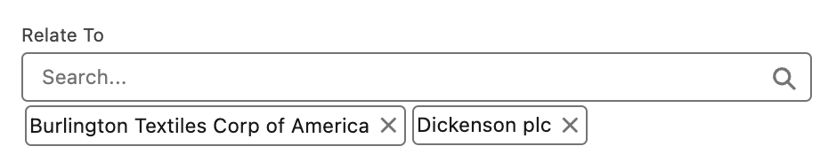
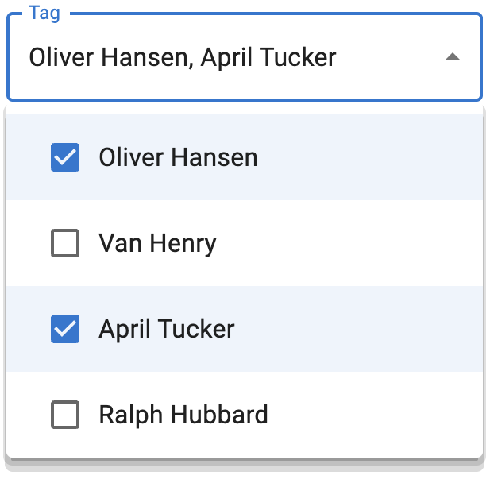
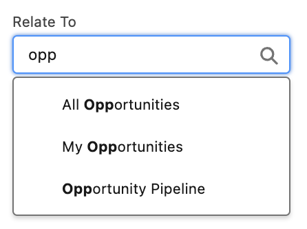
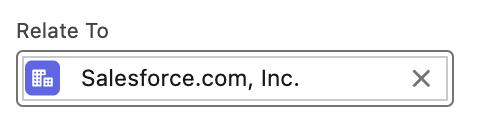
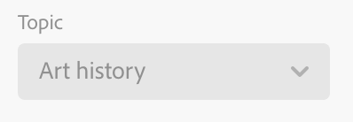
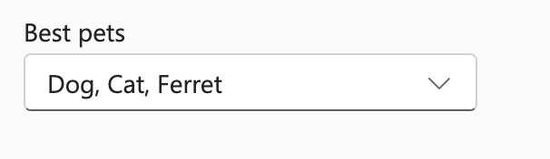
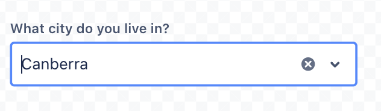
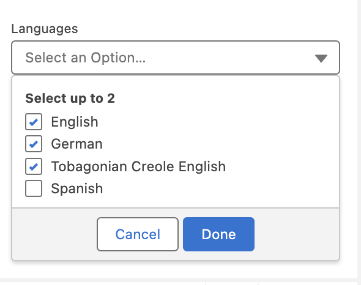

## NOTE: THIS DOCUMENT IS IN EARLY DRAFT AND UNDER HEAVY REVISION


## Combobox Explainer

Last Updated:


1. Background and scope of this document
2. Overview of Combo-box
3. Recommended anatomy for version 1
4. Introduction of the filter attribute
5. Introduction of the search attribute
6. Introduction of multiple attribute
7. Keyboard behavior
8. Other approaches considered
9. Open Questions
10. Research


### Background and scope of this document


#### Background

From the early days of the web, form controls have been pivotal in creating interactive and dynamic user experiences. Elements like <input>, <button>, and <select> were foundational, offering basic interactivity. As the web matured, so did the demands of web designers and developers. They sought more versatile and customizable controls to cater to a myriad of designs and functionalities.

The <select> element, for instance, while functional, lacks flexibility. It offers limited customization, which often leads developers to craft their own solutions. These custom implementations, while visually appealing, often come at the cost of performance, reliability, and most importantly, accessibility.

Recognizing these limitations, the [<selectlist>](https://open-ui.org/components/selectlist/) was introduced. This element builds on the foundation of the <select> but provides greater flexibility. The <selectlist> lets developers create a button-triggered dropdown with customizable appearance and behavior. Paired with <listbox>, and inclusive of <option> and <optgroup>, it offers a modern, adaptable, yet accessible web control.

Right now, many websites have their own type of **'combobox'**, but they're all a bit different. We often see a mix of <input> fields and <datalist> elements trying to do the job, but it's not quite perfect. By creating a standard**<code> <combobox></code></strong>, we're aiming to simplify things. 

This proposal for <combobox> builds upon the strengths of <selectlist> and <listbox>. It aims to offer a control that is versatile for developers, intuitive for users, and, above all, accessible to all.

By standardizing such elements, we hope to bridge the gap between design demands and the need for performant, reliable, and accessible web controls. 


#### Scope of this document

This document aims to provide a complete view of combo-box utilisation across the web to inform a potential proposal within Open UI. The goal of this document is to propose a very basic anatomy to simplify the initial shipment of <combobox> (or some other name) in the web platform. It will heavily build upon selectlist but provide a better accessible and extensible solution than that of an input bound with datalist.


#### Out of scope of this document

This document will not be attempting some of the complex scenarios found across the web that leverage various ways in which to represent multi-selected options. Additionally, it does not intend to cover the addition of options that are not available in a <listbox>. It will not cover multi-select but will leverage the resolutions defined by selectlist.

A good analogy for what this document will result in looking like is the [Tabs research document.](https://open-ui.org/components/tabs.research.parts/)


### Recommended anatomy for version 1


#### Approach 1


```
<input type="text" list="browsers"  />
<datalist id="browsers">
	<option>firefox</option>
	<option>Chrome</option>
</datalist>
```


**Pros:**


* Native elements

**Cons:**


* You can't achieve multi-select with <datalist>:
* grouping options or adding icons next to options, the <datalist> approach falls short.
* Inconsistent Browser Support: While most modern browsers support <datalist>, the appearance and behavior can be inconsistent across different browsers.


#### Approach 2


```
<selectlist combobox>
  <input type=selectlist>
  <listbox>
	<option>One</option>
	<option>Two</option>
  </listbox>
</selectlist>
```


**Pros:**


* Leveraging the existing <selectlist>

**Cons:**


* Need to rely on an opt-in attribute(combobox) to modify the behavior of <selectlist>.


#### Approach 3 (Recommended)


```
<combobox>
   <input type=selectlist>
   <listbox>
	<option>One</option>
	<option>Two</option>
   </listbox>
</combobox>
```


**Pros:**


* Clear Semantics: The <combobox> element explicitly conveys its purpose.

**Cons:**


* Introducing new element, <combobox>


##### Anatomy of <combobox>:


<p id="gdcalert1" ><span style="color: red; font-weight: bold">>>>>>  gd2md-html alert: inline image link here (to images/image1.png). Store image on your image server and adjust path/filename/extension if necessary. </span><br>(<a href="#">Back to top</a>)(<a href="#gdcalert2">Next alert</a>)<br><span style="color: red; font-weight: bold">>>>>> </span></p>


1. <combobox>: The root container that encapsulates the entire combobox structure. It provides context for the interaction between the input and the listbox.
    1. **Slots**:
        1. input
        2. Listbox
    2. **Attributes**:
        3. **multiple**: Allows multiple options to be selected.
        4. **search**: Indicates the combobox will actively fetch results based on user input.
        5. **filter**: Indicates the combobox will narrow down visible options based on user input.
2. <input type=selectlist>: This is where the user can type input or view the selected option. It acts as the trigger to display the listbox.
    3. **Slots**:
        6. **placeholder** (optional): To display hint text when the input is empty.
        7. **selectedoption** (optional): To display the current selected option from the listbox. ???
3. <listbox>: This container holds the selectable options. It's hidden by default and is displayed when the <input type=selectlist> is activated.
    4. **Slots**:
        8. **option**
        9. **optgroup** (optional)
4. <option>: Represents an individual selectable item within the listbox.
5. <optgroup> (Optional): A container to group related options together.
    5. **Slots**:
        10. **legend**: To label the group.
        11. **option**: The options within this group.
    6. 
6. <legend> (Optional, within <optgroup>): Provides a label or title for a group of options within the listbox.


##### Default Behavior

Just like a regular dropdown, the <combobox> doesn't need much to get started. Here's how you can set it up with the basics:


```
<combobox>
  <option>Option 1</option>
  <option>Option 2</option>
  <option>Option 3</option>
</combobox>
```


When you use it like this, the combobox creates the parts you need: an input to drop down the list, a place showing your selected option, and the `listbox` itself.


##### Combobox with selectedoption/optgroup


```
<combobox>
    <input type="selectlist" placeholder="Select or type an item...">
    <selectedoption></selectedoption>
    <listbox>
        <option>Apple</option>
        <option>Banana</option>
        <!-- Group of options with a legend -->
        <optgroup>
            <legend>Citrus Fruits</legend>
            <option>Orange</option>
            <option>Lemon</option>
        </optgroup>
        <!-- Another group of options with a legend -->
        <optgroup>
            <legend>Berries</legend>
            <option>Strawberry</option>
            <option>Blueberry</option>
        </optgroup>
    </listbox>
</combobox>
```


### Introduction of the `_filter_` attribute

The introduction of the `filter` _bool_ attribute revolutionizes the way users interact with combobox elements. By narrowing down visible options based on real-time input.


```
<combobox filter>
    <input type="selectlist" placeholder="Type to filter...">
    <listbox>
        <option>Apple</option>
        <option>Apricot</option>
        <option>Banana</option>
        <!-- ... -->
    </listbox>
</combobox>
```


<p id="gdcalert2" ><span style="color: red; font-weight: bold">>>>>>  gd2md-html alert: inline image link here (to images/image2.png). Store image on your image server and adjust path/filename/extension if necessary. </span><br>(<a href="#">Back to top</a>)(<a href="#gdcalert3">Next alert</a>)<br><span style="color: red; font-weight: bold">>>>>> </span></p>


E.g: Type 'A' to quickly filter to 'Apple' and 'Apricot'.


### Introduction of the `_search_` attribute

The introduction of the `search` attribute support search with


* pattern
* startswith 
* Contains
* ..

The current behavior of <selectlist> is the _startswith_ value


```
<combobox search>
    <input type="selectlist" placeholder="Type to search...">
    <listbox>
       <option>Apple</option>
        <option>Apricot</option>
        <option>Banana</option>
        <!-- ... -->
    </listbox>
</combobox>
```


### Introduction of `multiple` attribute

TBD


### Keyboard Behavior

TBD : [https://www.w3.org/WAI/ARIA/apg/patterns/combobox/](https://www.w3.org/WAI/ARIA/apg/patterns/combobox/) 


### <span style="text-decoration:underline;">Combobox Research</span>


<table>
  <tr>
   <td><strong>Combobox</strong>
   </td>
   <td><strong>Select</strong>
   </td>
   <td><strong>Dropdown</strong>
   </td>
   <td><strong>N/A</strong>
   </td>
  </tr>
  <tr>
   <td><a href="https://www.w3.org/WAI/ARIA/apg/patterns/combobox/">WAI-ARIA</a>
   </td>
   <td><a href="https://ant.design/components/select">Ant Design</a>
   </td>
   <td><a href="https://system.design.orange.com/0c1af118d/p/910b9b-dropdown/b/04c480">Boosted</a>
   </td>
   <td rowspan="7" >Bootstrap
<p>
<a href="https://www.carbondesignsystem.com/">Carbon Design System</a>
<p>
<a href="https://www.chromium.org/">Chromium</a> <a href="https://www.goodbarber.com/uxdesign/">GoodBarber Design System</a> 
<p>
<a href="https://public-ui.github.io/">KoliBri</a> 
<p>
<a href="https://material.io/">Material Components Web</a> 
<p>
<a href="https://primer.style/">Primer Design System</a> 
   </td>
  </tr>
  <tr>
   <td><a href="https://evergreen.segment.com/components/combobox">Evergreen</a>
   </td>
   <td><a href="https://atlassian.design/components/select/examples">Atlaskit</a>
   </td>
   <td><a href="https://semantic-ui.com/modules/dropdown.html">Semantic UI</a>
   </td>
  </tr>
  <tr>
   <td><a href="https://react.fluentui.dev/?path=/docs/components-combobox--default">UI Fabric</a>
   </td>
   <td><a href="https://mui.com/material-ui/react-select/">Material UI</a>
   </td>
   <td><a href="https://fluentsite.z22.web.core.windows.net/0.66.2/components/dropdown/definition">Stardust UI</a>
   </td>
  </tr>
  <tr>
   <td><a href="https://explore.fast.design/components/fast-combobox">FAST</a>
   </td>
   <td><a href="https://tailwind-elements.com/docs/standard/forms/select/">Tailwind Elements</a>
   </td>
   <td>
   </td>
  </tr>
  <tr>
   <td><a href="https://www.lightningdesignsystem.com/components/combobox/#Base-Combobox">Lightning Design System</a>
   </td>
   <td>
   </td>
   <td>
   </td>
  </tr>
  <tr>
   <td><a href="https://lion-web.netlify.app/components/combobox/overview/">Lion</a>
   </td>
   <td>
   </td>
   <td>
   </td>
  </tr>
  <tr>
   <td><a href="https://spectrum.adobe.com/page/combo-box/">Spectrum</a>
   </td>
   <td>
   </td>
   <td>
   </td>
  </tr>
</table>


## Features of combobox


1. Base
2. Grouped options
3. Disabled options
4. Bordered-less 
5. Autocomplete (none, list , inline, both)
6. Loading
7. Select Clearable
8. Multiple Selection 
9. Clearall
10. Custom selection render
11. Custom Tag Render
12. Dropdown indicator
13. Hide Already Selected
14. Responsive maxTagCount
15. Disabled State
16. Readonly
17. Error
18. Internationalization
19. Search with sort
20. Picker Combobox


### Base


<p id="gdcalert3" ><span style="color: red; font-weight: bold">>>>>>  gd2md-html alert: inline image link here (to images/image3.png). Store image on your image server and adjust path/filename/extension if necessary. </span><br>(<a href="#">Back to top</a>)(<a href="#gdcalert4">Next alert</a>)<br><span style="color: red; font-weight: bold">>>>>> </span></p>


  

<p id="gdcalert4" ><span style="color: red; font-weight: bold">>>>>>  gd2md-html alert: inline image link here (to images/image4.png). Store image on your image server and adjust path/filename/extension if necessary. </span><br>(<a href="#">Back to top</a>)(<a href="#gdcalert5">Next alert</a>)<br><span style="color: red; font-weight: bold">>>>>> </span></p>


      

<p id="gdcalert5" ><span style="color: red; font-weight: bold">>>>>>  gd2md-html alert: inline image link here (to images/image5.png). Store image on your image server and adjust path/filename/extension if necessary. </span><br>(<a href="#">Back to top</a>)(<a href="#gdcalert6">Next alert</a>)<br><span style="color: red; font-weight: bold">>>>>> </span></p>


    

**   [WAI-ARIA](https://www.w3.org/TR/wai-aria-practices/#intro)                         Ant Design                              Atlaskit         **

**              **


<p id="gdcalert6" ><span style="color: red; font-weight: bold">>>>>>  gd2md-html alert: inline image link here (to images/image6.png). Store image on your image server and adjust path/filename/extension if necessary. </span><br>(<a href="#">Back to top</a>)(<a href="#gdcalert7">Next alert</a>)<br><span style="color: red; font-weight: bold">>>>>> </span></p>


<p id="gdcalert7" ><span style="color: red; font-weight: bold">>>>>>  gd2md-html alert: inline image link here (to images/image7.png). Store image on your image server and adjust path/filename/extension if necessary. </span><br>(<a href="#">Back to top</a>)(<a href="#gdcalert8">Next alert</a>)<br><span style="color: red; font-weight: bold">>>>>> </span></p>


** Boosted                                               Evergreen**


<p id="gdcalert8" ><span style="color: red; font-weight: bold">>>>>>  gd2md-html alert: inline image link here (to images/image8.png). Store image on your image server and adjust path/filename/extension if necessary. </span><br>(<a href="#">Back to top</a>)(<a href="#gdcalert9">Next alert</a>)<br><span style="color: red; font-weight: bold">>>>>> </span></p>


    

<p id="gdcalert9" ><span style="color: red; font-weight: bold">>>>>>  gd2md-html alert: inline image link here (to images/image9.png). Store image on your image server and adjust path/filename/extension if necessary. </span><br>(<a href="#">Back to top</a>)(<a href="#gdcalert10">Next alert</a>)<br><span style="color: red; font-weight: bold">>>>>> </span></p>


[UI Fabric](https://developer.microsoft.com/en-us/fabric)                                                  **       FAST**

**		**


<p id="gdcalert10" ><span style="color: red; font-weight: bold">>>>>>  gd2md-html alert: inline image link here (to images/image10.png). Store image on your image server and adjust path/filename/extension if necessary. </span><br>(<a href="#">Back to top</a>)(<a href="#gdcalert11">Next alert</a>)<br><span style="color: red; font-weight: bold">>>>>> </span></p>



     

<p id="gdcalert11" ><span style="color: red; font-weight: bold">>>>>>  gd2md-html alert: inline image link here (to images/image11.png). Store image on your image server and adjust path/filename/extension if necessary. </span><br>(<a href="#">Back to top</a>)(<a href="#gdcalert12">Next alert</a>)<br><span style="color: red; font-weight: bold">>>>>> </span></p>


    **LDS 			          		      LION**


<p id="gdcalert12" ><span style="color: red; font-weight: bold">>>>>>  gd2md-html alert: inline image link here (to images/image12.png). Store image on your image server and adjust path/filename/extension if necessary. </span><br>(<a href="#">Back to top</a>)(<a href="#gdcalert13">Next alert</a>)<br><span style="color: red; font-weight: bold">>>>>> </span></p>


      

<p id="gdcalert13" ><span style="color: red; font-weight: bold">>>>>>  gd2md-html alert: inline image link here (to images/image13.png). Store image on your image server and adjust path/filename/extension if necessary. </span><br>(<a href="#">Back to top</a>)(<a href="#gdcalert14">Next alert</a>)<br><span style="color: red; font-weight: bold">>>>>> </span></p>


**Material UI						Semantic UI**

**Spectrum**


<p id="gdcalert14" ><span style="color: red; font-weight: bold">>>>>>  gd2md-html alert: inline image link here (to images/image14.png). Store image on your image server and adjust path/filename/extension if necessary. </span><br>(<a href="#">Back to top</a>)(<a href="#gdcalert15">Next alert</a>)<br><span style="color: red; font-weight: bold">>>>>> </span></p>





<p id="gdcalert15" ><span style="color: red; font-weight: bold">>>>>>  gd2md-html alert: inline image link here (to images/image15.gif). Store image on your image server and adjust path/filename/extension if necessary. </span><br>(<a href="#">Back to top</a>)(<a href="#gdcalert16">Next alert</a>)<br><span style="color: red; font-weight: bold">>>>>> </span></p>


             

<p id="gdcalert16" ><span style="color: red; font-weight: bold">>>>>>  gd2md-html alert: inline image link here (to images/image16.gif). Store image on your image server and adjust path/filename/extension if necessary. </span><br>(<a href="#">Back to top</a>)(<a href="#gdcalert17">Next alert</a>)<br><span style="color: red; font-weight: bold">>>>>> </span></p>


	**Immediate popover launch#                 Delayed popover launch#**


<p id="gdcalert17" ><span style="color: red; font-weight: bold">>>>>>  gd2md-html alert: inline image link here (to images/image17.png). Store image on your image server and adjust path/filename/extension if necessary. </span><br>(<a href="#">Back to top</a>)(<a href="#gdcalert18">Next alert</a>)<br><span style="color: red; font-weight: bold">>>>>> </span></p>


<p id="gdcalert18" ><span style="color: red; font-weight: bold">>>>>>  gd2md-html alert: inline image link here (to images/image18.png). Store image on your image server and adjust path/filename/extension if necessary. </span><br>(<a href="#">Back to top</a>)(<a href="#gdcalert19">Next alert</a>)<br><span style="color: red; font-weight: bold">>>>>> </span></p>


**StartDust						Tailwind**


### Grouped options


<p id="gdcalert19" ><span style="color: red; font-weight: bold">>>>>>  gd2md-html alert: inline image link here (to images/image19.png). Store image on your image server and adjust path/filename/extension if necessary. </span><br>(<a href="#">Back to top</a>)(<a href="#gdcalert20">Next alert</a>)<br><span style="color: red; font-weight: bold">>>>>> </span></p>


  

<p id="gdcalert20" ><span style="color: red; font-weight: bold">>>>>>  gd2md-html alert: inline image link here (to images/image20.png). Store image on your image server and adjust path/filename/extension if necessary. </span><br>(<a href="#">Back to top</a>)(<a href="#gdcalert21">Next alert</a>)<br><span style="color: red; font-weight: bold">>>>>> </span></p>


      

<p id="gdcalert21" ><span style="color: red; font-weight: bold">>>>>>  gd2md-html alert: inline image link here (to images/image21.png). Store image on your image server and adjust path/filename/extension if necessary. </span><br>(<a href="#">Back to top</a>)(<a href="#gdcalert22">Next alert</a>)<br><span style="color: red; font-weight: bold">>>>>> </span></p>


**Ant Design                                    Atlaskit                                UI Fabric**


<p id="gdcalert22" ><span style="color: red; font-weight: bold">>>>>>  gd2md-html alert: inline image link here (to images/image22.png). Store image on your image server and adjust path/filename/extension if necessary. </span><br>(<a href="#">Back to top</a>)(<a href="#gdcalert23">Next alert</a>)<br><span style="color: red; font-weight: bold">>>>>> </span></p>


      

<p id="gdcalert23" ><span style="color: red; font-weight: bold">>>>>>  gd2md-html alert: inline image link here (to images/image23.png). Store image on your image server and adjust path/filename/extension if necessary. </span><br>(<a href="#">Back to top</a>)(<a href="#gdcalert24">Next alert</a>)<br><span style="color: red; font-weight: bold">>>>>> </span></p>





<p id="gdcalert24" ><span style="color: red; font-weight: bold">>>>>>  gd2md-html alert: inline image link here (to images/image24.png). Store image on your image server and adjust path/filename/extension if necessary. </span><br>(<a href="#">Back to top</a>)(<a href="#gdcalert25">Next alert</a>)<br><span style="color: red; font-weight: bold">>>>>> </span></p>


    **LDS			        Material UI**( ListSubheader/native <optgroup>)


<p id="gdcalert25" ><span style="color: red; font-weight: bold">>>>>>  gd2md-html alert: inline image link here (to images/image25.png). Store image on your image server and adjust path/filename/extension if necessary. </span><br>(<a href="#">Back to top</a>)(<a href="#gdcalert26">Next alert</a>)<br><span style="color: red; font-weight: bold">>>>>> </span></p>


**Tailwind Elements**


#### No images (TBD)


1.  [WAI-ARIA](https://www.w3.org/TR/wai-aria-practices/#intro) 


### Disabled Options


<p id="gdcalert26" ><span style="color: red; font-weight: bold">>>>>>  gd2md-html alert: inline image link here (to images/image26.png). Store image on your image server and adjust path/filename/extension if necessary. </span><br>(<a href="#">Back to top</a>)(<a href="#gdcalert27">Next alert</a>)<br><span style="color: red; font-weight: bold">>>>>> </span></p>


       

<p id="gdcalert27" ><span style="color: red; font-weight: bold">>>>>>  gd2md-html alert: inline image link here (to images/image27.png). Store image on your image server and adjust path/filename/extension if necessary. </span><br>(<a href="#">Back to top</a>)(<a href="#gdcalert28">Next alert</a>)<br><span style="color: red; font-weight: bold">>>>>> </span></p>


<p id="gdcalert28" ><span style="color: red; font-weight: bold">>>>>>  gd2md-html alert: inline image link here (to images/image28.png). Store image on your image server and adjust path/filename/extension if necessary. </span><br>(<a href="#">Back to top</a>)(<a href="#gdcalert29">Next alert</a>)<br><span style="color: red; font-weight: bold">>>>>> </span></p>


** Boosted                          UI Fabric 			Semantic UI**


<p id="gdcalert29" ><span style="color: red; font-weight: bold">>>>>>  gd2md-html alert: inline image link here (to images/image29.png). Store image on your image server and adjust path/filename/extension if necessary. </span><br>(<a href="#">Back to top</a>)(<a href="#gdcalert30">Next alert</a>)<br><span style="color: red; font-weight: bold">>>>>> </span></p>


**Tailwind Elements**


### Bordered-less **(subtle)**


<p id="gdcalert30" ><span style="color: red; font-weight: bold">>>>>>  gd2md-html alert: inline image link here (to images/image30.png). Store image on your image server and adjust path/filename/extension if necessary. </span><br>(<a href="#">Back to top</a>)(<a href="#gdcalert31">Next alert</a>)<br><span style="color: red; font-weight: bold">>>>>> </span></p>


  

<p id="gdcalert31" ><span style="color: red; font-weight: bold">>>>>>  gd2md-html alert: inline image link here (to images/image31.png). Store image on your image server and adjust path/filename/extension if necessary. </span><br>(<a href="#">Back to top</a>)(<a href="#gdcalert32">Next alert</a>)<br><span style="color: red; font-weight: bold">>>>>> </span></p>


**Ant Design                                                          Atlaskit**

**			**


<p id="gdcalert32" ><span style="color: red; font-weight: bold">>>>>>  gd2md-html alert: inline image link here (to images/image32.png). Store image on your image server and adjust path/filename/extension if necessary. </span><br>(<a href="#">Back to top</a>)(<a href="#gdcalert33">Next alert</a>)<br><span style="color: red; font-weight: bold">>>>>> </span></p>


**   	        **

<p id="gdcalert33" ><span style="color: red; font-weight: bold">>>>>>  gd2md-html alert: inline image link here (to images/image33.png). Store image on your image server and adjust path/filename/extension if necessary. </span><br>(<a href="#">Back to top</a>)(<a href="#gdcalert34">Next alert</a>)<br><span style="color: red; font-weight: bold">>>>>> </span></p>


**        **

**UI Fabric					Semantic UI **


<p id="gdcalert34" ><span style="color: red; font-weight: bold">>>>>>  gd2md-html alert: inline image link here (to images/image34.png). Store image on your image server and adjust path/filename/extension if necessary. </span><br>(<a href="#">Back to top</a>)(<a href="#gdcalert35">Next alert</a>)<br><span style="color: red; font-weight: bold">>>>>> </span></p>


**Spectrum						**


#### No images(TBD)


1.  **[WAI-ARIA](https://www.w3.org/TR/wai-aria-practices/#intro)**


### Autocomplete (none, list , inline, both)


#### None


<p id="gdcalert35" ><span style="color: red; font-weight: bold">>>>>>  gd2md-html alert: inline image link here (to images/image35.gif). Store image on your image server and adjust path/filename/extension if necessary. </span><br>(<a href="#">Back to top</a>)(<a href="#gdcalert36">Next alert</a>)<br><span style="color: red; font-weight: bold">>>>>> </span></p>


               

<p id="gdcalert36" ><span style="color: red; font-weight: bold">>>>>>  gd2md-html alert: inline image link here (to images/image36.gif). Store image on your image server and adjust path/filename/extension if necessary. </span><br>(<a href="#">Back to top</a>)(<a href="#gdcalert37">Next alert</a>)<br><span style="color: red; font-weight: bold">>>>>> </span></p>


** [WAI-ARIA](https://www.w3.org/TR/wai-aria-practices/#intro) 						LION**


#### List


<p id="gdcalert37" ><span style="color: red; font-weight: bold">>>>>>  gd2md-html alert: inline image link here (to images/image37.gif). Store image on your image server and adjust path/filename/extension if necessary. </span><br>(<a href="#">Back to top</a>)(<a href="#gdcalert38">Next alert</a>)<br><span style="color: red; font-weight: bold">>>>>> </span></p>


  

<p id="gdcalert38" ><span style="color: red; font-weight: bold">>>>>>  gd2md-html alert: inline image link here (to images/image38.gif). Store image on your image server and adjust path/filename/extension if necessary. </span><br>(<a href="#">Back to top</a>)(<a href="#gdcalert39">Next alert</a>)<br><span style="color: red; font-weight: bold">>>>>> </span></p>


 **[WAI-ARIA](https://www.w3.org/TR/wai-aria-practices/#intro)**                                                   **Ant Design     **


<p id="gdcalert39" ><span style="color: red; font-weight: bold">>>>>>  gd2md-html alert: inline image link here (to images/image39.gif). Store image on your image server and adjust path/filename/extension if necessary. </span><br>(<a href="#">Back to top</a>)(<a href="#gdcalert40">Next alert</a>)<br><span style="color: red; font-weight: bold">>>>>> </span></p>


         

<p id="gdcalert40" ><span style="color: red; font-weight: bold">>>>>>  gd2md-html alert: inline image link here (to images/image40.png). Store image on your image server and adjust path/filename/extension if necessary. </span><br>(<a href="#">Back to top</a>)(<a href="#gdcalert41">Next alert</a>)<br><span style="color: red; font-weight: bold">>>>>> </span></p>


** Atlaskit                                                             Evergreen**


<p id="gdcalert41" ><span style="color: red; font-weight: bold">>>>>>  gd2md-html alert: inline image link here (to images/image41.png). Store image on your image server and adjust path/filename/extension if necessary. </span><br>(<a href="#">Back to top</a>)(<a href="#gdcalert42">Next alert</a>)<br><span style="color: red; font-weight: bold">>>>>> </span></p>


<p id="gdcalert42" ><span style="color: red; font-weight: bold">>>>>>  gd2md-html alert: inline image link here (to images/image42.png). Store image on your image server and adjust path/filename/extension if necessary. </span><br>(<a href="#">Back to top</a>)(<a href="#gdcalert43">Next alert</a>)<br><span style="color: red; font-weight: bold">>>>>> </span></p>


<p id="gdcalert43" ><span style="color: red; font-weight: bold">>>>>>  gd2md-html alert: inline image link here (to images/image43.png). Store image on your image server and adjust path/filename/extension if necessary. </span><br>(<a href="#">Back to top</a>)(<a href="#gdcalert44">Next alert</a>)<br><span style="color: red; font-weight: bold">>>>>> </span></p>





<p id="gdcalert44" ><span style="color: red; font-weight: bold">>>>>>  gd2md-html alert: inline image link here (to images/image44.png). Store image on your image server and adjust path/filename/extension if necessary. </span><br>(<a href="#">Back to top</a>)(<a href="#gdcalert45">Next alert</a>)<br><span style="color: red; font-weight: bold">>>>>> </span></p>


**UI Fabric**


<p id="gdcalert45" ><span style="color: red; font-weight: bold">>>>>>  gd2md-html alert: inline image link here (to images/image45.png). Store image on your image server and adjust path/filename/extension if necessary. </span><br>(<a href="#">Back to top</a>)(<a href="#gdcalert46">Next alert</a>)<br><span style="color: red; font-weight: bold">>>>>> </span></p>


    

<p id="gdcalert46" ><span style="color: red; font-weight: bold">>>>>>  gd2md-html alert: inline image link here (to images/image46.png). Store image on your image server and adjust path/filename/extension if necessary. </span><br>(<a href="#">Back to top</a>)(<a href="#gdcalert47">Next alert</a>)<br><span style="color: red; font-weight: bold">>>>>> </span></p>


                **Boosted**


<p id="gdcalert47" ><span style="color: red; font-weight: bold">>>>>>  gd2md-html alert: inline image link here (to images/image47.png). Store image on your image server and adjust path/filename/extension if necessary. </span><br>(<a href="#">Back to top</a>)(<a href="#gdcalert48">Next alert</a>)<br><span style="color: red; font-weight: bold">>>>>> </span></p>


    

<p id="gdcalert48" ><span style="color: red; font-weight: bold">>>>>>  gd2md-html alert: inline image link here (to images/image48.png). Store image on your image server and adjust path/filename/extension if necessary. </span><br>(<a href="#">Back to top</a>)(<a href="#gdcalert49">Next alert</a>)<br><span style="color: red; font-weight: bold">>>>>> </span></p>


**FAST                                             Semantic UI**


<p id="gdcalert49" ><span style="color: red; font-weight: bold">>>>>>  gd2md-html alert: inline image link here (to images/image49.png). Store image on your image server and adjust path/filename/extension if necessary. </span><br>(<a href="#">Back to top</a>)(<a href="#gdcalert50">Next alert</a>)<br><span style="color: red; font-weight: bold">>>>>> </span></p>


<p id="gdcalert50" ><span style="color: red; font-weight: bold">>>>>>  gd2md-html alert: inline image link here (to images/image50.png). Store image on your image server and adjust path/filename/extension if necessary. </span><br>(<a href="#">Back to top</a>)(<a href="#gdcalert51">Next alert</a>)<br><span style="color: red; font-weight: bold">>>>>> </span></p>


**Spectrum 					Tailwind Elements**


<p id="gdcalert51" ><span style="color: red; font-weight: bold">>>>>>  gd2md-html alert: inline image link here (to images/image51.png). Store image on your image server and adjust path/filename/extension if necessary. </span><br>(<a href="#">Back to top</a>)(<a href="#gdcalert52">Next alert</a>)<br><span style="color: red; font-weight: bold">>>>>> </span></p>


<p id="gdcalert52" ><span style="color: red; font-weight: bold">>>>>>  gd2md-html alert: inline image link here (to images/image52.png). Store image on your image server and adjust path/filename/extension if necessary. </span><br>(<a href="#">Back to top</a>)(<a href="#gdcalert53">Next alert</a>)<br><span style="color: red; font-weight: bold">>>>>> </span></p>


			**LDS**


<p id="gdcalert53" ><span style="color: red; font-weight: bold">>>>>>  gd2md-html alert: inline image link here (to images/image53.gif). Store image on your image server and adjust path/filename/extension if necessary. </span><br>(<a href="#">Back to top</a>)(<a href="#gdcalert54">Next alert</a>)<br><span style="color: red; font-weight: bold">>>>>> </span></p>


  

<p id="gdcalert54" ><span style="color: red; font-weight: bold">>>>>>  gd2md-html alert: inline image link here (to images/image54.gif). Store image on your image server and adjust path/filename/extension if necessary. </span><br>(<a href="#">Back to top</a>)(<a href="#gdcalert55">Next alert</a>)<br><span style="color: red; font-weight: bold">>>>>> </span></p>


#### **LION					Stardust UI**


#### Inline


<p id="gdcalert55" ><span style="color: red; font-weight: bold">>>>>>  gd2md-html alert: inline image link here (to images/image55.png). Store image on your image server and adjust path/filename/extension if necessary. </span><br>(<a href="#">Back to top</a>)(<a href="#gdcalert56">Next alert</a>)<br><span style="color: red; font-weight: bold">>>>>> </span></p>



  

<p id="gdcalert56" ><span style="color: red; font-weight: bold">>>>>>  gd2md-html alert: inline image link here (to images/image56.gif). Store image on your image server and adjust path/filename/extension if necessary. </span><br>(<a href="#">Back to top</a>)(<a href="#gdcalert57">Next alert</a>)<br><span style="color: red; font-weight: bold">>>>>> </span></p>


**  Fast					LION**


<p id="gdcalert57" ><span style="color: red; font-weight: bold">>>>>>  gd2md-html alert: inline image link here (to images/image57.png). Store image on your image server and adjust path/filename/extension if necessary. </span><br>(<a href="#">Back to top</a>)(<a href="#gdcalert58">Next alert</a>)<br><span style="color: red; font-weight: bold">>>>>> </span></p>


  	

<p id="gdcalert58" ><span style="color: red; font-weight: bold">>>>>>  gd2md-html alert: inline image link here (to images/image58.png). Store image on your image server and adjust path/filename/extension if necessary. </span><br>(<a href="#">Back to top</a>)(<a href="#gdcalert59">Next alert</a>)<br><span style="color: red; font-weight: bold">>>>>> </span></p>


**Spectrum					    Stardust UI**


##### No screenshots(TBD)


1.  [WAI-ARIA](https://www.w3.org/TR/wai-aria-practices/#intro) 


#### Both

** **

<p id="gdcalert59" ><span style="color: red; font-weight: bold">>>>>>  gd2md-html alert: inline image link here (to images/image59.gif). Store image on your image server and adjust path/filename/extension if necessary. </span><br>(<a href="#">Back to top</a>)(<a href="#gdcalert60">Next alert</a>)<br><span style="color: red; font-weight: bold">>>>>> </span></p>


<p id="gdcalert60" ><span style="color: red; font-weight: bold">>>>>>  gd2md-html alert: inline image link here (to images/image60.png). Store image on your image server and adjust path/filename/extension if necessary. </span><br>(<a href="#">Back to top</a>)(<a href="#gdcalert61">Next alert</a>)<br><span style="color: red; font-weight: bold">>>>>> </span></p>


 **[WAI-ARIA](https://www.w3.org/TR/wai-aria-practices/#intro)**                                             **Fabric      **


<p id="gdcalert61" ><span style="color: red; font-weight: bold">>>>>>  gd2md-html alert: inline image link here (to images/image61.gif). Store image on your image server and adjust path/filename/extension if necessary. </span><br>(<a href="#">Back to top</a>)(<a href="#gdcalert62">Next alert</a>)<br><span style="color: red; font-weight: bold">>>>>> </span></p>


**LION**


### Loading

    


<p id="gdcalert62" ><span style="color: red; font-weight: bold">>>>>>  gd2md-html alert: inline image link here (to images/image62.gif). Store image on your image server and adjust path/filename/extension if necessary. </span><br>(<a href="#">Back to top</a>)(<a href="#gdcalert63">Next alert</a>)<br><span style="color: red; font-weight: bold">>>>>> </span></p>


    

<p id="gdcalert63" ><span style="color: red; font-weight: bold">>>>>>  gd2md-html alert: inline image link here (to images/image63.gif). Store image on your image server and adjust path/filename/extension if necessary. </span><br>(<a href="#">Back to top</a>)(<a href="#gdcalert64">Next alert</a>)<br><span style="color: red; font-weight: bold">>>>>> </span></p>


   

<p id="gdcalert64" ><span style="color: red; font-weight: bold">>>>>>  gd2md-html alert: inline image link here (to images/image64.gif). Store image on your image server and adjust path/filename/extension if necessary. </span><br>(<a href="#">Back to top</a>)(<a href="#gdcalert65">Next alert</a>)<br><span style="color: red; font-weight: bold">>>>>> </span></p>


 **Ant Design                              Atlaskit                                                   LDS**


<p id="gdcalert65" ><span style="color: red; font-weight: bold">>>>>>  gd2md-html alert: inline image link here (to images/image65.gif). Store image on your image server and adjust path/filename/extension if necessary. </span><br>(<a href="#">Back to top</a>)(<a href="#gdcalert66">Next alert</a>)<br><span style="color: red; font-weight: bold">>>>>> </span></p>


**Lion		**


<p id="gdcalert66" ><span style="color: red; font-weight: bold">>>>>>  gd2md-html alert: inline image link here (to images/image66.gif). Store image on your image server and adjust path/filename/extension if necessary. </span><br>(<a href="#">Back to top</a>)(<a href="#gdcalert67">Next alert</a>)<br><span style="color: red; font-weight: bold">>>>>> </span></p>


<p id="gdcalert67" ><span style="color: red; font-weight: bold">>>>>>  gd2md-html alert: inline image link here (to images/image67.gif). Store image on your image server and adjust path/filename/extension if necessary. </span><br>(<a href="#">Back to top</a>)(<a href="#gdcalert68">Next alert</a>)<br><span style="color: red; font-weight: bold">>>>>> </span></p>


            **Semantic UI** \


<p id="gdcalert68" ><span style="color: red; font-weight: bold">>>>>>  gd2md-html alert: inline image link here (to images/image68.png). Store image on your image server and adjust path/filename/extension if necessary. </span><br>(<a href="#">Back to top</a>)(<a href="#gdcalert69">Next alert</a>)<br><span style="color: red; font-weight: bold">>>>>> </span></p>


    **StartDust UI**


#### No images (TBD)


1. **[WAI-ARIA](https://www.w3.org/TR/wai-aria-practices/#intro)**


### Clearable

 

<p id="gdcalert69" ><span style="color: red; font-weight: bold">>>>>>  gd2md-html alert: inline image link here (to images/image69.gif). Store image on your image server and adjust path/filename/extension if necessary. </span><br>(<a href="#">Back to top</a>)(<a href="#gdcalert70">Next alert</a>)<br><span style="color: red; font-weight: bold">>>>>> </span></p>


<p id="gdcalert70" ><span style="color: red; font-weight: bold">>>>>>  gd2md-html alert: inline image link here (to images/image70.png). Store image on your image server and adjust path/filename/extension if necessary. </span><br>(<a href="#">Back to top</a>)(<a href="#gdcalert71">Next alert</a>)<br><span style="color: red; font-weight: bold">>>>>> </span></p>


                                        

<p id="gdcalert71" ><span style="color: red; font-weight: bold">>>>>>  gd2md-html alert: inline image link here (to images/image71.png). Store image on your image server and adjust path/filename/extension if necessary. </span><br>(<a href="#">Back to top</a>)(<a href="#gdcalert72">Next alert</a>)<br><span style="color: red; font-weight: bold">>>>>> </span></p>


 **Ant Design                                           Atlaskit**


<p id="gdcalert72" ><span style="color: red; font-weight: bold">>>>>>  gd2md-html alert: inline image link here (to images/image72.png). Store image on your image server and adjust path/filename/extension if necessary. </span><br>(<a href="#">Back to top</a>)(<a href="#gdcalert73">Next alert</a>)<br><span style="color: red; font-weight: bold">>>>>> </span></p>


<p id="gdcalert73" ><span style="color: red; font-weight: bold">>>>>>  gd2md-html alert: inline image link here (to images/image73.png). Store image on your image server and adjust path/filename/extension if necessary. </span><br>(<a href="#">Back to top</a>)(<a href="#gdcalert74">Next alert</a>)<br><span style="color: red; font-weight: bold">>>>>> </span></p>


<p id="gdcalert74" ><span style="color: red; font-weight: bold">>>>>>  gd2md-html alert: inline image link here (to images/image74.png). Store image on your image server and adjust path/filename/extension if necessary. </span><br>(<a href="#">Back to top</a>)(<a href="#gdcalert75">Next alert</a>)<br><span style="color: red; font-weight: bold">>>>>> </span></p>


<p id="gdcalert75" ><span style="color: red; font-weight: bold">>>>>>  gd2md-html alert: inline image link here (to images/image75.png). Store image on your image server and adjust path/filename/extension if necessary. </span><br>(<a href="#">Back to top</a>)(<a href="#gdcalert76">Next alert</a>)<br><span style="color: red; font-weight: bold">>>>>> </span></p>


                **LDS**


<p id="gdcalert76" ><span style="color: red; font-weight: bold">>>>>>  gd2md-html alert: inline image link here (to images/image76.gif). Store image on your image server and adjust path/filename/extension if necessary. </span><br>(<a href="#">Back to top</a>)(<a href="#gdcalert77">Next alert</a>)<br><span style="color: red; font-weight: bold">>>>>> </span></p>


      

<p id="gdcalert77" ><span style="color: red; font-weight: bold">>>>>>  gd2md-html alert: inline image link here (to images/image77.png). Store image on your image server and adjust path/filename/extension if necessary. </span><br>(<a href="#">Back to top</a>)(<a href="#gdcalert78">Next alert</a>)<br><span style="color: red; font-weight: bold">>>>>> </span></p>


**Stardust UI							Tailwind Elements**


#### No images (TBD)


2. **[WAI-ARIA](https://www.w3.org/TR/wai-aria-practices/#intro)**


### Multiple Selection


<p id="gdcalert78" ><span style="color: red; font-weight: bold">>>>>>  gd2md-html alert: inline image link here (to images/image78.png). Store image on your image server and adjust path/filename/extension if necessary. </span><br>(<a href="#">Back to top</a>)(<a href="#gdcalert79">Next alert</a>)<br><span style="color: red; font-weight: bold">>>>>> </span></p>


           

<p id="gdcalert79" ><span style="color: red; font-weight: bold">>>>>>  gd2md-html alert: inline image link here (to images/image79.png). Store image on your image server and adjust path/filename/extension if necessary. </span><br>(<a href="#">Back to top</a>)(<a href="#gdcalert80">Next alert</a>)<br><span style="color: red; font-weight: bold">>>>>> </span></p>


         

<p id="gdcalert80" ><span style="color: red; font-weight: bold">>>>>>  gd2md-html alert: inline image link here (to images/image80.png). Store image on your image server and adjust path/filename/extension if necessary. </span><br>(<a href="#">Back to top</a>)(<a href="#gdcalert81">Next alert</a>)<br><span style="color: red; font-weight: bold">>>>>> </span></p>





**      Ant Design                                   Atlaskit               		   Boosted**


<p id="gdcalert81" ><span style="color: red; font-weight: bold">>>>>>  gd2md-html alert: inline image link here (to images/image81.png). Store image on your image server and adjust path/filename/extension if necessary. </span><br>(<a href="#">Back to top</a>)(<a href="#gdcalert82">Next alert</a>)<br><span style="color: red; font-weight: bold">>>>>> </span></p>


**  **


            **Boosted**

** **

<p id="gdcalert82" ><span style="color: red; font-weight: bold">>>>>>  gd2md-html alert: inline image link here (to images/image82.png). Store image on your image server and adjust path/filename/extension if necessary. </span><br>(<a href="#">Back to top</a>)(<a href="#gdcalert83">Next alert</a>)<br><span style="color: red; font-weight: bold">>>>>> </span></p>


        

<p id="gdcalert83" ><span style="color: red; font-weight: bold">>>>>>  gd2md-html alert: inline image link here (to images/image83.png). Store image on your image server and adjust path/filename/extension if necessary. </span><br>(<a href="#">Back to top</a>)(<a href="#gdcalert84">Next alert</a>)<br><span style="color: red; font-weight: bold">>>>>> </span></p>


    **Evergreen                                              UI Fabric**


<p id="gdcalert84" ><span style="color: red; font-weight: bold">>>>>>  gd2md-html alert: inline image link here (to images/image84.png). Store image on your image server and adjust path/filename/extension if necessary. </span><br>(<a href="#">Back to top</a>)(<a href="#gdcalert85">Next alert</a>)<br><span style="color: red; font-weight: bold">>>>>> </span></p>


** **

<p id="gdcalert85" ><span style="color: red; font-weight: bold">>>>>>  gd2md-html alert: inline image link here (to images/image85.png). Store image on your image server and adjust path/filename/extension if necessary. </span><br>(<a href="#">Back to top</a>)(<a href="#gdcalert86">Next alert</a>)<br><span style="color: red; font-weight: bold">>>>>> </span></p>


<p id="gdcalert86" ><span style="color: red; font-weight: bold">>>>>>  gd2md-html alert: inline image link here (to images/image86.png). Store image on your image server and adjust path/filename/extension if necessary. </span><br>(<a href="#">Back to top</a>)(<a href="#gdcalert87">Next alert</a>)<br><span style="color: red; font-weight: bold">>>>>> </span></p>


        **UI Fabric **


<p id="gdcalert87" ><span style="color: red; font-weight: bold">>>>>>  gd2md-html alert: inline image link here (to images/image87.png). Store image on your image server and adjust path/filename/extension if necessary. </span><br>(<a href="#">Back to top</a>)(<a href="#gdcalert88">Next alert</a>)<br><span style="color: red; font-weight: bold">>>>>> </span></p>


 

<p id="gdcalert88" ><span style="color: red; font-weight: bold">>>>>>  gd2md-html alert: inline image link here (to images/image88.png). Store image on your image server and adjust path/filename/extension if necessary. </span><br>(<a href="#">Back to top</a>)(<a href="#gdcalert89">Next alert</a>)<br><span style="color: red; font-weight: bold">>>>>> </span></p>


<p id="gdcalert89" ><span style="color: red; font-weight: bold">>>>>>  gd2md-html alert: inline image link here (to images/image89.png). Store image on your image server and adjust path/filename/extension if necessary. </span><br>(<a href="#">Back to top</a>)(<a href="#gdcalert90">Next alert</a>)<br><span style="color: red; font-weight: bold">>>>>> </span></p>


<p id="gdcalert90" ><span style="color: red; font-weight: bold">>>>>>  gd2md-html alert: inline image link here (to images/image90.png). Store image on your image server and adjust path/filename/extension if necessary. </span><br>(<a href="#">Back to top</a>)(<a href="#gdcalert91">Next alert</a>)<br><span style="color: red; font-weight: bold">>>>>> </span></p>


<p id="gdcalert91" ><span style="color: red; font-weight: bold">>>>>>  gd2md-html alert: inline image link here (to images/image91.png). Store image on your image server and adjust path/filename/extension if necessary. </span><br>(<a href="#">Back to top</a>)(<a href="#gdcalert92">Next alert</a>)<br><span style="color: red; font-weight: bold">>>>>> </span></p>


<p id="gdcalert92" ><span style="color: red; font-weight: bold">>>>>>  gd2md-html alert: inline image link here (to images/image92.png). Store image on your image server and adjust path/filename/extension if necessary. </span><br>(<a href="#">Back to top</a>)(<a href="#gdcalert93">Next alert</a>)<br><span style="color: red; font-weight: bold">>>>>> </span></p>


<p id="gdcalert93" ><span style="color: red; font-weight: bold">>>>>>  gd2md-html alert: inline image link here (to images/image93.png). Store image on your image server and adjust path/filename/extension if necessary. </span><br>(<a href="#">Back to top</a>)(<a href="#gdcalert94">Next alert</a>)<br><span style="color: red; font-weight: bold">>>>>> </span></p>


                **LDS**


<p id="gdcalert94" ><span style="color: red; font-weight: bold">>>>>>  gd2md-html alert: inline image link here (to images/image94.png). Store image on your image server and adjust path/filename/extension if necessary. </span><br>(<a href="#">Back to top</a>)(<a href="#gdcalert95">Next alert</a>)<br><span style="color: red; font-weight: bold">>>>>> </span></p>


    **LION**


<p id="gdcalert95" ><span style="color: red; font-weight: bold">>>>>>  gd2md-html alert: inline image link here (to images/image95.png). Store image on your image server and adjust path/filename/extension if necessary. </span><br>(<a href="#">Back to top</a>)(<a href="#gdcalert96">Next alert</a>)<br><span style="color: red; font-weight: bold">>>>>> </span></p>


<p id="gdcalert96" ><span style="color: red; font-weight: bold">>>>>>  gd2md-html alert: inline image link here (to images/image96.png). Store image on your image server and adjust path/filename/extension if necessary. </span><br>(<a href="#">Back to top</a>)(<a href="#gdcalert97">Next alert</a>)<br><span style="color: red; font-weight: bold">>>>>> </span></p>


<p id="gdcalert97" ><span style="color: red; font-weight: bold">>>>>>  gd2md-html alert: inline image link here (to images/image97.png). Store image on your image server and adjust path/filename/extension if necessary. </span><br>(<a href="#">Back to top</a>)(<a href="#gdcalert98">Next alert</a>)<br><span style="color: red; font-weight: bold">>>>>> </span></p>


            **Material UI**


<p id="gdcalert98" ><span style="color: red; font-weight: bold">>>>>>  gd2md-html alert: inline image link here (to images/image98.png). Store image on your image server and adjust path/filename/extension if necessary. </span><br>(<a href="#">Back to top</a>)(<a href="#gdcalert99">Next alert</a>)<br><span style="color: red; font-weight: bold">>>>>> </span></p>


<p id="gdcalert99" ><span style="color: red; font-weight: bold">>>>>>  gd2md-html alert: inline image link here (to images/image99.png). Store image on your image server and adjust path/filename/extension if necessary. </span><br>(<a href="#">Back to top</a>)(<a href="#gdcalert100">Next alert</a>)<br><span style="color: red; font-weight: bold">>>>>> </span></p>


            **Semantic UI**


<p id="gdcalert100" ><span style="color: red; font-weight: bold">>>>>>  gd2md-html alert: inline image link here (to images/image100.png). Store image on your image server and adjust path/filename/extension if necessary. </span><br>(<a href="#">Back to top</a>)(<a href="#gdcalert101">Next alert</a>)<br><span style="color: red; font-weight: bold">>>>>> </span></p>


<p id="gdcalert101" ><span style="color: red; font-weight: bold">>>>>>  gd2md-html alert: inline image link here (to images/image101.png). Store image on your image server and adjust path/filename/extension if necessary. </span><br>(<a href="#">Back to top</a>)(<a href="#gdcalert102">Next alert</a>)<br><span style="color: red; font-weight: bold">>>>>> </span></p>


**Stardust UI				Tailwind Elements**


#### No images (TBD)


3. **[WAI-ARIA](https://www.w3.org/TR/wai-aria-practices/#intro)**


### Custom Title


<p id="gdcalert102" ><span style="color: red; font-weight: bold">>>>>>  gd2md-html alert: inline image link here (to images/image102.png). Store image on your image server and adjust path/filename/extension if necessary. </span><br>(<a href="#">Back to top</a>)(<a href="#gdcalert103">Next alert</a>)<br><span style="color: red; font-weight: bold">>>>>> </span></p>


**Evergreen**


### Custom Selection Render


<p id="gdcalert103" ><span style="color: red; font-weight: bold">>>>>>  gd2md-html alert: inline image link here (to images/image103.png). Store image on your image server and adjust path/filename/extension if necessary. </span><br>(<a href="#">Back to top</a>)(<a href="#gdcalert104">Next alert</a>)<br><span style="color: red; font-weight: bold">>>>>> </span></p>


      

<p id="gdcalert104" ><span style="color: red; font-weight: bold">>>>>>  gd2md-html alert: inline image link here (to images/image104.png). Store image on your image server and adjust path/filename/extension if necessary. </span><br>(<a href="#">Back to top</a>)(<a href="#gdcalert105">Next alert</a>)<br><span style="color: red; font-weight: bold">>>>>> </span></p>


 

<p id="gdcalert105" ><span style="color: red; font-weight: bold">>>>>>  gd2md-html alert: inline image link here (to images/image105.png). Store image on your image server and adjust path/filename/extension if necessary. </span><br>(<a href="#">Back to top</a>)(<a href="#gdcalert106">Next alert</a>)<br><span style="color: red; font-weight: bold">>>>>> </span></p>





**   Ant Design                                          Evergreen                                UI Fabric**


<p id="gdcalert106" ><span style="color: red; font-weight: bold">>>>>>  gd2md-html alert: inline image link here (to images/image106.png). Store image on your image server and adjust path/filename/extension if necessary. </span><br>(<a href="#">Back to top</a>)(<a href="#gdcalert107">Next alert</a>)<br><span style="color: red; font-weight: bold">>>>>> </span></p>


<p id="gdcalert107" ><span style="color: red; font-weight: bold">>>>>>  gd2md-html alert: inline image link here (to images/image107.png). Store image on your image server and adjust path/filename/extension if necessary. </span><br>(<a href="#">Back to top</a>)(<a href="#gdcalert108">Next alert</a>)<br><span style="color: red; font-weight: bold">>>>>> </span></p>


**LDS 								LION**


<p id="gdcalert108" ><span style="color: red; font-weight: bold">>>>>>  gd2md-html alert: inline image link here (to images/image108.png). Store image on your image server and adjust path/filename/extension if necessary. </span><br>(<a href="#">Back to top</a>)(<a href="#gdcalert109">Next alert</a>)<br><span style="color: red; font-weight: bold">>>>>> </span></p>


<p id="gdcalert109" ><span style="color: red; font-weight: bold">>>>>>  gd2md-html alert: inline image link here (to images/image109.png). Store image on your image server and adjust path/filename/extension if necessary. </span><br>(<a href="#">Back to top</a>)(<a href="#gdcalert110">Next alert</a>)<br><span style="color: red; font-weight: bold">>>>>> </span></p>


**Semantic UI							Stardust UI**


<p id="gdcalert110" ><span style="color: red; font-weight: bold">>>>>>  gd2md-html alert: inline image link here (to images/image110.png). Store image on your image server and adjust path/filename/extension if necessary. </span><br>(<a href="#">Back to top</a>)(<a href="#gdcalert111">Next alert</a>)<br><span style="color: red; font-weight: bold">>>>>> </span></p>


 

<p id="gdcalert111" ><span style="color: red; font-weight: bold">>>>>>  gd2md-html alert: inline image link here (to images/image111.png). Store image on your image server and adjust path/filename/extension if necessary. </span><br>(<a href="#">Back to top</a>)(<a href="#gdcalert112">Next alert</a>)<br><span style="color: red; font-weight: bold">>>>>> </span></p>


                **Tailwind Elements**


#### No images (TBD)


1.  **[WAI-ARIA](https://www.w3.org/TR/wai-aria-practices/#intro)**


### Custom Tag Render


<p id="gdcalert112" ><span style="color: red; font-weight: bold">>>>>>  gd2md-html alert: inline image link here (to images/image112.png). Store image on your image server and adjust path/filename/extension if necessary. </span><br>(<a href="#">Back to top</a>)(<a href="#gdcalert113">Next alert</a>)<br><span style="color: red; font-weight: bold">>>>>> </span></p>





**            Ant Design**


#### No images (TBD)


1.  **[WAI-ARIA](https://www.w3.org/TR/wai-aria-practices/#intro)**


### Custom Filter PlaceHolder and Icon


<p id="gdcalert113" ><span style="color: red; font-weight: bold">>>>>>  gd2md-html alert: inline image link here (to images/image113.png). Store image on your image server and adjust path/filename/extension if necessary. </span><br>(<a href="#">Back to top</a>)(<a href="#gdcalert114">Next alert</a>)<br><span style="color: red; font-weight: bold">>>>>> </span></p>


        

<p id="gdcalert114" ><span style="color: red; font-weight: bold">>>>>>  gd2md-html alert: inline image link here (to images/image114.png). Store image on your image server and adjust path/filename/extension if necessary. </span><br>(<a href="#">Back to top</a>)(<a href="#gdcalert115">Next alert</a>)<br><span style="color: red; font-weight: bold">>>>>> </span></p>


**Evergreen 			Semantic UI**


### Drop Down Indicator

**               **


<p id="gdcalert115" ><span style="color: red; font-weight: bold">>>>>>  gd2md-html alert: inline image link here (to images/image115.png). Store image on your image server and adjust path/filename/extension if necessary. </span><br>(<a href="#">Back to top</a>)(<a href="#gdcalert116">Next alert</a>)<br><span style="color: red; font-weight: bold">>>>>> </span></p>


 \
	** Atlaskit**


#### No images (TBD)


1.  **[WAI-ARIA](https://www.w3.org/TR/wai-aria-practices/#intro)**
2. Ant Design
3. 


### Hide Already Selected


<p id="gdcalert116" ><span style="color: red; font-weight: bold">>>>>>  gd2md-html alert: inline image link here (to images/image116.png). Store image on your image server and adjust path/filename/extension if necessary. </span><br>(<a href="#">Back to top</a>)(<a href="#gdcalert117">Next alert</a>)<br><span style="color: red; font-weight: bold">>>>>> </span></p>


**             Ant Design**


#### No images (TBD)


1.  **[WAI-ARIA](https://www.w3.org/TR/wai-aria-practices/#intro)**


### Max Count


<p id="gdcalert117" ><span style="color: red; font-weight: bold">>>>>>  gd2md-html alert: inline image link here (to images/image117.png). Store image on your image server and adjust path/filename/extension if necessary. </span><br>(<a href="#">Back to top</a>)(<a href="#gdcalert118">Next alert</a>)<br><span style="color: red; font-weight: bold">>>>>> </span></p>


<p id="gdcalert118" ><span style="color: red; font-weight: bold">>>>>>  gd2md-html alert: inline image link here (to images/image118.png). Store image on your image server and adjust path/filename/extension if necessary. </span><br>(<a href="#">Back to top</a>)(<a href="#gdcalert119">Next alert</a>)<br><span style="color: red; font-weight: bold">>>>>> </span></p>


**Ant Design						Semantic UI**


#### No images (TBD)


1. **[WAI-ARIA](https://www.w3.org/TR/wai-aria-practices/#intro)**
2. 


### Label Position


<p id="gdcalert119" ><span style="color: red; font-weight: bold">>>>>>  gd2md-html alert: inline image link here (to images/image119.png). Store image on your image server and adjust path/filename/extension if necessary. </span><br>(<a href="#">Back to top</a>)(<a href="#gdcalert120">Next alert</a>)<br><span style="color: red; font-weight: bold">>>>>> </span></p>


  

<p id="gdcalert120" ><span style="color: red; font-weight: bold">>>>>>  gd2md-html alert: inline image link here (to images/image120.png). Store image on your image server and adjust path/filename/extension if necessary. </span><br>(<a href="#">Back to top</a>)(<a href="#gdcalert121">Next alert</a>)<br><span style="color: red; font-weight: bold">>>>>> </span></p>


        **Boosted				Spectrum**


#### No images (TBD)


1.  **[WAI-ARIA](https://www.w3.org/TR/wai-aria-practices/#intro)** 


### Required


<p id="gdcalert121" ><span style="color: red; font-weight: bold">>>>>>  gd2md-html alert: inline image link here (to images/image121.png). Store image on your image server and adjust path/filename/extension if necessary. </span><br>(<a href="#">Back to top</a>)(<a href="#gdcalert122">Next alert</a>)<br><span style="color: red; font-weight: bold">>>>>> </span></p>


<p id="gdcalert122" ><span style="color: red; font-weight: bold">>>>>>  gd2md-html alert: inline image link here (to images/image122.png). Store image on your image server and adjust path/filename/extension if necessary. </span><br>(<a href="#">Back to top</a>)(<a href="#gdcalert123">Next alert</a>)<br><span style="color: red; font-weight: bold">>>>>> </span></p>


**Boosted						Material UI**


<p id="gdcalert123" ><span style="color: red; font-weight: bold">>>>>>  gd2md-html alert: inline image link here (to images/image123.png). Store image on your image server and adjust path/filename/extension if necessary. </span><br>(<a href="#">Back to top</a>)(<a href="#gdcalert124">Next alert</a>)<br><span style="color: red; font-weight: bold">>>>>> </span></p>


**Spectrum**


#### No images (TBD)


1.  **[WAI-ARIA](https://www.w3.org/TR/wai-aria-practices/#intro)** 


### Disabled State

**   **


<p id="gdcalert124" ><span style="color: red; font-weight: bold">>>>>>  gd2md-html alert: inline image link here (to images/image124.png). Store image on your image server and adjust path/filename/extension if necessary. </span><br>(<a href="#">Back to top</a>)(<a href="#gdcalert125">Next alert</a>)<br><span style="color: red; font-weight: bold">>>>>> </span></p>


<p id="gdcalert125" ><span style="color: red; font-weight: bold">>>>>>  gd2md-html alert: inline image link here (to images/image125.png). Store image on your image server and adjust path/filename/extension if necessary. </span><br>(<a href="#">Back to top</a>)(<a href="#gdcalert126">Next alert</a>)<br><span style="color: red; font-weight: bold">>>>>> </span></p>


     

<p id="gdcalert126" ><span style="color: red; font-weight: bold">>>>>>  gd2md-html alert: inline image link here (to images/image126.png). Store image on your image server and adjust path/filename/extension if necessary. </span><br>(<a href="#">Back to top</a>)(<a href="#gdcalert127">Next alert</a>)<br><span style="color: red; font-weight: bold">>>>>> </span></p>


     

<p id="gdcalert127" ><span style="color: red; font-weight: bold">>>>>>  gd2md-html alert: inline image link here (to images/image127.png). Store image on your image server and adjust path/filename/extension if necessary. </span><br>(<a href="#">Back to top</a>)(<a href="#gdcalert128">Next alert</a>)<br><span style="color: red; font-weight: bold">>>>>> </span></p>


**Ant Design                               Boosted                     UI Fabric**


<p id="gdcalert128" ><span style="color: red; font-weight: bold">>>>>>  gd2md-html alert: inline image link here (to images/image128.png). Store image on your image server and adjust path/filename/extension if necessary. </span><br>(<a href="#">Back to top</a>)(<a href="#gdcalert129">Next alert</a>)<br><span style="color: red; font-weight: bold">>>>>> </span></p>


            

<p id="gdcalert129" ><span style="color: red; font-weight: bold">>>>>>  gd2md-html alert: inline image link here (to images/image129.png). Store image on your image server and adjust path/filename/extension if necessary. </span><br>(<a href="#">Back to top</a>)(<a href="#gdcalert130">Next alert</a>)<br><span style="color: red; font-weight: bold">>>>>> </span></p>


    **Fast					Semantic UI**

     

<p id="gdcalert130" ><span style="color: red; font-weight: bold">>>>>>  gd2md-html alert: inline image link here (to images/image130.png). Store image on your image server and adjust path/filename/extension if necessary. </span><br>(<a href="#">Back to top</a>)(<a href="#gdcalert131">Next alert</a>)<br><span style="color: red; font-weight: bold">>>>>> </span></p>


                     

<p id="gdcalert131" ><span style="color: red; font-weight: bold">>>>>>  gd2md-html alert: inline image link here (to images/image131.png). Store image on your image server and adjust path/filename/extension if necessary. </span><br>(<a href="#">Back to top</a>)(<a href="#gdcalert132">Next alert</a>)<br><span style="color: red; font-weight: bold">>>>>> </span></p>


**Material UI			Spectrum			**


<p id="gdcalert132" ><span style="color: red; font-weight: bold">>>>>>  gd2md-html alert: inline image link here (to images/image132.png). Store image on your image server and adjust path/filename/extension if necessary. </span><br>(<a href="#">Back to top</a>)(<a href="#gdcalert133">Next alert</a>)<br><span style="color: red; font-weight: bold">>>>>> </span></p>


<p id="gdcalert133" ><span style="color: red; font-weight: bold">>>>>>  gd2md-html alert: inline image link here (to images/image133.png). Store image on your image server and adjust path/filename/extension if necessary. </span><br>(<a href="#">Back to top</a>)(<a href="#gdcalert134">Next alert</a>)<br><span style="color: red; font-weight: bold">>>>>> </span></p>


**Stardust UI					  Tailwind Elements**


#### No images (TBD)


2.  **[WAI-ARIA](https://www.w3.org/TR/wai-aria-practices/#intro)** 


### Hover


    

<p id="gdcalert134" ><span style="color: red; font-weight: bold">>>>>>  gd2md-html alert: inline image link here (to images/image134.png). Store image on your image server and adjust path/filename/extension if necessary. </span><br>(<a href="#">Back to top</a>)(<a href="#gdcalert135">Next alert</a>)<br><span style="color: red; font-weight: bold">>>>>> </span></p>


### Error

  


<p id="gdcalert135" ><span style="color: red; font-weight: bold">>>>>>  gd2md-html alert: inline image link here (to images/image135.png). Store image on your image server and adjust path/filename/extension if necessary. </span><br>(<a href="#">Back to top</a>)(<a href="#gdcalert136">Next alert</a>)<br><span style="color: red; font-weight: bold">>>>>> </span></p>


**        **

<p id="gdcalert136" ><span style="color: red; font-weight: bold">>>>>>  gd2md-html alert: inline image link here (to images/image136.png). Store image on your image server and adjust path/filename/extension if necessary. </span><br>(<a href="#">Back to top</a>)(<a href="#gdcalert137">Next alert</a>)<br><span style="color: red; font-weight: bold">>>>>> </span></p>


   	

<p id="gdcalert137" ><span style="color: red; font-weight: bold">>>>>>  gd2md-html alert: inline image link here (to images/image137.png). Store image on your image server and adjust path/filename/extension if necessary. </span><br>(<a href="#">Back to top</a>)(<a href="#gdcalert138">Next alert</a>)<br><span style="color: red; font-weight: bold">>>>>> </span></p>


**Ant Design             Material UI			Semantic UI**


<p id="gdcalert138" ><span style="color: red; font-weight: bold">>>>>>  gd2md-html alert: inline image link here (to images/image138.png). Store image on your image server and adjust path/filename/extension if necessary. </span><br>(<a href="#">Back to top</a>)(<a href="#gdcalert139">Next alert</a>)<br><span style="color: red; font-weight: bold">>>>>> </span></p>


**Spectrum**


#### No images (TBD)


3.  **[WAI-ARIA](https://www.w3.org/TR/wai-aria-practices/#intro)** 


### Warning

  


<p id="gdcalert139" ><span style="color: red; font-weight: bold">>>>>>  gd2md-html alert: inline image link here (to images/image139.png). Store image on your image server and adjust path/filename/extension if necessary. </span><br>(<a href="#">Back to top</a>)(<a href="#gdcalert140">Next alert</a>)<br><span style="color: red; font-weight: bold">>>>>> </span></p>


**Ant Design**


#### No images (TBD)


1.  **[WAI-ARIA](https://www.w3.org/TR/wai-aria-practices/#intro)** 


### Internationalisation


## 

<p id="gdcalert140" ><span style="color: red; font-weight: bold">>>>>>  gd2md-html alert: inline image link here (to images/image140.png). Store image on your image server and adjust path/filename/extension if necessary. </span><br>(<a href="#">Back to top</a>)(<a href="#gdcalert141">Next alert</a>)<br><span style="color: red; font-weight: bold">>>>>> </span></p>


            **Boosted**


<p id="gdcalert141" ><span style="color: red; font-weight: bold">>>>>>  gd2md-html alert: inline image link here (to images/image141.png). Store image on your image server and adjust path/filename/extension if necessary. </span><br>(<a href="#">Back to top</a>)(<a href="#gdcalert142">Next alert</a>)<br><span style="color: red; font-weight: bold">>>>>> </span></p>


**Spectrum**


#### No images (TBD)


1.  WAI-ARIA 
2. Ant Design
3. Atlaskit


### Truncation


<p id="gdcalert142" ><span style="color: red; font-weight: bold">>>>>>  gd2md-html alert: inline image link here (to images/image142.png). Store image on your image server and adjust path/filename/extension if necessary. </span><br>(<a href="#">Back to top</a>)(<a href="#gdcalert143">Next alert</a>)<br><span style="color: red; font-weight: bold">>>>>> </span></p>


**Spectrum**


#### No images (TBD)


1.  WAI-ARIA 
2.  Ant Design
3.  Atlaskit


### [Search with sort](https://ant.design/components/select#select-demo-search-sort)


<p id="gdcalert143" ><span style="color: red; font-weight: bold">>>>>>  gd2md-html alert: inline image link here (to images/image143.png). Store image on your image server and adjust path/filename/extension if necessary. </span><br>(<a href="#">Back to top</a>)(<a href="#gdcalert144">Next alert</a>)<br><span style="color: red; font-weight: bold">>>>>> </span></p>


<p id="gdcalert144" ><span style="color: red; font-weight: bold">>>>>>  gd2md-html alert: inline image link here (to images/image144.png). Store image on your image server and adjust path/filename/extension if necessary. </span><br>(<a href="#">Back to top</a>)(<a href="#gdcalert145">Next alert</a>)<br><span style="color: red; font-weight: bold">>>>>> </span></p>


**Ant Design**


#### No images (TBD)


1.  **[WAI-ARIA](https://www.w3.org/TR/wai-aria-practices/#intro)** 


### Picker Combobox


<p id="gdcalert145" ><span style="color: red; font-weight: bold">>>>>>  gd2md-html alert: inline image link here (to images/image145.png). Store image on your image server and adjust path/filename/extension if necessary. </span><br>(<a href="#">Back to top</a>)(<a href="#gdcalert146">Next alert</a>)<br><span style="color: red; font-weight: bold">>>>>> </span></p>


** WARIA**
